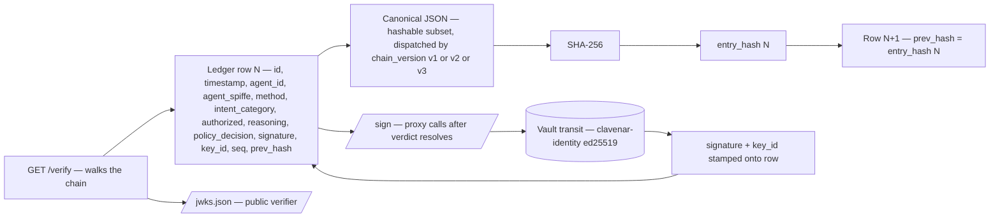
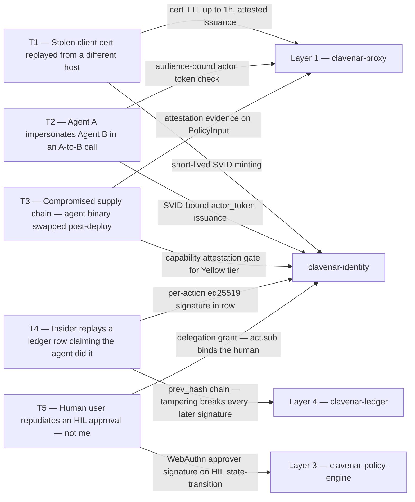

# Clavenar Technical Specification

Consolidated technical record for Clavenar. Each major section below was previously a standalone spec file in this repo; legacy cross-references in prose now resolve to the matching anchor in this document.

`SECURITY.md` (RFC 9116-style disclosure policy) remains a separate file at the repo root by convention — it is referenced by `security.txt` and surfaced in the GitHub Security tab.

## Contents

- [Identity service](#identity-service) — SVID issuance, OIDC delegation, action signing, attestation, federation
- [Agent onboarding (WAO)](#agent-onboarding-wao) — registration, capability envelope, lifecycle, chain v3
- [Tenancy scope](#tenancy-scope) — what is tenant-isolated today vs. deployment-wide in v1
- [Console config page](#console-config-page) — `/config` diagnostic surface
- [Operator authentication](#operator-authentication) — console + HIL human auth, RBAC, cross-channel identity
- [Regulatory export](#regulatory-export) — EU AI Act Article 11/12 audit bundle
- [Continuous compliance evidence](#continuous-compliance-evidence) — auto-derived EU AI Act Article 14/15 + SOC 2 / ISO 27001 evidence register
- [Demo experience](#demo-experience) — public-facing demo design
- [Console policy management](#console-policy-management) — read + CRUD + activate/deactivate of `*.rego` and `*.json` policies from the console
- [Policy catalog](#policy-catalog) — browseable on-disk library of starter policies with frontmatter-driven metadata, one-click install, and a CLI scaffolder
- [Policy exchange](#policy-exchange) — signed, versioned Rego packs gated by a mandatory local attack-catalog backtest before install
- [Forensic-tier deep review](#forensic-tier-deep-review) — async heavy-LLM auditor running against a sampled slice of the audit stream
- [Internal service mTLS](#internal-service-mtls) — agreed substrate for proxy↔backend hops (shipped v0.8.3 — application hops; v0.8.4 — NATS transport)
- [Workload SVID refresh](#workload-svid-refresh) — short-lived per-service SVIDs minted on top of the bootstrap cert (designed; implementation v1.x+3)
- [Agent-facing error envelope](#agent-facing-error-envelope) — the shared JSON 403/429/503 body the data plane returns to callers
- [Kill-chain breaker](#kill-chain-breaker) — cross-replica multi-step attack detection over a shared NATS-KV behavioral-history bucket
- [Threat model](#threat-model) — STRIDE-organized, layer-by-layer
- [Runbooks](#runbooks) — operational; maintained privately

---

## §0. Module status by release

One-glance reference for *what shipped when* and *which services
each module landed on*. Each row mirrors a section below; the
authoritative wire-contract detail still lives in those sections.
**Status legend:** **shipped** = live in prod on the demo VPS today;
**designed** = TECH_SPEC entry exists but no compose / chart shipment.

| § | Module | Status | Landed | Services touched |
|---|---|---|---|---|
| 1 | [Identity service](#identity-service) | shipped | — | `clavenar-identity` (new, port 8086 / 8186), `clavenar-proxy`, `clavenar-policy-engine`, `clavenar-ledger`, `clavenar-hil` |
| 2 | [Agent onboarding (WAO)](#agent-onboarding-wao) | shipped | chain v3 | `clavenar-identity`, `clavenar-ctl` (new binary `clavenarctl`), `clavenar-console`, `clavenar-ledger`, `clavenar-e2e`, `clavenar-chaos-monkey` |
| 3 | [Tenancy scope](#tenancy-scope) | described | — | (semantics, no new service) |
| 4 | [Console config page](#console-config-page) | shipped | — | `clavenar-console`, `clavenar-sdk` (+3 public getters) |
| 5 | [Operator authentication](#operator-authentication) | shipped | — | `clavenar-hil` (passkey + session), `clavenar-console` (auth-mode + viewer/approver gates) |
| 6 | [Regulatory export](#regulatory-export) | shipped (slices 1+2+3) | — | `clavenar-ledger`, `clavenar-identity` (new `POST /sign/blob`), `clavenar-sdk`, `clavenar-ctl` |
| 6a | [Continuous compliance evidence](#continuous-compliance-evidence) | shipped | v1.3.0 | `clavenar-ledger` (`POST /compliance/evidence`, manifest v4), `clavenar-sdk`, `clavenar-console` (`/compliance`), `clavenar-ctl` (`--include-compliance`) |
| 7 | [Demo experience](#demo-experience) | shipped | — | `clavenar-website`, `clavenar-demo-mint` (new), `clavenar-console`, `clavenar-proxy`, `clavenar-hil`, `clavenar-ledger`, `clavenar-chaos-catalog` (new), `clavenar-simulator` |
| 8 | [Console policy management](#console-policy-management) | shipped | — | `clavenar-policy-engine` (SQLite store + write API), `clavenar-console`, `clavenar-sdk`, `clavenar-ledger` (consumes `policy.*` event kinds — chain v3 is event-kind-polymorphic, no schema bump) |
| 9 | [Policy catalog](#policy-catalog) | shipped | — | `clavenar-policy-engine` (frontmatter + 4 endpoints), `clavenar-console` (`/policies/library`), `clavenar-sdk`, `clavenar-ctl` (`policy scaffold` + `policy library`) |
| 9a | [Policy exchange](#policy-exchange) | shipped | v1.3.0 | `clavenar-sdk` (pack manifest + `PackSigner`), `clavenar-chaos-catalog` (`policy_input` corpus), `clavenar-ctl` (`policy exchange {sign,install}`); reuses `/sign/blob` + `evaluate-batch` |
| 10 | [Forensic-tier deep review](#forensic-tier-deep-review) | shipped 2026-05-13 | v0.6.0 | `clavenar-deep-review` (new repo), `clavenar-e2e`, `clavenar-charts` (chart 0.7.0 — eight-service stack, shipped 2026-05-14) |
| 11 | [Internal service mTLS](#internal-service-mtls) | shipped (apps v0.8.3 → NATS v0.8.4 → six sessions through 2026-05-14) | v0.8.3, v0.8.4 | every backend (`clavenar-proxy`, `clavenar-brain`, `clavenar-policy-engine`, `clavenar-ledger`, `clavenar-hil`, `clavenar-identity`, `clavenar-console`, `clavenar-simulator`) — every internal application hop is now mTLS-gated; NATS transport pinned TLS+mTLS in v0.8.4 |
| 11a | [Kill-chain breaker](#kill-chain-breaker) | shipped | v1.3.0 | `clavenar-proxy` (NATS-KV shared history store), `clavenar-policy-engine` (`recent_sequence` + governance.rego rule), `clavenar-e2e` (JetStream + `run-killchain.sh`) |
| 12 | [Workload SVID refresh](#workload-svid-refresh) | designed (implementation v1.x+3) | — | `clavenar-identity` (issuer), every internal service (consumer) |
| 13 | [Threat model](#threat-model) | reference | — | (STRIDE table, no new service) |
| 14 | [Runbooks](#runbooks) | reference | — | (on-call procedures; maintained in clavenar-internal-specs) |

Versions in the **Landed** column reference `clavenar-internal-specs/VERSION`
(the demo-VPS deploy axis) or chain versions where the wire schema
moved. Modules without a single landed version were rolled in over
several patches and the per-section "Module status" line carries the
detail.

---

## Identity service


Companion spec to `README.md` §11.3 ("Agent identity — IAM for bots"). Scoped to what §11.3 commits to and grounded in the primitives Clavenar already ships (NATS forensic bus, hash-chained ledger, HIL, `regorus` policy engine).

**Module status:** **shipped.** Touches `clavenar-proxy`, `clavenar-policy-engine`, `clavenar-ledger`, `clavenar-hil`; introduced the `clavenar-identity` service (port 8086). The companion [Agent onboarding](#agent-onboarding-wao) section (also shipped) layers the agent-registry / lifecycle / capability-envelope work on top of these primitives.

### 1. What §11.3 actually commits to

The spec promises three capabilities. Restated as testable claims:

| Spec bullet | Operational claim |
|---|---|
| OIDC / SPIFFE federation | Every agent has a verifiable workload identity bound to a human/team/tenant principal. Agent-to-agent calls require a Clavenar-mediated handshake, not just transport mTLS. |
| Digital signatures for actions | Every resolved tool call — Authorized, HIL-Approved, or blocked (denied / violation) — produces a Clavenar-issued, ledger-anchored signature over `(agent_id, correlation_id, method, request_payload, verdict, prev_hash)`. The signature is the legal proof; a blocked attack is as non-repudiable as an approval. |
| Capability attestation | Sensitive tools (Yellow tier and a configurable allowlist) require fresh evidence the agent's runtime is unmodified — TPM/SGX quote, or remote-attestation token from a managed runtime. |

Identity, in Clavenar's threat model, is **necessary but insufficient** (§13.1). WI's job is not to replace Brain/Policy/HIL — it is to make the `agent_id` field they all key off of cryptographically meaningful end-to-end.

### 2. Threat model (in scope)

| # | Threat | Today | After WI |
|---|---|---|---|
| T1 | Stolen client cert replayed from a different host | Proxy accepts it (CN trusted unconditionally) | Cert short-TTL (≤1h) + attested issuance; replay window collapses |
| T2 | Agent A impersonates Agent B in an A→B call | No A2A check today; Brain sees the *receiving* agent's view only | SVID-bound `actor_token` + audience binding rejects mismatch |
| T3 | Compromised supply chain: agent binary swapped post-deploy | Undetected | Capability attestation gates Yellow-tier tools |
| T4 | Insider replays a ledger row claiming "the agent did it" | Possible — `agent_id` is not signed by the agent, only stamped by the proxy | Per-action signature chain anchored to ledger `prev_hash` provides non-repudiation |
| T5 | Human user repudiates an HIL approval ("not me") | WebAuthn approver auth covers approver side | WI binds the *delegation* user→agent so the agent's own action is also non-repudiable |

**Out of scope:** governing the human IdP itself (delegate to Okta/Entra), key custody for the issuing CA (delegate to Vault Transit / KMS), cross-tenant federation v1 (single-tenant first).

### 3. Identity model

#### 3.1 Names

```
spiffe://<trust-domain>/tenant/<tid>/agent/<agent-name>/instance/<uuidv7>
```

- `tenant/<tid>` — billing/isolation boundary; matches the existing `agent_id` prefix convention used by the simulator.
- `agent/<agent-name>` — stable logical identity (e.g. `support-bot-3`). This is what policy rules and Brain's persona-drift baseline key off.
- `instance/<uuidv7>` — per-process; rotates on restart. Lets us revoke a single misbehaving replica without grounding the fleet.

The existing `MtlsIdentity.cn` becomes a *projection* of this SPIFFE ID for backwards compatibility — the proxy parses the SAN URI and falls back to CN only for legacy clients during a deprecation window.

#### 3.2 Principals and delegation

```
Human (OIDC subject)
   │  delegates capabilities via signed grant
   ▼
Agent root identity (SPIFFE, long-lived, in attestation policy)
   │  mints
   ▼
Agent instance SVID (≤1h TTL, hardware-attested)
   │  on A→B call, mints
   ▼
Actor token (audience-bound, ≤60s TTL, single-use)
```

The delegation grant is the missing piece in today's architecture. It carries:

```json
{
  "iss":  "clavenar-identity",
  "sub":  "spiffe://wd.local/tenant/acme/agent/support-bot-3",
  "act":  { "sub": "user:alice@acme.com", "idp": "okta", "amr": ["webauthn"] },
  "scope": ["mcp:read:tickets", "mcp:write:tickets"],
  "yellow_scope": ["refund:<=50usd"],
  "exp":  1714694400,
  "jti":  "01HW..."
}
```

`act` is RFC 8693 actor-token semantics: "this agent is acting *on behalf of* this human." The proxy presents `act.sub` to HIL approvers verbatim ("Alice's support-bot-3 wants to refund $42") — this is what makes the audit story land for compliance officers reading EU AI Act Article 12 logs.

#### 3.3 Federation

- **Inbound (humans → Clavenar):** OIDC. Clavenar trusts an enterprise IdP for human auth; the IdP's `id_token` is exchanged at `clavenar-identity` for a delegation grant via OAuth 2.0 Token Exchange (RFC 8693).
- **Outbound (agents → other Clavenar tenants):** SPIFFE federation bundle. Tenant A's trust bundle is published at `https://identity.<tenant-a>/.well-known/spiffe-bundle`; Tenant B's identity service polls it. Cross-tenant A2A becomes possible without sharing a CA.

### 4. The new service: `clavenar-identity`

Standalone Rust service, port 8086. It is the only component allowed to mint SVIDs and delegation grants. It is a NATS forensic publisher for issuance/revocation events, so the ledger has a row for every cert minted.

#### 4.1 HTTP surface

| Method | Path | Purpose | Auth |
|---|---|---|---|
| `POST` | `/svid` | Issue an instance SVID against an attestation document | Attestation evidence (§6) |
| `POST` | `/grant` | Exchange OIDC `id_token` + agent SVID → delegation grant | OIDC `id_token` + SVID mTLS |
| `POST` | `/actor-token` | Mint an audience-bound A→B token | Caller SVID + grant |
| `POST` | `/sign` | Clavenar-side signing of a finalized verdict (§5) | Proxy SVID only |
| `POST` | `/revoke` | Revoke an instance SVID or a delegation grant (`{"kind":"svid","svid_id":...}` / `{"kind":"grant","jti":...}`, optional `reason`). Sets `revoked_at` + emits `svid.revoked` / `grant.revoked` chain v3 event. | Admin capability (`agents:admin`) — spec previously named "Operator WebAuthn" but identity terminates on OIDC + caps; admin is the cap-equivalent kill switch (matches `decommission`). |
| `GET`  | `/jwks.json` | Public keys for grant/actor-token verification | Public |
| `GET`  | `/.well-known/spiffe-bundle` | SPIFFE federation bundle | Public |

#### 4.2 Storage

SQLite, mirroring the ledger's "boring + auditable" stance:

- `svids` (id, spiffe_id, attestation_id, not_before, not_after, revoked_at)
- `grants` (jti, agent_spiffe, human_sub, scope_json, yellow_scope_json, exp, revoked_at)
- `attestations` (id, kind {tpm-quote, sev-snp, sgx-dcap, gcp-tpm, aws-nitro, k8s-projected}, evidence_blob, verified_at, policy_version)

No JSON in queryable columns where it can be a column — we want SQL-grep-able audits.

#### 4.3 Keys

Issuer keys live in **Vault Transit** by default (Clavenar already runs Vault for credential injection). The identity service never holds private key material in-process — it calls `transit/sign/<key>` over the existing Vault client. Rotation is Vault-driven.

**Alt-backend for OSS / `clavenar-lite`** (added v0.6.6, multi-key in v0.6.8): a file-loaded Ed25519 signer is available behind the same `Sign` trait for deployments that don't run Vault. Opt-in via `CLAVENAR_IDENTITY_SIGNING_KEY_PATH=/path/to/key.pem` (PKCS#8 PEM); the key sits in process memory for the life of the binary. Vault takes precedence when both are configured; the file path is selected only when Vault env vars are unset. Operator setup: `openssl genpkey -algorithm ed25519 -out clavenar-identity.key && chmod 600 clavenar-identity.key`. The trade-off vs. Vault is "operational simplicity (no Vault dep) vs. compromise blast radius (key bytes in process)". The wire envelope (`vault:v1:<base64>`) is preserved by both backends so the ledger verifier's strip path stays unchanged; the JWKS `kid` (`clavenar-identity-file:v1` by default, override via `CLAVENAR_IDENTITY_SIGNING_KEY_ID`) distinguishes the backend for audit-row triage. Multi-key rotation: comma-separated paths + matching-length comma-separated kids — first becomes the active signer, the rest stay in JWKS so verifiers can still validate pre-rotation chain rows. See [Runbooks](#runbooks) §7 for the rotation procedure.

### 5. Action signing & ledger anchoring

This is the highest-value bullet — non-repudiation is what unlocks the §15 "trust dividend" insurance story.



Per-row signature commits to `prev_hash`, so tampering with any earlier row breaks every later signature — two-layer integrity, see §5.2.

#### 5.1 What gets signed

After the security verdict resolves and `forward_upstream` runs (or is denied), the proxy calls `clavenar-identity` `/sign` with:

```rust
struct SignRequest {
    agent_spiffe: String,
    correlation_id: Uuid,
    method: String,
    request_payload_sha256: [u8; 32],   // do NOT send payload itself
    verdict: Verdict,                    // Authorized | ReviewApproved | ReviewDenied | Violation
    upstream_outcome: Option<UpstreamOutcome>,
    prev_hash: String,                   // tail hash of the ledger chain
}
```

The signing service returns `{ signature, key_id, signed_at }`. The proxy's NATS forensic event then carries this triple, and the ledger's hashable becomes:

```
{ id, timestamp, agent_id, agent_spiffe, method, intent_category, authorized,
  reasoning, policy_decision, signature, key_id, seq, prev_hash }
```

**This is a chain-version bump.** The hashable field order is the chain version, so we ship it as `CURRENT_CHAIN_VERSION = 2`, dispatched per-row exactly like the existing version-negotiation machinery already in the ledger. Old rows verify under v1; new rows under v2. No retroactive re-signing.

#### 5.2 What the signature is *over*

`sha256(prev_hash || "|" || canonical_json(hashable_v2_minus_signature))` — the same shape as the chain hash, signed with the issuer key. This means:

- The signature transitively commits to *all prior ledger state* via `prev_hash`.
- Tampering with any historical row breaks the signature on every later row, not just the chain hash. Two-layer integrity.
- A regulator reproducing the chain only needs Clavenar's JWKS + the ledger export — no live service.

**Implementation note: proxy uses `GENESIS_PREV_HASH` (64 zeros) in the signed envelope, not the live ledger tail.** A naive implementation would have the proxy `GET /chain-tail` from `clavenar-ledger` before every `/sign` call — a second mandatory RTT on the hot path. Instead, the proxy signs against the all-zeros constant; the ledger then stamps the real `prev_hash` into the chain row on append. The two-layer integrity claim still holds because the chain-row hash (which uses the real `prev_hash`) is what auditors verify, not the per-action signature in isolation. Rationale lives in `clavenar-proxy/src/sign.rs` module-doc. This is the only signing-side wire deviation from the spec contract; integrators verifying signatures must use `GENESIS_PREV_HASH` for the signed-payload re-computation, then check chain continuity separately.

#### 5.3 What is *not* signed

`source` (client-controlled metadata, not in hashable) and any HIL approver identity that is not yet cryptographic. WebAuthn-backed approver signatures are the natural follow-on, but they sign a *separate* HIL state-transition event, not the proxy's verdict event.

### 6. Capability attestation

Gating model: Policy Engine consults a new `attestation_required` rule per tool/method, evaluated against fresh attestation evidence the proxy attaches to `PolicyInput`.

```rust
struct PolicyInput {
    // ... existing fields ...
    attestation: Option<AttestationClaims>,   // NEW
}

struct AttestationClaims {
    kind: AttestationKind,         // tpm | sev-snp | sgx-dcap | nitro | gcp-shielded | k8s-projected
    measurement: String,           // hex-encoded PCR/MRENCLAVE/etc.
    issued_at: DateTime<Utc>,      // freshness
    expires_at: DateTime<Utc>,     // ≤ 15min
    nonce_echo: String,            // proves liveness against a Clavenar-issued nonce
}
```

Rego rule sketch:

```rego
deny[msg] {
  tool_requires_attestation[input.method]
  not fresh_attestation(input.attestation)
  msg := "attestation required or stale"
}

deny[msg] {
  tool_requires_attestation[input.method]
  not allowed_measurements[input.method][input.attestation.measurement]
  msg := "agent measurement not in allowlist"
}
```

The allowlist is per-method, not per-tenant — the security claim is "the code that calls `wire_transfer` is the code we approved." Allowlist updates are a separate signed artifact (think Sigstore-style transparency log; v1 it's a checked-in JSON file in the policy repo).

**Performance note.** Attestation verification is expensive (10–50ms for a TPM quote). The proxy caches verified attestations keyed by `spiffe_id || measurement` for `min(expires_at, 5min)`. Cache misses block the request; cache hits add zero latency to the hot path. This is the only way to keep the §6 "every millisecond × 50 sub-calls" budget intact.

### 7. Wire-contract changes

Shared types are duplicated on each side of the wire. The fields below need to land **simultaneously** in both repos of each pair:

| Edge | Field added | Repos to grep |
|---|---|---|
| Proxy → Brain | `agent_spiffe: String` | `clavenar-proxy/src/fork.rs`, `clavenar-brain/src/lib.rs` |
| Proxy → Policy | `agent_spiffe: String`, `attestation: Option<AttestationClaims>` | `clavenar-proxy/src/fork.rs`, `clavenar-policy-engine/src/lib.rs` |
| Proxy → HIL | `agent_spiffe: String`, `delegation_jti: String` | `clavenar-proxy/src/sandbox_handoff.rs` (CreatePending site), `clavenar-hil/src/api.rs` |
| Proxy → Ledger (NATS) | `agent_spiffe`, `signature`, `key_id` (chain v2) | `clavenar-proxy`, `clavenar-ledger/src/chain.rs` |

Console (`clavenar-console`) needs a "Delegation: alice@acme via support-bot-3" badge on every audit row — wire it through the existing correlation-id join.

### 8. Failure & fallback semantics

| Failure | Behaviour | Reasoning |
|---|---|---|
| `clavenar-identity` unreachable on `/sign` | Proxy fails *closed* on Yellow-tier and any tool with `attestation_required`; fails *open* (no signature, ledger v1 row) on Authorized non-attested calls, with a `signing_unavailable` signal in Brain's signal aggregator. Blocked verdicts (denied / violation) sign *fail-soft* — the request is already blocked, so a `/sign` outage only downgrades the receipt to v1, never changes the deny outcome | Don't take the whole stack down because a non-critical service blips; do refuse to sign forged-checks-from-the-future; a denial has no audit gap to fail-closed on |
| Attestation expired mid-burst | Proxy returns 401 with `attestation_stale`; agent re-attests | Same model as expired SVID |
| Vault Transit unavailable | Identity service degrades to `signing_unavailable` (above) | Single failure domain — Vault is already a hard dep |
| Federation bundle stale (cross-tenant) | Reject A2A; allow same-tenant | Matches the §13.1 "identity is necessary but insufficient" framing — better to fail safe |

### 9. Migration & rollout

Five phases, each independently shippable. **All five shipped.**

1. **SVID issuance, no enforcement.** *(shipped)* `clavenar-identity` mints SVIDs alongside the existing CA. Proxy parses the SPIFFE SAN from the cert and falls back to CN for legacy clients.
2. **Delegation grants.** *(shipped)* `/grant` exchange wired; HIL records the delegation principal on pending rows; proxy threads `X-Clavenar-Grant` through and rejects expired grants with `grant_expired`.
3. **Action signing (chain v2).** *(shipped)* Ledger gained v2 dispatch (`HashableEntryV2` with `agent_spiffe`, `signature`, `key_id`); proxy calls `/sign` after the verdict resolves; verifier exposes JWKS-based per-row signature check; mixed-v1/v2 export verifies.
4. **Attestation enforcement.** *(shipped)* `policies/attestation.rego` ships with `attestation_required` rules keyed on `wire_transfer` and `delete_*`; `attestation_allowlist.json` carries the per-tool measurement list; proxy attaches `AttestationClaims` (with a per-spiffe-id cache and `X-Clavenar-Attestation` per-request header override) on every `/evaluate`; chaos-monkey `unattested_binary` asserts deny.
5. **Cross-tenant federation.** *(shipped)* SPIFFE bundle endpoint at `GET /.well-known/spiffe-bundle`; `/actor-token` mint + `/actor-token/redeem` with peer-bundle freshness gate (`peer_bundle_unknown:<td>` / `peer_bundle_stale:<td>`); federation poller; two-tenant `run-federation.sh` e2e in `clavenar-e2e`.

The §11.3 valuation claim (⭐⭐⭐⭐⭐, "zero-trust score" metric) and the §15 trust-dividend story are both unblocked.

### 10. Test surface

- **`clavenar-e2e`** gains: SVID issuance happy path; revocation kills next request within 1s; signed-row chain verification against a regulator-style export.
- **`clavenar-chaos-monkey`** gains: `stolen_svid_replay`, `unattested_binary`, `expired_grant`, `cross_tenant_unfederated`. All four must produce specific, predicted verdicts.
- **`clavenar-simulator`** has a `--delegation-mix` flag (env `SIM_DELEGATION_MIX`) — comma-separated pool of human `act.sub` values; each fire picks one at random and stamps an unsigned `X-Clavenar-Grant` header. The proxy's v1 grant parser is signature-advisory (`clavenar-proxy/src/grant.rs`), so the unsigned grant is accepted and the console audit page renders the "Delegation: <human> via <agent>" badge with realistic variety. *Shipped 2026-05-13 (v0.6.5).*

### 11. What this spec deliberately does not include

- A bespoke PKI. We use SPIFFE + Vault Transit because they exist and are audited.
- A new HIL approver flow. WebAuthn approver auth is a separate workstream; this spec only ensures the *agent side* of the delegation is cryptographic. Both sides land independently.
- A custom revocation mechanism. Short-TTL SVIDs (≤1h) + grant `jti` denylist published over NATS is enough. CRLs are a 1990s answer to a 2026 problem.
- A new audit UI. The console's existing `/audit` correlation-id join is the right shape; we just add three columns.

---

## Agent onboarding (WAO)


Companion to the [Identity service](#identity-service) section. Where that section covers how a *running* agent gets a cryptographic identity (SVID, grant, action signature, attestation), this spec covers the missing pre-step: how an agent gets *registered with the platform* in the first place — who declared it should exist, with what capabilities, owned by which team — and how that record gates every downstream identity operation.

**Module status:** shipped. Extends `clavenar-identity` (no new service); introduces a new top-level CLI binary `clavenarctl`; extends `clavenar-console` and `clavenar-ledger` (chain v3); touches `clavenar-e2e` and `clavenar-chaos-monkey`. Depends on the issuance, signing, and chain-version-negotiation primitives in the [Identity service](#identity-service) section.

### 1. What this closes

The [Identity service](#identity-service) section makes the `agent_id` field cryptographically meaningful end-to-end. It does not say where the field comes from. Today, `POST /svid` mints an instance cert for *any* `(tenant, agent_name)` pair as long as attestation passes — first call wins. `POST /grant` accepts arbitrary opaque scope strings from the caller. There is no record of "this agent should exist, owned by this human/team, scoped to these capabilities" prior to issuance.

The operational consequences:

| Gap | Today | After WAO |
|---|---|---|
| Namespace squat | Any compromised attestor can claim `wire-transfer-bot` and the platform issues | `(tenant, agent_name)` must be pre-registered or `/svid` rejects (in `enforce`) |
| Capability sprawl | `/grant` honors any scope string Brain/Policy hasn't explicitly denied | `/grant` rejects scopes outside the agent's registered envelope |
| Audit lineage | Chain shows "Alice's bot did X." Nobody can prove Alice ever said the bot should exist | Chain shows "Alice declared `support-bot-3` exists with envelope Y on date D" alongside every later verdict row, both signed |
| Incident lever | Only kill-switch is to revoke the SVID and refuse to mint a new one — terminal | Suspend (reversible, blocks new SVIDs + revokes existing) and decommission (terminal, name unreusable) |
| Routing accountability | `agent_id` is opaque to HIL approvers; "who owns this agent" is tribal knowledge | HIL pending rows carry `owner_team` and registering human; envelope shown inline so approvers can see the action is in-envelope |

The capability envelope is the load-bearing primitive. Without it, registration is namespace-only and adds nothing the chain doesn't already have. With it, the chain transitively binds *what was authorized* to *what was done*.

### 2. Threat model (in scope)

| # | Threat | Today | After WAO |
|---|---|---|---|
| T1 | Compromised attestor claims a high-privilege `agent_name` it never had | First-call wins; SVID issued; agent inherits whatever runtime privileges its name implies | `agent_name` must be pre-registered by a human with `agents:create`; unregistered names rejected (`enforce`) or flagged (`warn`) |
| T2 | Agent silently escalates its own capabilities via `/grant` request | `/grant` accepts arbitrary scopes; only Brain/Policy at runtime gate them | `/grant` intersects requested scopes with the registered envelope before issuance; out-of-envelope = `403 scope_outside_envelope` |
| T3 | Operator fakes a registration retroactively to cover an incident | Sidecar registry tables are operator-trusted | Lifecycle events anchored in chain v3, signed by `clavenar-identity` issuer key; tampering breaks every later signature |
| T4 | Compromised team member quietly hands their high-privilege agent to an attacker-controlled team | No ownership transfer concept | Transfer requires `agents:admin` (different capability than owner-team membership), emits `agent.owner_team_transferred` chain row |
| T5 | Decommissioned agent name re-registered with looser scope | No retention; name is reusable | `UNIQUE (tenant, agent_name)` includes Decommissioned; re-register attempt returns `409 agent_name_retired` |

**Out of scope:** receiving-team consent on transfer (admins can dump on unwilling teams in v1; flagged as v2 follow-on); a capability-change request workflow (the widen endpoint is the *terminal* action — any approval flow on top is a separate spec); bulk operations (per-team mass suspend); a Terraform provider (the `--if-absent` CLI flag covers IaC patterns until a customer asks for native Terraform).

### 3. The registration record

#### 3.1 Schema

Lives in `clavenar-identity`'s SQLite alongside `svids`, `grants`, `attestations`. One table:

```sql
CREATE TABLE agents (
    id                          TEXT PRIMARY KEY,           -- uuidv7
    tenant                      TEXT NOT NULL,
    agent_name                  TEXT NOT NULL,
    state                       TEXT NOT NULL,              -- Active | Suspended | Decommissioned
    scope_envelope              TEXT NOT NULL,              -- JSON array of opaque scope strings
    yellow_envelope             TEXT NOT NULL,              -- JSON array of opaque yellow-scope strings
    attestation_kinds_accepted  TEXT NOT NULL,              -- JSON array; [] = inherit global allowlist
    created_by_sub              TEXT NOT NULL,              -- OIDC subject; immutable
    created_by_idp              TEXT NOT NULL,              -- "okta" | "entra" | ...; immutable
    owner_team                  TEXT NOT NULL,              -- IdP group claim; mutable via transfer
    created_at                  TEXT NOT NULL,              -- RFC 3339; immutable
    state_changed_at            TEXT NOT NULL,
    state_changed_by            TEXT NOT NULL,              -- OIDC subject of last transition
    description                 TEXT,                       -- optional free text
    UNIQUE (tenant, agent_name)                             -- includes Decommissioned (no name reuse)
);

CREATE INDEX agents_by_tenant_state ON agents (tenant, state);
CREATE INDEX agents_by_owner_team   ON agents (tenant, owner_team);
```

Field rationale:

- **`scope_envelope` / `yellow_envelope` separately** mirror the `/grant` request shape (`scope` / `yellow_scope` in `grant.rs`). Per-field intersection at grant time produces per-field rejection reasons (`scope_outside_envelope` vs `yellow_scope_outside_envelope`) without forcing the handler to inspect each entry to know which side it belongs to.
- **`attestation_kinds_accepted`** is per-agent narrowing of the global attestation allowlist. Empty array means "any kind currently accepted by the global identity config." Closes the namespace-squat-with-stolen-attestation hole one click further than the global setting alone.
- **`created_by_sub` and `created_by_idp` are immutable.** No `UPDATE` path. Non-repudiation requires that a regulator reading the chain can always identify the human who authorized the agent's existence.
- **`state_changed_*` overwrite on transition.** The full history is in chain v3 rows; the mutable columns just serve fast "show me current state" reads. SQLite is not the audit log — the ledger is.
- **`UNIQUE (tenant, agent_name)` includes `Decommissioned`.** Name recycling is forbidden to prevent the "decommission `payments-bot`, immediately re-register with looser scope" attack. Decommission is terminal and the row stays as the audit anchor.
- **No `version` / `etag`.** Last-write-wins on the rare contended state transition; the second writer's chain row is a no-op the handler short-circuits.
- **No `tags`, `slack_channel`, `repo_url`, `runtime_hints`.** Identity holds only what `/svid`, `/grant`, `/sign`, the gating logic, and the ledger anchoring need. External metadata belongs in external systems.
- **Tenants are *not* a row.** `tenant` is a string, validated by the existing `validate_label` in `svid.rs:116`. A `tenants` table is a separate spec — it implies tenant lifecycle, billing, per-tenant IdP federation, and is a much bigger commitment than this feature warrants.

#### 3.2 Lifecycle state machine

Three states. Two reversible transitions, one terminal:

```
       agents:create                 owner-team or admin
            │                                │
            ▼                                ▼
        ┌──────┐  suspend     ┌────────────┐  decommission   ┌─────────────────┐
   ───▶ │Active│ ───────────▶ │ Suspended  │ ──────────────▶ │ Decommissioned  │
        └──────┘              └────────────┘                 └─────────────────┘
            ▲                       │                                ▲
            └─────── unsuspend ─────┘                                │
                       (admin only)                                  │
                                                                     │
                            decommission (admin only) ───────────────┘
```

- **Active → Suspended** is reachable by any owner-team member or any tenant admin. One-click pause for incident response.
- **Suspended → Active** requires `agents:admin`. If the team that suspended themselves can also unsuspend themselves, the suspend lever doesn't survive a compromised team account.
- **`* → Decommissioned`** requires `agents:admin`. Terminal. The row remains; the `(tenant, agent_name)` is permanently unreusable.
- **Suspend is hard.** Existing SVIDs are revoked via the NATS revocation broadcast that [Identity service](#identity-service) §8 already needs (denylist consulted on `/sign`). Outstanding grants reject. There is no "soft suspend that lets in-flight requests run to TTL."

#### 3.3 Ownership

Two principals on every record, doing different jobs:

- **`created_by_sub` (immutable):** non-repudiation. The human who declared this agent should exist. Their signature anchors the `agent.registered` chain row; nothing changes that fact later.
- **`owner_team` (mutable):** routing. The team responsible for operating the agent. HIL fans out Yellow-tier approvals to whatever Slack/Teams channel maps to the team. Transferable by `agents:admin` only; emits `agent.owner_team_transferred`.

The IdP `groups` claim is required. `POST /agents` with an `owner_team` not in the caller's `groups` returns `403 owner_team_not_in_token` — you cannot register an agent owned by a team you don't belong to. If a tenant's IdP doesn't emit `groups`, `POST /agents` returns `403 missing_team_claim` and the tenant is documented to configure the claim before onboarding.

### 4. The capability envelope

#### 4.1 Grammar

Scopes are opaque, NFC-normalized lowercase strings, ≤128 bytes, no whitespace. The existing `validate_label` in `grant.rs:267` is reused (extended to the new envelope columns). No DSL, no parser, no semantic comparison.

A scope is either in a set or it isn't. `refund:<=50usd` and `refund:<=100usd` are distinct strings; if the envelope contains the first, the second is rejected. Teams that want graduated tiers declare each tier as a separate envelope entry (`refund:<=50usd`, `refund:<=500usd`, `refund:<=5000usd`) and rely on `regorus` rules at runtime for the dollar comparison.

The conventions `mcp:read:<resource>`, `mcp:write:<resource>`, `yellow:<token>` are documented but not enforced by the parser. Forward compatibility: any future structured grammar is a strict superset (string equality is a degenerate case of any comparator), so opaque-string envelopes verify under every future grammar without invalidating chain v3 rows.

#### 4.2 Intersection at `/grant`

```
GrantRequest.scope          ⊆  Agent.scope_envelope          → 200, mint
GrantRequest.scope          ⊄  Agent.scope_envelope          → 403 scope_outside_envelope
GrantRequest.yellow_scope   ⊆  Agent.yellow_envelope         → 200, mint
GrantRequest.yellow_scope   ⊄  Agent.yellow_envelope         → 403 yellow_scope_outside_envelope
```

The 403 response body lists the offending scope(s) for debuggability:

```json
{ "error": "scope_outside_envelope", "offenders": ["wire_transfer"] }
```

Empty envelope (`[]`) is legal and means "this agent can hold an SVID but cannot be granted any capability." Useful as a Suspended → Active rehearsal state before scopes are restored. Any non-empty grant request against an empty envelope returns `scope_outside_envelope`.

### 5. Wire surface

#### 5.1 Registration & lifecycle

All endpoints below take `Authorization: Bearer <oidc_id_token>`. `clavenar-identity` validates against the per-tenant JWKS configured in `identity.toml`, extracts `sub`, `idp` (from issuer mapping), `groups` (for `owner_team` checks), and resolves capabilities by mapping `groups → [agents:create, agents:admin, ...]` per `[capabilities.tenants.<tid>]` config.

| Method | Path | Capability | Chain v3 event |
|---|---|---|---|
| `POST` | `/agents` | `agents:create` | `agent.registered` |
| `GET` | `/agents` | any tenant member | — |
| `GET` | `/agents/{id}` | any tenant member | — |
| `POST` | `/agents/{id}/suspend` | owner-team or `agents:admin` | `agent.suspended` |
| `POST` | `/agents/{id}/unsuspend` | `agents:admin` | `agent.unsuspended` |
| `POST` | `/agents/{id}/decommission` | `agents:admin` | `agent.decommissioned` |
| `POST` | `/agents/{id}/envelope/narrow` | owner-team or `agents:admin` | `agent.envelope_narrowed` |
| `POST` | `/agents/{id}/envelope/widen` | `agents:admin` | `agent.envelope_widened` |
| `POST` | `/agents/{id}/attestation-kinds` | dispatched per direction | `agent.attestation_kinds_changed` |
| `POST` | `/agents/{id}/owner-team` | `agents:admin` | `agent.owner_team_transferred` |
| `POST` | `/agents/{id}/description` | owner-team or `agents:admin` | `agent.description_changed` |

Asymmetric authority is the principle: narrowing the envelope (less capability) is owner-team self-service; widening (more capability) requires a different human with `agents:admin`. The original registering admin's signature covered the original envelope; widening is a *new* authorization event and must be a *new* authorization signature.

#### 5.2 Request and response shapes

```
POST /agents
Authorization: Bearer <oidc_id_token>

{
  "tenant":             "acme",
  "agent_name":         "support-bot-3",
  "owner_team":         "payments",
  "scope_envelope":     ["mcp:read:tickets", "mcp:write:tickets"],
  "yellow_envelope":    ["refund:<=50usd"],
  "attestation_kinds":  ["tpm", "sev-snp"],
  "description":        "Triage bot for tier-1 tickets"
}

200 → { "id": "<uuidv7>", "spiffe_id_pattern": "spiffe://wd.local/tenant/acme/agent/support-bot-3/instance/*",
        "state": "Active", "created_at": "...", ... }

401 → { "error": "invalid_token" }                  // OIDC validation failed
403 → { "error": "missing_capability:agents:create" }
403 → { "error": "owner_team_not_in_token" }        // owner_team not in caller's groups claim
403 → { "error": "missing_team_claim" }             // IdP doesn't emit groups
409 → { "error": "agent_name_taken" }
409 → { "error": "agent_name_retired" }             // decommissioned, name unreusable
422 → { "error": "scope_not_normalized", "field": "scope_envelope[2]" }
```

Lifecycle endpoints all take `{ "reason": "<free text>" }` (optional) and return `{ "state": "<new state>", "state_changed_at": "..." }`. The `reason` lands in the chain v3 payload for the corresponding event.

Envelope-narrow / -widen take the *full new envelope*, not a diff:

```
POST /agents/{id}/envelope/narrow
{ "scope_envelope":  ["mcp:read:tickets"],
  "yellow_envelope": [] }
```

The handler verifies the new envelope is a strict subset of the old (for narrow) or strict superset (for widen) and rejects otherwise (`422 envelope_not_narrower` / `422 envelope_not_wider`). Caller passes the whole intended state; no diff parsing, no JSON-merge-patch ambiguity.

### 6. Gate integration with `/svid` and `/grant`

The agent record is consulted in the same SQLite transaction as the issuance INSERT. No TOCTOU window between gating check and minting.

#### 6.1 `/svid` failure catalog (`enforce` mode)

| Status | Error | Condition |
|---|---|---|
| 200 | — | Record exists, Active, attestation kind in record's allowlist (or in global allowlist if record's is empty), attestation valid |
| 403 | `unregistered_agent` | No record for `(tenant, agent_name)` |
| 403 | `agent_suspended` | Record exists, state Suspended |
| 403 | `agent_decommissioned` | Record exists, state Decommissioned |
| 403 | `attestation_kind_not_accepted` | Record's `attestation_kinds_accepted` non-empty and presented kind not in it |
| 422 | (existing) | Existing attestation-evidence shape errors, unchanged |

#### 6.2 `/grant` failure catalog (always, regardless of mode for registered agents)

| Status | Error | Condition |
|---|---|---|
| 200 | — | Record exists, Active, requested scopes ⊆ envelope, requested yellow ⊆ yellow envelope |
| 403 | `scope_outside_envelope` | Body lists offending scopes |
| 403 | `yellow_scope_outside_envelope` | Body lists offending yellow scopes |
| 403 | `agent_suspended` / `agent_decommissioned` | Bad state |
| 403 | `unregistered_agent` (`enforce` only) | No record |

#### 6.3 Mode behaviour

`CLAVENAR_IDENTITY_REGISTRATION_MODE = off | warn | enforce`. Default `enforce` (post-rollout posture; `RegistrationMode::default()` in `clavenar-identity/src/lib.rs`). Operators staging a brownfield rollout set `CLAVENAR_IDENTITY_REGISTRATION_MODE=warn` to onboard agents without 403'ing unregistered names first.

| Mode | Unregistered name on `/svid` | Unregistered name on `/grant` | Registered agent + out-of-envelope grant |
|---|---|---|---|
| `off` | 200, no signal | 200, no signal | 200, no signal (envelope ignored) |
| `warn` | 200 + `unregistered_agent` signal on forensic event | 200 with wildcard envelope + `unregistered_agent` signal | **403 `scope_outside_envelope`** |
| `enforce` | 403 `unregistered_agent` | 403 `unregistered_agent` | 403 `scope_outside_envelope` |

The principle: **registration is opt-in to enforcement**. The mode flag governs the *unknown* case (no record). Once a record exists, its envelope is enforced regardless of mode — otherwise registration in `warn` would be decorative. This lets operators onboard their highest-risk agents first, get real enforcement immediately on those, and let lower-risk agents run unregistered until the global flip.

The signal vocabulary on the forensic event uses `unregistered_agent` (consistent with `peer_bundle_stale` / `grant_expired` naming from the [Identity service](#identity-service) section).

### 7. Chain v3 — lifecycle row anchoring

`CURRENT_CHAIN_VERSION = 3` after this lands. v1 (verdict, no signature), v2 (verdict + signature), and v3 (lifecycle event) coexist in the chain; verifier dispatches per-row. No retroactive re-signing.

#### 7.1 Two-tier hashable

The outer hashable is fixed at v3 launch and never altered without a v4 bump. Per-event-kind variation lives in a separate payload, content-hashed into `payload_sha256`:

```json
{
  "id":               "<uuidv7>",
  "timestamp":        "<RFC 3339 UTC>",
  "event_kind":       "agent.registered",
  "agent_id":         "<uuidv7 of the agents row>",
  "tenant":           "acme",
  "agent_name":       "support-bot-3",
  "actor_sub":        "user:alice@acme.com",
  "actor_idp":        "okta",
  "payload_sha256":   "<hex>",
  "signature":        "<base64>",
  "key_id":           "<clavenar-identity issuer key id>",
  "seq":              42,
  "prev_hash":        "<hex>"
}
```

Hash formula (same shape as v1/v2):

```
entry_hash[n] = sha256( prev_hash[n] || "|" || canonical_json(hashable_v3_minus_signature) )
signature      = sign(clavenar-identity issuer key, entry_hash[n])
payload_sha256 = sha256( canonical_json(payload) )
```

#### 7.2 Per-kind payloads

| `event_kind` | Payload |
|---|---|
| `agent.registered` | `{ scope_envelope, yellow_envelope, attestation_kinds_accepted, owner_team, description }` |
| `agent.suspended` / `agent.unsuspended` / `agent.decommissioned` | `{ state_before, state_after, reason }` |
| `agent.envelope_narrowed` / `agent.envelope_widened` | `{ scope_envelope_before, scope_envelope_after, yellow_envelope_before, yellow_envelope_after }` (all four always present) |
| `agent.attestation_kinds_changed` | `{ attestation_kinds_before, attestation_kinds_after }` |
| `agent.owner_team_transferred` | `{ owner_team_before, owner_team_after }` |
| `agent.description_changed` | (no payload — chain row's `actor_sub` + `timestamp` is the proof; description content lives in identity's local table) |

`canonical_json` for both the outer hashable and the payload is the existing v1/v2 canonicalizer in `clavenar-ledger` (sorted keys, no whitespace, UTF-8 NFC). One canonicalizer, no per-version variants.

#### 7.3 Ground rules

- **`actor_sub` is always a real human.** No `system:`, no `tofu:*`. Migration-CLI runs publish `actor_sub = "system:migration:<operator_oidc_sub>"` — the operator who ran the migration is recorded; never anonymous.
- **The outer hashable is locked.** New event kinds add only payload schemas. New optional outer fields are forbidden; if it matters enough to put outside the payload, it warrants a v4 bump.
- **Adding event kinds is free.** Specifically, future spec follow-ons (capability-change request flow, transfer-pending, etc.) add new payloads only — no chain version bump.

### 8. Authentication for human callers

#### 8.1 Transport

All `/agents` endpoints take a raw OIDC `id_token` in `Authorization: Bearer`. Stateless server-side validation against the configured per-tenant JWKS. No Clavenar-issued session token (would double the revocation surface for no security gain). No reuse of `/grant` for human auth (would conflate the human/agent boundary the rest of the spec maintains).

#### 8.2 Capability resolution

Capabilities (`agents:create`, `agents:admin`, ...) are derived from the IdP `groups` claim via server-side mapping in `identity.toml`:

```toml
[capabilities.tenants.acme]
"clavenar-agent-creators" = ["agents:create"]
"clavenar-platform-admins" = ["agents:create", "agents:admin"]
```

This avoids requiring per-tenant IdP claim customisation (the #1 enterprise SaaS onboarding failure mode). The tenant administrator only has to tell their IdP team "add a group called `clavenar-agent-creators` and put your developers in it."

#### 8.3 Per-tenant IdP

Multi-tenant `clavenar-identity` reads `[oidc.tenants.<tid>] issuer = "..." jwks_url = "..."` per tenant. Per-call routing is by the `tenant` field in the request body. A request whose `tenant` doesn't match the OIDC token's issuer mapping returns `403 tenant_mismatch`.

### 9. The `clavenarctl` CLI

New top-level binary built on top of `clavenar-sdk`. Two artifacts, one source of truth: SDK is the typed library (consumed by `clavenar-console` and integrators); CLI is a `[[bin]]` in a new crate that depends on SDK.

#### 9.1 Auth

OIDC device authorization flow (RFC 8628), the same pattern as `gcloud auth login`, `aws sso login`, `gh auth login`.

```
clavenarctl auth login --tenant acme        # device-flow; cache id_token + refresh_token in ~/.clavenar/credentials.json
clavenarctl auth logout
clavenarctl auth whoami                      # echoes sub, idp, groups, capabilities
```

No long-lived API tokens. No operator SVID requirement (would be a circular bootstrap). The CLI re-uses the cached refresh token transparently; expired refresh sends the operator back through device flow.

#### 9.2 Commands

```
clavenarctl agents create \
  --tenant acme --name support-bot-3 \
  --owner-team payments \
  --scope mcp:read:tickets --scope mcp:write:tickets \
  --yellow-scope refund:<=50usd \
  --attestation-kind tpm --attestation-kind sev-snp \
  --description "Triage bot for tier-1 tickets" \
  [--if-absent]                            # idempotent: 200 if record matches; 409 if differs

clavenarctl agents list --tenant acme [--state Active|Suspended|Decommissioned] [--owner-team payments] [--json]
clavenarctl agents get <id> [--json]
clavenarctl agents suspend <id> --reason "investigating anomaly"
clavenarctl agents unsuspend <id>
clavenarctl agents decommission <id> --reason "team disbanded"
clavenarctl agents envelope narrow <id> --scope mcp:read:tickets
clavenarctl agents envelope widen  <id> --scope mcp:write:knowledge-base --yellow-scope refund:<=500usd
clavenarctl agents transfer <id> --to-team newteam
clavenarctl agents description <id> --text "..."

clavenarctl agents migrate \
  --identity-db /var/lib/clavenar-identity/identity.sqlite \
  [--dry-run] [--default-owner-team unassigned] [--default-envelope '*'] [--default-attestation-kinds '*']
```

#### 9.3 Conventions

- `--json` on every read command; tests and shadow-scanner integration depend on machine-readable output.
- `--if-absent` on `create` for IaC-without-Terraform patterns: a CI job loops a YAML file and runs `clavenarctl agents create --if-absent` per entry. Returns 200 if the existing record matches the requested envelope, 409 if it differs.
- Exit codes are deterministic and documented: `0` success, `2` validation error, `3` auth/capability error, `4` conflict, `5` server error.

### 10. Console (`clavenar-console`) extensions

The console gets the same OIDC auth dance as the CLI (auth-code flow + PKCE), holds tokens server-side, never exposes them to user-facing JS. Tenant context is inferred from the OIDC `tenant` claim or per-IdP `console.toml`. No tenant switcher in v1.

#### 10.1 New pages

| Path | Content |
|---|---|
| `/agents` | Tenant-scoped index. Columns: name, state badge, owner team, # scopes, # yellow scopes, last activity (joined from latest ledger row by `agent_name`). Filters: state, owner team, search. |
| `/agents/new` | Form: tenant (auto-filled), name, owner-team (dropdown of caller's groups), scope envelope (multi-input), yellow envelope (multi-input), attestation kinds (checkboxes from global allowlist), description. Submits to `POST /agents`. |
| `/agents/{id}` | Full record + lifecycle timeline (chain v3 rows for this agent, newest first). htmx action buttons gated on caller's capability. |

#### 10.2 Cross-page weaving

The audit story is invisible without it.

- **`/audit`** gains an "Agent" column. Linkable to `/agents/{id}` if registered; italic name otherwise. New "Filter by owner team" dropdown. `unregistered_agent`-signal rows get a one-click "Register…" link that prefills `/agents/new` with the observed `(tenant, agent_name)`.
- **`/hil/{id}`** gets an "Authorization context" panel above the request body: agent name (linked), owner team, registering human (`created_by_sub`), registration date, full envelope. The requested method/payload is visually flagged in-envelope or outside-envelope. The latter shouldn't happen post-`enforce` but in `warn` mode it can — surface it loudly so approvers see the gap.

#### 10.3 Verbs

The console has no "delete" verb. Decommission is terminal but the row stays. The word "delete" is operationally dangerous for an audit log and we don't need it.

### 11. Failure & fallback semantics

| Failure | Behaviour | Reasoning |
|---|---|---|
| `clavenar-identity` SQLite unavailable | Same as today: `/svid`, `/grant`, `/agents` all 503 | Single failure domain — identity is already a hard dep |
| Per-tenant JWKS endpoint unreachable | Cached JWKS used until expiry; after expiry, 503 with `jwks_unavailable` for that tenant only | Don't take down all tenants because one IdP is down |
| Caller's `id_token` expired | `401 invalid_token` | CLI re-runs device flow; console re-runs auth-code flow |
| Agent record missing in `enforce` | `403 unregistered_agent` on `/svid` and `/grant` | The point |
| Agent record missing in `warn` | 200 + signal on forensic event | The point |
| Envelope intersection fails | `403 scope_outside_envelope` regardless of mode | Registration opts you into enforcement |
| Suspend racing with in-flight `/sign` | `/sign` denylist consults the revocation broadcast (NATS); next call after suspend rejects | Hard suspend semantics from §3.2 |
| Migration CLI partial failure | Idempotent; rerun completes from where it stopped; chain rows for already-migrated agents are no-ops | One operator, one transactional intent |

### 12. Migration & rollout

Five slices, each independently shippable.

1. **Schema + reads.** `agents` table created; `GET /agents`, `GET /agents/{id}`, `clavenarctl agents list/get` work. `POST /agents` and lifecycle endpoints not yet wired. Mode flag defaults `off`. *Exit:* schema migration ships to all environments; SDK `Client::list_agents` callable.
2. **Writes + lifecycle (no gating).** `POST /agents` and the lifecycle endpoints all work. Console `/agents`, `/agents/new`, `/agents/{id}` ship. `clavenarctl agents create/suspend/...` ship. Mode still `off`. *Exit:* operators can enroll and manage records; nothing breaks because no gate consults them yet.
3. **Chain v3.** Ledger gains v3 dispatch. Every `POST /agents` and lifecycle endpoint emits a chain v3 row. Console `/agents/{id}` timeline ships. Verifier exposes per-row signature check across v1, v2, v3. *Exit:* `verify_chain` passes against a mixed v1/v2/v3 export; `clavenarctl ledger verify` succeeds.
4. **Mode `warn`.** `/svid` and `/grant` consult the registry; unregistered names succeed with a signal stamped on the forensic event. Registered agents get envelope enforcement immediately. Console `/audit` highlights `unregistered_agent` rows with the "Register…" link. *Exit:* `clavenar-e2e` happy path passes with the simulator agents either pre-registered (via migration CLI) or running unregistered with signals; chaos-monkey scenarios assert correct mode behaviour.
5. **Mode `enforce`.** Default flips. Migration CLI is the official adoption tool — operators run `clavenarctl agents migrate --default-envelope '*'` to bulk-enroll existing agents before flipping. `clavenar-e2e`, `clavenar-simulator`, `clavenar-chaos-monkey` boot scripts run the migration in their setup. *Exit:* `clavenar-e2e` happy path passes with `enforce` and zero unregistered names; chaos-monkey `unregistered_agent_enforce` scenario denies as expected.

The first set of slices unblocks the §11.3 audit-lineage story (chain row "Alice declared this agent"); the later slices close the namespace-squat and capability-sprawl threats (T1, T2). The early slices are decoupled from capability-attestation enforcement and other downstream work.

### 13. Test surface

#### 13.1 `clavenar-e2e`

A new bash runner `run-onboarding.sh` (or fold into `run.sh` if boot time tolerates). Boots `clavenar-identity` + a `dexidp/dex` mock IdP container + the migration target stack. Asserts:

1. **Bootstrap.** Mock IdP issues `id_token` for `admin@acme.com` (in group `clavenar-platform-admins`); `clavenarctl auth login` succeeds; `clavenarctl agents create` returns 200; agent record present in identity SQLite; `agent.registered` chain v3 row present in ledger with the registering human's `actor_sub` and the full envelope in payload.
2. **First SVID against registered agent.** Existing SVID issuance flow runs; assert no `unregistered_agent` signal in forensic event; resulting cert SAN matches the registered `(tenant, agent_name)`.
3. **Grant intersection.** `/grant` with scopes inside envelope succeeds; `/grant` with one in-envelope and one out-of-envelope scope returns `403 scope_outside_envelope` with the offender named.
4. **End-to-end Yellow-tier with envelope-context.** Pre-registered simulator agent drives a wire_transfer that hits HIL; HIL pending row carries the agent's envelope and registering human; chain has both `agent.registered` and the verdict row signed by the same key.
5. **Suspend revokes in flight.** Issue SVID, suspend the agent, verify next `/grant` returns `agent_suspended` and next `/sign` returns `agent_suspended` (revocation broadcast worked).
6. **Lifecycle chain replay.** Run register → suspend → unsuspend → narrow envelope → decommission; `clavenarctl ledger verify` against the export; chain valid; six v3 rows in the right order; signatures valid against JWKS.
7. **Migration CLI.** Boot stack with `CLAVENAR_IDENTITY_REGISTRATION_MODE=warn`, drive simulator to populate svids table, run `clavenarctl agents migrate --default-envelope '*'`, assert all simulator agents now have records with wildcard envelope and `actor_sub` includes the operator's OIDC subject.
8. **Mode flip.** Flip `enforce`, drive an unregistered agent, assert `403 unregistered_agent`.

The dex mock is configured with two static users:

- `admin@acme.com` with `groups: [clavenar-platform-admins]` (mapped to `agents:create + agents:admin`)
- `dev@acme.com` with `groups: [payments]` (no Clavenar capabilities — tests `403 missing_capability:agents:create`)

#### 13.2 `clavenar-chaos-monkey`

New scenarios. Each must produce a specific predicted verdict (the existing pattern):

| Scenario | Asserted verdict |
|---|---|
| `unregistered_agent_enforce` | `/svid` for `(acme, brand-new-bot)` with no record → `403 unregistered_agent` |
| `scope_outside_envelope` | `/grant` with one in- and one out-of-envelope scope → `403 scope_outside_envelope`, offender named |
| `suspended_agent_grant` | Register, suspend, `/grant` → `403 agent_suspended`; bonus: `/svid` → `403 agent_suspended` |
| `decommissioned_name_reuse` | Register, decommission, re-register same `(tenant, agent_name)` → `409 agent_name_retired` |
| `envelope_widen_unauthorized` | Caller without `agents:admin` on widen → `403 missing_capability:agents:admin`; same call with admin → 200 |
| `owner_team_spoof` | `POST /agents` with `owner_team` not in caller's `groups` → `403 owner_team_not_in_token` |
| `stale_oidc_token` | `id_token` past `exp` → `403 invalid_token` |
| `migration_replay` | Run migration twice; second run is no-op; no duplicate ledger rows; no schema violation |

Onboarding scenarios are pure-identity, no policy-tracker hits, so they run early in the chaos-monkey order — explicitly *before* the existing `velocity_breaker` scenario, which must run last because the policy tracker records every `/evaluate`.

#### 13.3 Out of test scope

- **Real IdP integration tests.** Real Okta/Entra tenants don't fit in CI; the dex mock is the contract. Real-IdP setup is a docs deliverable.
- **Cross-tenant federation of agent records.** Agent records are tenant-local. Cross-tenant federation deals only with SPIFFE bundles (per [Identity service](#identity-service) §3.3). No behaviour to test.
- **Latency regression.** Adding `/agents` lookups on the `/svid` and `/grant` hot paths is real overhead; chasing latency budgets in CI is noisy. Document the expectation ("registered-agent gating adds <1ms p99 to `/svid`") and verify manually before the `enforce` flip.

### 14. Wire-contract changes (cross-repo grep before renaming)

| Edge | Field added | Repos to grep |
|---|---|---|
| Console → Identity (read) | `GET /agents` response shape | `clavenar-console`, `clavenar-identity/src/agents.rs`, `clavenar-sdk` |
| Console → Identity (write) | `POST /agents` and lifecycle bodies | `clavenar-console`, `clavenar-identity/src/agents.rs`, `clavenar-sdk` |
| `clavenarctl` → Identity | All `/agents` shapes | `clavenar-sdk`, `clavenar-ctl/src/cmd/agents.rs`, `clavenar-identity/src/agents.rs` |
| Identity → Ledger (NATS) | Chain v3 outer hashable + per-kind payloads | `clavenar-identity/src/agents_ledger.rs`, `clavenar-ledger/src/chain.rs` (v3 dispatch), `clavenar-ledger/src/verify.rs` |
| Identity → Proxy/HIL (existing rejection signals) | New error codes (`unregistered_agent`, `scope_outside_envelope`, `agent_suspended`, `agent_decommissioned`, `attestation_kind_not_accepted`) | `clavenar-proxy/src/grant.rs`, `clavenar-proxy/src/sign.rs` (signal aggregator), `clavenar-brain` (signal display), `clavenar-console/src/audit.rs` (filter chips) |

The shared types are duplicated on each side of the wire (no shared crate, per repo convention); land changes simultaneously.

### 15. What this spec deliberately does not include

- **Receiving-team consent on transfer.** v1 lets `agents:admin` dump an agent on an unwilling team. v2 should add `pending_transfer_to: <team>` + accept/reject by receiving team. Out of scope.
- **Capability-change request workflow.** The widen endpoint is the *terminal* action. A workflow on top — owner-team submits request, admin or HIL approves, widen fires — is a separate spec. The endpoint shape is designed to be the workflow's terminal call.
- **Bulk operations.** "Suspend all agents owned by team X" is a real incident-response need; v1 admins iterate. Defer until an operator explicitly asks.
- **Terraform provider.** The `--if-absent` CLI flag covers IaC-shaped use cases. A native Terraform provider is the natural follow-on once a customer asks.
- **Tenant lifecycle.** Tenants are implicit (declared by first use of the string). A `tenants` table implies billing boundaries, per-tenant IdP federation, and tenant decommissioning — much bigger spec.
- **WebAuthn approver auth on lifecycle transitions.** Today's auth is OIDC-only on `/agents`. Step-up auth for high-impact transitions (decommission, widen) is a separate WebAuthn workstream; this spec only ensures the transitions are signed in the chain. WebAuthn lands independently.
- **Per-agent attestation policy beyond `attestation_kinds_accepted`.** Per-method attestation requirements (capability attestation in [Identity service](#identity-service) §6) remain global. Per-agent rule overrides — "this specific agent's `wire_transfer` calls require measurement X" — wait for the global rule to settle before being layered on.
- **Agent groups / hierarchies.** No nested ownership, no parent-child agents, no inheritance. Each agent is a flat record. If 50 agents share an envelope, register 50 records (the CLI's `--if-absent` makes this scriptable).

---

## Tenancy scope


Cross-cutting clarification — applies to every module. Clavenar v1 ships a **single-tenant-per-deployment posture with a tenant-scoped trust root**. Operators should not conflate "the SVID carries a tenant segment" with "the system enforces tenant isolation end-to-end."

### 1. What is tenant-scoped today

- **Agent enrollment** (`clavenar-identity`). `POST /agents` validates the request body's `tenant` against the OIDC token's tenant claim and returns `403 tenant_mismatch` on mismatch ([Agent onboarding §8.3 per-tenant IdP](#agent-onboarding-wao)). Schema enforces `UNIQUE (tenant, agent_name)` including `Decommissioned` rows; reads filter `WHERE tenant=?`. Index `agents_by_tenant_state` exists.
- **SVID URIs.** Every instance certificate carries `spiffe://<td>/tenant/<tid>/agent/<name>/instance/<uuid>` ([Identity service §3](#identity-service)). The tenant segment is signed into the cert by Vault Transit and is durable for the cert's lifetime — the SVID URI is the immutable artifact this whole section is shaped around.
- **v3 lifecycle chain rows** (`clavenar-ledger`). Agent register / rotate / revoke / suspend / decommission events live in chain v3 with a `tenant` column; `read_lifecycle_for_agent` gates `WHERE tenant=? AND agent_id=?` (index `idx_entries_tenant_agent`). This is the one ledger surface that is tenant-isolated end-to-end.

### 2. What carries `tenant` as a field but does not filter on it

- **v1/v2 verdict rows** (`clavenar-ledger`). `entries.tenant` exists as a column on all rows but no read function references it. The `/audit/{agent_id}` JSON receipt, `/audit/paged`, the console's `/audit` page fan-out, `/audit/replay/corpus`, and the distinct-agents list are global across tenants.
- **Self-Learn mining corpus** ([Console policy management](#console-policy-management)). `read_replay_corpus` has no tenant predicate; the miner sees every tenant's traffic in a shared pool.
- **Policy Lab replay-batch.** Same SQL, same gap.

### 3. What has no tenant axis at all

- **Policy ruleset** (`clavenar-policy-engine`). The `policies` and `policy_versions` tables have no `tenant` column. One engine; one active ruleset; applied to every agent regardless of tenant claim. Activating, deactivating, or editing a policy is deployment-wide.
- **HIL pending queue** (`clavenar-hil`). `pending_requests` has no `tenant` column; one global approval queue. A human approver cannot tell which tenant a pending belongs to except by inspecting the `agent_id` prefix convention.
- **Brain `/inspect`** (`clavenar-brain`). Tenant is not in the request shape; classifiers, persona drift models, and indirect-injection detectors are identical for every caller.
- **Console UI.** `CLAVENAR_CONSOLE_AGENTS_TENANT` is process-wide (default `acme`). No tenant switcher; every page reads the global state above.

### 4. Why this shape

The SVID is durable infrastructure. Once issued and signed by Vault Transit, the URI cannot be rewritten without re-issuance. Adding the `tenant/<tid>` segment at v1 costs near zero; adding it on day 200 means re-rolling every running agent and handling the gap period where some workloads carry tenant-aware URIs and some do not. The OIDC tenant gate at enrollment is a real security boundary today — it prevents tenant-A credentials from minting a tenant-B SVID at the trust root — even though downstream services do not filter on tenant. The work is therefore not nominal even before multi-tenant SaaS ships.

Downstream tenant-scoping (v1/v2 verdict reads, policy ruleset, HIL queue, mining corpus, Brain context) is the year-2 multi-tenant workstream. The Agent Onboarding section already calls the broader piece out of scope ([§15 "Tenant lifecycle"](#agent-onboarding-wao)); this section is the stocktaking complement that an operator can read in one sitting.

### 5. Implication for v1 deployments

One Clavenar deployment serves one operational tenant. Cross-tenant federation happens at the SPIFFE bundle layer (`/.well-known/spiffe-bundle`, see [Identity service](#identity-service) "Cross-tenant federation"), not by sharing a console process between two tenant orgs. Operators who need data-plane isolation today should deploy two stacks — separate compose, separate ledger volume, separate identity CA — and federate via the bundle endpoint. Year-2 SaaS-style multi-tenant support, where one deployment serves N tenant orgs with isolated audit / policy / HIL state, is deferred.

### 6. What this section is not

- It does not commit to a roadmap date for closing the gaps in §2 / §3. Year-2 means "after v1 settles," not a quarter.
- It does not propose API shapes for tenant-aware reads. When the year-2 workstream picks up, the migration design lands as a fresh section, not as edits here.
- It is not authoritative for `clavenar-charts`. The Helm chart's multi-replica posture has separate caveats called out per-service in `values.yaml`; this section covers wire / data isolation only.

---

## Console config page


Companion to the [Agent onboarding](#agent-onboarding-wao) section only in form. Where that section is a multi-service initiative with a chain version bump, a new CLI binary, and five rollout slices, this section is the opposite end of the scale: one read-only HTML page at `/config` in `clavenar-console` that answers "what is this binary, what is it talking to, and is everything reachable?" — the implicit question every operator currently answers with `ps`, `printenv`, and `curl` against four URLs.

**Module status:** shipped. Local to `clavenar-console`; one additive change to `clavenar-sdk` (three new public getters). No new service. No chain version change. No new endpoints on any backend. The only cross-repo dependency is bumping the `clavenar-sdk` version `clavenar-console` consumes.

### 1. What this closes

Today, an operator who SSH-tunnels into the console host and asks "is this thing wired up correctly?" has to:

1. `ps -ef | grep clavenar-console` — find the process.
2. `cat /proc/$PID/environ | tr '\0' '\n'` — see what URLs and flags it booted with.
3. `curl http://localhost:8083/health` — check the ledger.
4. Repeat (3) for HIL, identity, simulator.
5. Cross-reference the env against a runbook to know which knobs are even in scope.

The operational consequences:

| Gap | Today | After CONFIG |
|---|---|---|
| URL drift | "Is the console pointing at staging-ledger or prod-ledger?" needs shell access on the console host | One page renders the URL the SDK is actually pinging |
| Wiring health | Need to remember each backend's port and curl them by hand | Four parallel probes, color-coded latency badges, truncated error reason on failure |
| Optional service status | "Is the simulator wired up here?" requires the operator to know the env var name | Card explicitly shows "configured" / "not configured (set `CLAVENAR_CONSOLE_SIMULATOR_URL`)" |
| Token rotation verification | "Did this binary pick up the new operator token after the env was updated?" cannot be answered without shell | sha256[..8] fingerprint of the bearer; matching fingerprints across operators prove same token, mismatched fingerprints prove the rotation hasn't reached every box |
| Build provenance | `cargo install clavenar-console` produces a binary with no version readout in the UI | Page renders `v0.x.y (abc12345)` from `CARGO_PKG_VERSION` and a short git SHA captured at build time |
| Auth posture readability | `cookie_secure` and `session_ttl_secs` live in env vars; verifying them against the deploy doc requires shell | One card |

The page is a diagnostic, not a control plane. Mutation is explicitly out of scope (§11).

### 2. Threat model and posture

#### 2.1 Posture

The console's existing read-only surface (`/audit`, `/velocity`, `/stats/*`, `/hil` listing, `/exports`, `/agents`, `/sim`) is **open** — auth gates only the `/hil/{id}/{approve,deny,modify}` POSTs. The README documents the deploy posture: bind to `127.0.0.1`, expose via SSH tunnel or reverse proxy. `/config` matches this posture.

The justification is operational. An auth-gated config page is *worse* during incidents because it hides the very wiring an operator needs to debug auth itself. If WebAuthn is broken, the page that says "your RP id is wrong" must not require WebAuthn.

#### 2.2 Threats

| # | Threat | Mitigation |
|---|---|---|
| T1 | Operator pastes a `/config` screenshot into a public Slack channel; the screenshot leaks an OIDC bearer token | Token is never in handler scope; only `bearer_fingerprint() -> Option<String>` (sha256 hex prefix) is available to the template. The fingerprint is non-invertible and safe to print. |
| T2 | Operator pastes a `/config` screenshot; screenshot leaks the HIL session cookie of the rendering operator | Cookie value is held in `AuthState.store` keyed by an opaque UUID; the handler reads `SessionData.name` and never the cookie value. |
| T3 | Future contributor adds `{{ operator_token }}` to a template, exposing the raw token | The handler doesn't have access to the raw token (T1 mitigation makes the regression impossible at the type level). The redaction integration test (§7) is a second line of defense, asserting the rendered body never contains the configured token string. |
| T4 | Operator inadvertently deploys with `cookie_secure=false` in production | Page surfaces the flag prominently; mismatch with deploy posture is visible at a glance. |
| T5 | Pinned build runs against the wrong ledger or HIL because of an env-typo at deploy time | Page renders the *effective* URL (sourced from the SDK client itself, not a copy maintained alongside) and an immediate health badge. |

**Out of threat-model scope:** unauthenticated reverse-proxy bypass (deployment-layer concern, not console concern); active attacker on the operator's host (any defense the page could offer is moot once `/proc/$PID/environ` is readable).

#### 2.3 Redaction discipline

Redact-by-architecture, not redact-by-template. The handler must never receive any value that should not be rendered. Concretely:

- The OIDC operator token is held by `AgentsClient` as a private field; the public surface exposes only `bearer_fingerprint() -> Option<String>`. The handler asks for and stores only the fingerprint.
- The HIL session cookie is held by `AuthState.store` keyed by an opaque UUID; the handler reads `SessionData.name` and never the cookie value.
- WebAuthn registered-credential identifiers live in HIL's database. The console does not query them; the page does not render them.

Treat every render as if it will be screenshotted into Slack. The redaction guard test (§7.2) is the mechanical check.

### 3. Page structure

Cards (`rounded-xl bg-white ring-1 ring-slate-200 shadow-card p-5`), single-column stack, four sections in this order. Single-column matches the established density; multi-column would create "the right column got truncated" cases on narrow screens for no information gain.

#### 3.1 Console

| Field | Source |
|---|---|
| Bind | `ProcessConfig.bind` (set in `main.rs` from `--bind`) |
| Port | `ProcessConfig.port` (set in `main.rs` from `--port`) |
| Version | `ProcessConfig.version = env!("CARGO_PKG_VERSION")` |
| Git SHA | `ProcessConfig.git_sha = option_env!("CLAVENAR_CONSOLE_GIT_SHA")` |
| `decided_by` fallback | `AppState.decided_by` |

Rendered as `v0.x.y` or `v0.x.y (abc12345)` depending on whether the build script captured a SHA (§5.3).

#### 3.2 Backends (required)

Two rows, ledger and HIL. Each row: URL + health badge.

URL via `LedgerClient::base_url()` (already exists in `clavenar-sdk`) and `HilClient::base_url()` (added by this spec to `clavenar-console`). Health badge from §4.

#### 3.3 Backends (optional)

Two rows, identity and simulator. Each row probes if the client is `Some`; renders a `not configured (set CLAVENAR_CONSOLE_IDENTITY_URL / CLAVENAR_SIMULATOR_URL)` placeholder if `None`.

The identity row also surfaces:

- `agents_tenant` — the tenant scope baked in via `--agents-tenant`.
- Operator token — `configured (sha256: ab12cd34)` or `unset`, sourced from `AgentsClient::bearer_fingerprint()`. The presence boolean and the fingerprint are the same readout (`Some(_)` vs `None`); no additional method needed.

#### 3.4 Auth

| Field | Source |
|---|---|
| Session TTL | `AuthState.config.session_ttl_secs` |
| `cookie_secure` | `AuthState.config.cookie_secure` |
| Currently logged in | Server-side: `extract_cookie(headers, SESSION_COOKIE)` → `AuthState.store.get(uuid).await` → `SessionData.name` or `(not logged in — open posture)` |

The "currently logged in" line is server-rendered, **not** JS-driven via `/auth/me`. JS-filled slots come out empty in `curl`, `wget`, headless screenshot capture, and view-source; the page is a screenshot artifact and must be self-contained. The nav stays JS-driven (separate concern; would otherwise require threading a `nav_user` field through every template).

The Auth card does **not** surface the WebAuthn RP id — that's HIL's configuration, not the console's, and the console doesn't hold it. If `/config` ever needs to display backend configuration (per [Agent onboarding](#agent-onboarding-wao)-style federation), it goes through the §11 federated-config follow-on, not this card.

The card does **not** surface the active session count, the current session's `expires_at`, or the list of registered WebAuthn credentials. The first two are screenshot footguns (operational signal, hard to keep current with the lazy-expiry session map); the third lives in HIL's database and belongs on a separate "credentials" page if at all.

### 4. Probe contract

```
GET <base_url>/health         # ledger, HIL, simulator
GET <base_url>/healthz        # identity (only service that uses /healthz)
```

| Aspect | Value | Reasoning |
|---|---|---|
| HTTP client | Dedicated `reqwest::Client` shared across probes | Probes need aggressive timeouts; SDK clients are tuned for real RPCs |
| Connect timeout | 500ms | Mostly catches "service not bound to expected port" |
| Total timeout | 1500ms | Page worst-case render is bounded by the slowest single probe |
| Concurrency | All probes via `tokio::join!` in the handler | Sum-of-latencies render is too slow; max-of-latencies is acceptable |
| Auth | None | `/health` and `/healthz` are unauthenticated across the stack |
| Body | Ignored | Most services return plain text; identity returns JSON; lowest common denominator is the status code |

Classification:

| Status | Latency | Render |
|---|---|---|
| 2xx | <500ms | Green badge with `42ms` |
| 2xx | 500–1500ms | Amber badge with the latency reading |
| Non-2xx, timeout, transport error | — | Red badge with truncated reason (`"connect refused"`, `"timeout after 1500ms"`, `"500 Internal"`) |
| Client = `None` | — | Grey "not configured" badge |

Red without a reason is useless during an incident. Always surface the truncated transport-error string.

Module location: new `clavenar-console/src/probe.rs`. Single function:

```rust
// Probe a /health-shaped endpoint and classify the result.
//
// `http`  — dedicated probe client (short timeouts, no auth).
// `base`  — the backend's base URL (taken from the SDK client).
// `path`  — `"/health"` or `"/healthz"`.
pub async fn probe(http: &Client, base: &Url, path: &str) -> Probe { ... }
```

Handler invokes it four times under one `tokio::join!`. Probe construction is `client.base_url().join(path).expect("static path")` — the SDK clients validate base URLs at startup, so the `expect` is unreachable for any base URL that successfully constructed a client.

### 5. Plumbing & wire surface

#### 5.1 Route

```
GET /config        # render the page; no other methods
```

No `POST`. No JSON-API counterpart. The page is server-rendered askama HTML, same shape as every other console page. Nav link added to `templates/base.html` after "Simulator", before the right-aligned subtitle/auth span.

#### 5.2 New SDK methods (additive, no behavior change)

| Crate | Method | Returns | Rationale |
|---|---|---|---|
| `clavenar-sdk::SimClient` | `pub fn base_url(&self) -> &Url` | The configured simulator URL | Page renders the URL the client is actually using |
| `clavenar-sdk::AgentsClient` | `pub fn has_bearer(&self) -> bool` | Whether `with_bearer` was called | Convenience; `bearer_fingerprint().is_some()` is equivalent |
| `clavenar-sdk::AgentsClient` | `pub fn bearer_fingerprint(&self) -> Option<String>` | sha256 hex prefix (first 8 chars) of the configured token | Diagnostic readout without exposing the token |

`LedgerClient::base_url()` already exists in `clavenar-sdk`; no change needed.

#### 5.3 New console-local additions

| File | Change |
|---|---|
| `clavenar-console/src/hil_client.rs` | Add `pub fn base_url(&self) -> &Url` (parity with the SDK clients) |
| `clavenar-console/build.rs` | New file. Shells out `git rev-parse --short=8 HEAD`; emits `cargo:rustc-env=CLAVENAR_CONSOLE_GIT_SHA=<sha>` on success, silent on failure. `cargo:rerun-if-changed=.git/HEAD` and `cargo:rerun-if-changed=.git/refs/heads`. |
| `clavenar-console/src/state.rs` | New struct `ProcessConfig { bind: String, port: u16, version: &'static str, git_sha: Option<&'static str> }`. New field `pub process: ProcessConfig` on `AppState`. |
| `clavenar-console/src/main.rs` | Build `ProcessConfig` from `Cli` before `AppState` construction. |
| `clavenar-console/src/probe.rs` | New module. See §4. |
| `clavenar-console/src/handlers.rs` | New `pub async fn config(...)` handler. Reads `AppState`, runs the four probes under `tokio::join!`, renders the template. |
| `clavenar-console/src/lib.rs` | Wire the route: `.route("/config", get(handlers::config))`. |
| `clavenar-console/templates/config.html` | New askama template. Four cards as in §3. |
| `clavenar-console/templates/base.html` | Add the nav link. |

The build script is allowed to fail silently. A release tarball without a `.git/` directory, or a build environment without `git` on PATH, must produce a working binary; `option_env!` returns `None` and the template renders the version without a SHA. **Build must not depend on git availability.**

### 6. Failure & fallback semantics

| Failure | Behaviour |
|---|---|
| Backend unreachable (connect refused) | Red badge with `"connect refused: ..."` reason; rest of the page renders |
| Backend slow (>1500ms) | Red badge with `"timeout after 1500ms"`; rest of the page renders |
| Backend returns 500 | Red badge with `"500 Internal Server Error"`; rest of the page renders |
| `CLAVENAR_CONSOLE_IDENTITY_URL` / `_SIMULATOR_URL` unset | Optional client is `None`; row renders "not configured" placeholder; no probe traffic to that URL |
| Operator token unset | Identity row renders `unset` for the token field; identity probe still runs |
| Build script unable to capture SHA | `option_env!` returns `None`; template renders `v0.x.y` without SHA |
| Operator hits `/config` while not logged in | Page renders; Auth card shows `(not logged in — open posture)` |
| `AuthState.store` lookup races with session expiry | `get` returns `None`; rendered as not-logged-in |
| Probe URL fails to construct (malformed base) | Should be unreachable — `LedgerClient::new` etc. validate base URLs at startup. If it happens anyway, render red with `"url construction failed"`. |

The handler does **not** 5xx on backend failure. A failed probe is a rendered red badge, not a server error — the entire purpose of the page is to display failure modes.

### 7. Test surface

#### 7.1 Unit tests

In `clavenar-console/src/probe.rs`:

- Probe classification — given `(status_code, latency)`, expect Green/Amber/Red. Doesn't open a socket; classification is a pure function.

In `clavenar-sdk/src/agents.rs`:

- `bearer_fingerprint` — same input always yields the same 8 hex chars; different inputs yield different 8 hex chars; absent bearer returns `None`.

#### 7.2 Integration tests

In `clavenar-console/tests/integration.rs`, reusing the existing `spawn_ledger`, `spawn_hil`, `spawn_sim` helpers:

| Test | Asserts |
|---|---|
| `config_renders_all_cards_when_all_backends_healthy` | All four cards render; all four URLs visible in body; all four probes green |
| `config_renders_optional_placeholders_when_clients_absent` | Identity URL and simulator URL absent → "not configured" placeholders; no probe traffic to those URLs |
| `config_renders_red_badge_when_backend_unreachable` | HIL stub closed (or 500s) → HIL row red with truncated error reason; ledger row still green; page still renders |
| `config_renders_logged_in_operator_when_session_present` | Pre-seed `AuthState.store`, set `clavenar_console_session` cookie on request → body contains operator name |
| `config_renders_not_logged_in_when_no_session` | No cookie → body contains "(not logged in — open posture)" |
| `config_redacts_operator_token` | **Load-bearing.** With `CLAVENAR_CONSOLE_OPERATOR_TOKEN=secret-jwt-blob.foo.bar` and a logged-in operator, body does NOT contain the raw token, does NOT contain the HIL session cookie value, DOES contain the 8-char fingerprint |
| `config_renders_mixed_health_classifications` | Green + amber + red coexist on one render |

The redaction test cannot be skipped. It's the only mechanical guard against a future contributor adding `{{ operator_token }}` to a template.

#### 7.3 Out of test scope

- Tailwind class / DOM structure assertions (brittle, low value).
- Exact latency-ms numbers (timing-flaky on CI).
- Concurrency tests on `tokio::join!` (stdlib semantics, no novel logic).
- `tests/common/mod.rs` extraction (refactor without payoff yet; defer until a third test file needs the helpers).
- `clavenar-e2e` coverage. The config page does not touch the security pipeline; integration tests in `clavenar-console` are authoritative.

### 8. Migration & rollout

Two PRs, sequential. No flag, no phased rollout — the page is purely additive and ships in one minor version.

1. **PR #1 — `clavenar-sdk`.** Add `SimClient::base_url`, `AgentsClient::has_bearer`, `AgentsClient::bearer_fingerprint`. Pure additions, no behavior change. Lands first so PR #2 can bump the SDK dep version.
2. **PR #2 — `clavenar-console`.** Bump SDK dep, add `HilClient::base_url`, `build.rs`, `ProcessConfig`, `probe.rs`, `/config` route + handler, `templates/config.html`, nav link, tests. One commit, or split plumbing/page/tests within the PR if review prefers smaller diffs; no separate intermediate-broken commit.

There is no `clavenarctl` change. There is no chain version bump. There is no policy-engine change. There is no new endpoint on any backend.

### 9. Wire-contract changes (cross-repo grep before renaming)

| Edge | Field added | Repos to grep |
|---|---|---|
| SDK consumers | `SimClient::base_url`, `AgentsClient::has_bearer`, `AgentsClient::bearer_fingerprint` | `clavenar-sdk`, `clavenar-console`, `clavenar-ctl` (future), any external integrators |

No other edges. The page consumes existing `/health` and `/healthz` endpoints unchanged; no backend wire shape shifts.

### 10. Operator preferences (future v2)

Recorded so v1 doesn't paint into a corner. **Not** in this spec's scope.

The natural follow-on is a small set of UI knobs on `/config`:

- Default tenant for `/agents` (currently the `--agents-tenant` CLI flag at process scope).
- "Hide simulator traffic" default for `/audit` (currently a query-string opt-in).
- Default page size for paginated tables (currently hardcoded).

Likely persistence: **localStorage**, not cookie or server-side session map. Reasons:

- The read-only surface is open; cookie-based prefs would force every operator into the console's session machinery.
- Server-side prefs would create per-operator state (a multi-instance console deploy loses prefs on routing).
- localStorage keeps `/config` v2 entirely client-side; no handler change.

The v1 page does not include a "(future) Operator preferences" placeholder card. Aspirational empty cards are clutter.

### 11. What this spec deliberately does not include

- **Mutation surface.** The page is GET-only. Live config edits — adjusting velocity thresholds, HIL TTLs, brain confidence — would require new write endpoints on each backend, audit-trail entries in the chain, and WebAuthn gating. Out of scope; lives in a separate spec if it ever materializes.
- **Federated config view.** Showing every backend's effective config (proxy mTLS chain, policy velocity backend, ledger export sinks, brain model id) implies adding `/config` endpoints across the stack. Not done.
- **Backend versions and SHAs.** Identity exposes `version` on `/healthz`; the others return plain text. Surfacing a per-backend version row requires extending each `/health` to return JSON with a stable shape — a multi-repo change with no current ask. The v1 page renders only the *console's* own version.
- **Active console session count.** Surfacing the count of in-memory `AuthState` sessions is a screenshot footgun (operational signal exposing concurrent operators) and impossible to keep current with the lazy-expiry model.
- **Registered WebAuthn credential listing.** Lives in HIL's database; needs a new HIL endpoint we don't have; belongs on a separate "credentials" page if at all.
- **Build dirty marker.** Adds a second `git status --porcelain` invocation per build for marginal value; the SHA tells you the commit, and the dev case is the only one that benefits.
- **Build timestamp.** Poisons reproducible builds. The release tag is the timestamp that matters.
- **Policy bundle browse/edit.** Different feature, different route, different auth model.
- **Tenant switcher.** Per [Identity service](#identity-service) §10 and [Agent onboarding](#agent-onboarding-wao) §10, console v1 is one-tenant-per-process. The config page reflects whatever the process booted with.
- **Auth gating on `/config`.** §2.1 explains why; making the diagnostic page require working auth is exactly backwards.
- **An "Operator preferences" v1 placeholder card.** §10 explains why.

---

## Operator authentication


Console + HIL human-auth surface — what an operator presents to the console, how the console proves an approver to HIL, and how Slack / Teams approvers anchor cross-channel clicks to a stable operator identity. Companion to "Console config page" (the read-only `/config` diagnostic) and the HIL section of `README.md`.

**Module status:** **shipped.** WebAuthn approver auth, OIDC, basic-admin, RBAC, Slack / Teams self-link, and viewer-route gating are all in. Touches `clavenar-hil` (passkey credentials, session cookie, `Authn::*` server-side stamping) and `clavenar-console` (auth-mode selector, ceremony proxy, `/me/identities`, viewer / approver gates).

### 1. What this closes

Originally, WebAuthn was the only auth path. That was a dealbreaker for buyers with existing OIDC SSO and there was no solo-evaluation mode. Cross-channel approvers (Slack / Teams) had no way to anchor their clicks to a stable operator identity, so chain rows could carry inconsistent `decided_by` values across channels. Read routes had no viewer-or-better gate, so a misconfigured deploy could leak audit data to anyone who hit the URL.

### 2. Auth modes

Four modes selected via `CLAVENAR_CONSOLE_AUTH={disabled|basic-admin|webauthn|oidc}`:

| Mode | Use case | Bind constraint |
|---|---|---|
| `disabled` | dev / CI; mirrors `CLAVENAR_HIL_AUTH_DISABLED=true` under a console-side switch | loopback only (`--bind 127.0.0.1`) |
| `basic-admin` | solo evaluation; single hardcoded user from `CLAVENAR_CONSOLE_ADMIN_USER` + `CLAVENAR_CONSOLE_ADMIN_PASS_BCRYPT` | refuses non-loopback bind unless `CLAVENAR_CONSOLE_ALLOW_BASIC_ADMIN_NETWORK=true` |
| `webauthn` | self-hosted small-team default; HIL holds passkey credentials, console proxies the ceremony | none |
| `oidc` | production with existing SSO; generic OIDC code flow against any compliant IdP | none |

Mode selection is a runtime knob, not a build-time choice — operators flip modes without rebuilding.

### 3. RBAC

Two static roles, mapped via OIDC `groups` claim, config-as-code only:

- `viewer` — read-only access to audit / chain / agent registry / config / exports / velocity / stats / HIL queue / sim / live tail.
- `approver` — viewer + ability to decide HIL pending items.

Group mapping lives in console config:

```yaml
auth:
  oidc:
    approver_groups: ["security-team", "finance-ops"]
    viewer_groups: ["engineering", "compliance"]
```

No user table. No runtime role exceptions. The IdP is the source of truth. (An `admin` tier is layered on top by [Console policy management](#console-policy-management) §8 for the `/policies` CRUD surface — `admin_groups` mirrors `approver_groups` / `viewer_groups`; resolution priority is `admin > approver > viewer`. The agent-registry write surface continues to require capabilities granted by `clavenar-identity`'s `[capabilities.tenants.<tid>]` map — not console role — so direct identity-API + `clavenarctl` remain the canonical agent-admin path.)

The viewer-route gates (`require_viewer` / `require_viewer_api`) sit in front of every console read route; no-session HTML page requests get a `303 → /login`, no-session SSE / JSON requests get `401`. `disabled` mode short-circuits both gates with a synthetic Approver session for dev / CI. The HIL-queue template carries a `can_approve` flag so OIDC viewers see the queue contents but no Approve / Deny / Modify buttons.

### 4. Cross-channel identity

Slack and Teams approvers self-link via a `/me/identities` page in the console using Slack / Teams OAuth. Console persists the link in a small `user_identities` table:

```sql
CREATE TABLE user_identities (
  oidc_sub      TEXT PRIMARY KEY,
  slack_user_id TEXT UNIQUE,
  teams_user_id TEXT UNIQUE,
  linked_at     TIMESTAMP NOT NULL,
  last_verified TIMESTAMP NOT NULL
);
```

A Slack / Teams approve click looks up `user_id → oidc_sub` via this table. **If no mapping exists, the click is rejected** with "your Slack identity is not linked — link via the console first." This forces every chain row to consistently stamp the same identity (`oidc:<sub>`) regardless of which channel the approval came from.

**Schema caveat:** the table sketches a key on `oidc_sub`, but `webauthn` and `basic-admin` modes don't produce OIDC subs. Implementation chose nullable per-mode columns (`oidc_sub` / `webauthn_name` / `basic_username`) with a CHECK constraint that exactly one is set. Reversible — the PK choice doesn't bind the wire format.

Buyers create their own Slack / Teams app from a manifest published in `clavenar-console/docs/` (`slack-app-manifest.json` / `teams-app-manifest.md`) — no marketplace presence.

**Wire surface** (HIL endpoints, called by the console):

| Method | Path | Body / Effect |
|---|---|---|
| `POST` | `/identities/upsert` | `{oidc_sub, slack_user_id?, teams_user_id?}` — upsert one row keyed by `oidc_sub` |
| `GET` | `/identities/{oidc_sub}` | Read one row by `oidc_sub` |
| `DELETE` | `/identities/{oidc_sub}/slack` | Unlink Slack only; row remains for Teams + other future channels |
| `DELETE` | `/identities/{oidc_sub}/teams` | Unlink Teams only |

The console's `/me/identities` page is the only authorized caller in v1; HIL gates these on the shared `CLAVENAR_HIL_DECIDE_TOKEN` bearer.

### 5. Chain `decided_by` schema

The literal `"clavenar-console"` value has been replaced — HIL now stamps `decided_by` server-side from the verified principal:

- `webauthn:{name}` — WebAuthn mode.
- `oidc:<sub>` — OIDC mode; also stamped on Slack / Teams clicks after self-link (the OAuth-linked `oidc_sub` flows through, not the underlying channel id).
- `basic:<username>` — basic-admin mode (auditor reads this and immediately knows the deployment was running in basic-admin mode).

The chain row also carries an `approver_assertion` JSON blob — extension hook for stronger per-decision claims:

- WebAuthn: `{ "method": "webauthn", "credential_id": "...", "iat": ... }`
- OIDC: `{ "method": "oidc-session", "sub": "...", "iat": ... }`
- Basic: `{ "method": "basic-admin", "username": "..." }` (intentionally cheap — no chain-of-trust to assert)

Existing WebAuthn rows in the chain don't get the field retroactively; only rows produced after the field landed carry it. No chain-version bump required; the field is additive.

### 6. Console → HIL trust

The trust path is **mode-dependent** because WebAuthn already has a stronger primitive and we don't tear it out:

- **WebAuthn mode (today, unchanged):** HIL is the credential authority. The console proxies WebAuthn ceremonies and shuttles HIL's session cookie back to the browser; subsequent `/decide` calls attach the HIL cookie and HIL stamps `decided_by` from the verified principal.
- **OIDC / basic-admin / disabled:** HIL has no credential to verify, so console and HIL share a bearer secret (`CLAVENAR_HIL_DECIDE_TOKEN`). Console verifies OIDC (or basic-admin), stamps `decided_by`, and presents the bearer on `/decide`. HIL trusts the request-body `decided_by` *only when* a valid bearer is present; without the bearer, the existing `Authn::Disabled` fallback applies. Console refuses to boot if the configured mode requires the token and it is missing; HIL defaults to per-request validation (401 on a token-less decide) but operators can opt into the same boot-time guard by setting `CLAVENAR_HIL_REQUIRE_DECIDE_TOKEN=true` — HIL then refuses to start unless `CLAVENAR_HIL_DECIDE_TOKEN` is also set. The opt-in keeps backward compatibility while letting bearer-only deployments fail loudly on first start.

The bearer is the interim posture for the non-WebAuthn modes; internal s2s mTLS via clavenar-identity SVIDs (substrate decision recorded in [Internal service mTLS](#internal-service-mtls); implementation deferred to v1.x+2) will replace it uniformly across all modes including WebAuthn.

### 7. Mechanical defaults

- OIDC token validation: JWKS, 1-hour cache TTL, reactive refresh on signature failure.
- Session: server-side encrypted cookie via `tower-sessions`, 8-hour rolling lifetime.
- Logout: clears server session, optionally calls IdP `end_session_endpoint`.
- CSRF: htmx + origin-check + per-session token; no separate state cookie.
- IdPs tested in CI: Keycloak (dockerizable). Quickstart docs only for Google / Okta / Azure AD / Auth0 — no CI fixtures (their public test infra is unreliable).

### 8. Future extensions

Triggers, not commitments — listed so a future contributor knows the hooks are deliberate, not accidental:

- **Per-decision WebAuthn step-up over OIDC sessions** — first design-partner from FinTech (PSD2 SCA), defense (FIPS / DoD impact level), or healthcare (HIPAA technical safeguards). The WebAuthn primitives already exist; v2 wires them as a step-up gating individual `/decide` calls on top of OIDC sessions, rather than a parallel auth mode.
- **Runtime role-management UI** — first buyer who demands non-GitOps role exceptions. Until then, config-as-code is sufficient.
- **Admin role + agent-registry UI in console** — first user who explicitly wants agent CRUD outside `clavenarctl`. Until then, `clavenarctl` + direct identity API are sufficient.
- **Four-eyes / separation-of-duties** — first buyer demanding per-human approval limits or "two distinct approvers required." This also triggers an upgrade from self-link to a more rigorous identity unification scheme.

### 9. Approval Center (operational)

The `/hil` queue is an operator workbench, not just a list. Shipped additive on top of §1–§6 — **no `/decide` wire-contract change and no new `Status`**:

- **Queue filter / search / sort** — `GET /hil?q=&risk_tier=&sort=`. `q` is a case-insensitive substring over agent_id / method / risk_summary; `risk_tier` ∈ {safe, risky, destructive, unscored} keys on the sandbox severity; `sort` ∈ {newest, oldest}. Filtering is in-process in the console (the live queue is small).
- **Bulk approve / deny** — `POST /hil/bulk/{approve,deny}` (console; approver-gated, demo-session rejected). Loops `/decide` per id; per-row conflicts (already decided / TTL-swept) are skipped, and the response re-renders the filtered `#hil-list` fragment in one swap.
- **SLA escalation** — HIL's TTL sweeper re-notifies approvers (a Slack / Teams escalation card) once a still-`Pending` row crosses `created_at + ttl_seconds × CLAVENAR_HIL_SLA_ESCALATE_FRACTION` (default 0.5; 0 disables), *before* the auto-deny. Idempotent: one nullable `escalated_at` column plus a conditional UPDATE fire the card exactly once. Emits a `clavenar.forensic` event with `kind = "escalated"` (the row stays `Pending`) and increments `clavenar_hil_escalations_total`.
- **Approver analytics** — `GET /approvals/stats?window=1h|6h|24h|7d` (clavenar-hil, read-only, ungated like `/pending`; SPIFFE-gated in mTLS mode) computes decided totals, deny rate, median / p95 time-to-decide (human decisions only — `system:ttl-sweep` excluded), oldest-pending age, and a per-approver breakdown from the local `pending_requests` rows. Surfaced at `/hil/analytics` in the console.

Hard approver-group routing and four-eyes (§8) remain deferred — these additions are queue ergonomics, not a change to *who* may decide.

### 10. Incident timeline + saved audit views (operator UX)

Read-only console surfaces; **no new ledger endpoint and no wire-contract change** — both source the existing audit-read API:

- **Incident timeline** — `GET /timeline` (console, `require_viewer`). Fans out the ledger's full agent list (`list_agents`) over a `?window=1h|24h|7d` span and classifies each row into five aligned sparkline series — request volume, denies, yellow (review), policy changes (`event_kind` `policy.*`), and human approvals (`intent_category` `HIL`) — on one shared bucket axis so correlated spikes line up. A notable-events feed lists policy mutations, denials, and HIL decisions newest-first, each linking to the existing `/audit/correlation/{id}` drill. Roster is the full chain list (not the simulator-only roster the `/stats` pages use) so policy mutations, stamped under `agent_id = "clavenar-policy-engine"`, are included. Honors the `hide_sim` toggle.
- **Saved audit views** — client-side only. The `/audit` page persists named filter sets to `localStorage` (`clavenar_audit_views`); a re-applied view is just a navigation to `/audit?<saved query>`. Progressive enhancement — the filter form works with JS disabled.

---

## Regulatory export


EU AI Act Article 11 / 12 audit-bundle export from the existing hash chain. Operator-fetched, operator-stored, signed, time-window scoped. Companion to the cold-tier `/export` (Iceberg + Parquet analytics snapshots) but with a different audience: external regulators, not internal analysts.

**Module status:** **shipped (slices 1 + 2 + 3).** Lives in `clavenar-ledger` + `clavenar-identity` (new `POST /sign/blob`) + `clavenar-sdk` + `clavenarctl`. No chain-version change.

### 1. What this closes

The existing `/export` produces Parquet for analytics; no auditor expects to reach for Parquet tooling. The Regulatory export gives auditors NDJSON + a verifiable manifest + a detached ed25519 signature in a tarball they can untar with `tar` and verify with `openssl` and `sha256sum`. The bundle is independently verifiable without a Clavenar binary in scope.

### 2. Articles in scope

- **EU AI Act Article 11** (technical documentation) and **Article 12** (automatic logging records) only.
- **Articles 14-15** (human oversight, accuracy) are now **auto-derived** from chain facts by the [Continuous compliance evidence](#continuous-compliance-evidence) module; slice 3's operator prose remains available for narrative an auditor wants on top. `?include_compliance=true` embeds the derived register and widens this bundle's `article_scope` to cover 14 + 15 (manifest v4).
- **GDPR Article 30** has a different surface (data categories, recipients) and isn't auto-derivable from forensic events; deferred until a buyer asks.

### 3. Bundle format

`.tar.gz` containing:

```
manifest.json                 — schema v3, signed
manifest.sig                  — detached ed25519 sig (128 hex chars + LF)
entries.ndjson                — one LedgerEntry per line, seq ASC
technical_documentation.md    — operator-supplied prose (optional)
README.txt                    — auditor verification checklist (7 steps)
```

NDJSON over Parquet because the audience reaches for Python / Excel / `jq` more readily than Parquet tooling. Detached signature rather than embedded — keeps the `manifest.json` byte-stable across signing implementations. Half-open window `[from, to)`. Empty windows return a valid bundle with `row_count: 0` (auditors expect a verifiable artifact even for "we logged nothing"). Operator stores; Clavenar does not retain bundles server-side.

### 4. Wire surface

| Method | Path | Body | Returns |
|---|---|---|---|
| POST | `/export/regulatory?from=…&to=…[&include_exports=true]` (clavenar-ledger) | optional `text/markdown` (≤ 1 MiB) | `application/gzip` (`.tar.gz`) |
| POST | `/sign/blob` (clavenar-identity) | `{ digest_hex, audience }` | `{ signature, key_id, algorithm: "ed25519", digest_alg: "sha256", signed_at }` |

`POST /export/regulatory` is the auditor-facing export. `POST /sign/blob` is the new signing primitive on clavenar-identity (sibling to `/sign`, same caller-allowlist gate, audience-tagged forensic event), wired via `CLAVENAR_IDENTITY_URL` + `CLAVENAR_LEDGER_SPIFFE` and routed through `clavenar-ledger::identity_client::ManifestSigner` / `HttpManifestSigner`.

### 5. Manifest schema (v3)

```jsonc
{
  "schema_version": "3",
  "generated_at": "<RFC 3339 UTC>",
  "window": { "from": "...", "to": "..." },
  "row_count": 1234,
  "seq_lo": 5000,
  "seq_hi": 6233,
  "chain_state": {
    "prev_hash_at_window_start": "...",
    "entry_hash_at_window_end": "..."
  },
  "ndjson_sha256": "...",
  "article_scope": ["EU-AI-Act-Article-11", "EU-AI-Act-Article-12"],
  "signature": {
    "sidecar": "manifest.sig",
    "algorithm": "ed25519",
    "digest_alg": "sha256",
    "key_id": "...",
    "signed_at": "..."
  },
  "technical_documentation": {     // optional, slice 3
    "filename": "technical_documentation.md",
    "sha256": "...",
    "byte_size": 2048
  },
  "parquet_pointers": [             // optional, with ?include_exports=true
    {
      "snapshot_id": "...",
      "written_at": "...",
      "data_uri": "...",
      "manifest_uri": "...",
      "data_sha256": "...",
      "byte_size": 1234567,
      "row_count": 50000,
      "seq_lo": 4000,
      "seq_hi": 6500
    }
  ]
}
```

The signature commits to `sha256(canonical_manifest_with_signature_blanked_to_null)` so `technical_documentation`, `parquet_pointers`, and `compliance_register` are signed transitively — tampering with any of them breaks both signature verification and a cheap recompute. v1 was the unsigned shape (slice 1); v2 added the `signature` envelope (slice 2); v3 added the optional `technical_documentation` and `parquet_pointers` blocks (slice 3); **v4** adds the optional `compliance_register` block (`{ filename, sha256, byte_size }`, committing to a bundled `compliance_register.json`; see [Continuous compliance evidence](#continuous-compliance-evidence)). Each version with its newest optional field unpopulated is byte-identical to the prior version aside from `schema_version`.

### 6. Auditor verification recipe

The README.txt embedded in the bundle spells out a 7-step recipe:

1. Untar the bundle.
2. Verify `entries.ndjson` byte-hash matches `manifest.json`'s `ndjson_sha256`.
3. Verify chain continuity from `chain_state.prev_hash_at_window_start` through every NDJSON row to `chain_state.entry_hash_at_window_end`.
4. (Optional) Verify `technical_documentation.md` byte-hash matches `manifest.technical_documentation.sha256`.
5. Blank `manifest.signature` → `null`, re-serialize pretty-printed JSON, sha256.
6. `ed25519_verify` the digest from step 5 against `manifest.sig` using the operator-published public key (`key_id` in `manifest.signature`).
7. (Optional) For each entry in `manifest.parquet_pointers`, fetch `data_uri`, sha256, compare to `data_sha256`.

Steps 1-3 are the chain-integrity check; steps 5-6 are the signature check; steps 4 and 7 cover the optional artifacts. Steps 2 + 3 alone establish the chain row data is authentic; step 6 adds non-repudiation against the signing key.

### 7. Operator-supplied prose

`POST /export/regulatory` accepts an optional `text/markdown` (or any `text/*`) request body up to 1 MiB, embedded verbatim as `technical_documentation.md`. The manifest's `technical_documentation` sub-object commits to `{ filename, sha256, byte_size }`; the signature commits transitively. 1 MiB is the hard cap (`413 payload_too_large` on overrun); operators with longer documentation typically reference it as a URL inside the markdown rather than embed.

### 8. Parquet pointers

`?include_exports=true` triggers a seq-overlap scan against the `exports` table; pointers for cold-tier snapshots whose seq range overlaps the window land in `manifest.parquet_pointers`. The auditor can independently fetch the snapshots to cross-check analytical aggregates against the chain rows.

### 9. CLI

```
clavenarctl regulatory export \
  --from <RFC3339> --to <RFC3339> \
  [--readme <PATH>] [--include-exports] \
  [--ledger-url <URL>] \
  --output bundle.tar.gz
```

Lives under a new top-level `regulatory` verb (own surface — distinct from `agents`; no identity gate today since the ledger doesn't gate `/export/regulatory`). The CLI is a thin pass-through to `LedgerClient::regulatory_export(window, RegulatoryExportOptions { readme, include_exports })` on `clavenar-sdk`.

### 10. Failure & fallback semantics

- **Identity unreachable** → `503 signing_unavailable`. Fail-closed: the ledger never emits an unsigned bundle. Operator runbook is "Identity service unreachable" in the [Runbooks](#runbooks) section.
- **Empty window** → `200 OK` with a valid bundle, `row_count: 0`.
- **Body too large** → `413 payload_too_large`.
- **Body content-type not `text/*`** → `400 unsupported_media_type` with a diagnostic body. Surfacing a curl-without-content-type-header mistake loudly (vs. silently dropping the prose) caught operator-side configuration errors during slice-3 rollout; the loud-fail posture stuck. Operators who genuinely want a no-prose bundle pass an empty body or omit the body entirely.

---

## Continuous compliance evidence

A live projection of the audit chain into an **EU AI Act Article 14/15 + SOC 2 / ISO 27001** evidence register. Where [Regulatory export](#regulatory-export) covers Articles 11 + 12 (technical documentation + automatic logging) as a signed bundle, this module *auto-derives* the human-oversight and accuracy/robustness controls — plus the operational-monitoring controls auditors ask about under SOC 2 / ISO 27001 — from facts the chain already carries. No operator prose required, no new chain version.

**Module status:** **shipped (v1.3.0).** Lives in `clavenar-ledger` (derivation engine + `POST /compliance/evidence`), `clavenar-sdk` (`compliance_evidence`), `clavenar-console` (`/compliance`), `clavenar-ctl` (`regulatory export --include-compliance`). No chain-version change.

### 1. Why auto-derive

Article 11/12 are document + log facts the chain *is*. Articles 14 (human oversight) and 15 (accuracy / robustness / cybersecurity), and the SOC 2 / ISO 27001 monitoring controls, are *also* answerable from the chain — who approved a Yellow-tier request, the distribution of deny signals, whether the chain still verifies, how many denials carry a clavenar-issued signature. Deriving them turns "write me a paragraph" into "show me the rows." The register is **evidence projection, not a conformity assessment** — every register carries that disclaimer on the wire.

### 2. Control catalog

The catalog is the static source of truth in `clavenar-ledger/src/compliance.rs`; this table mirrors it. Each control's `status` is `satisfied` / `partial` / `no_data` (the honest answer for an empty window).

| Control | Framework | Derived from | `satisfied` when |
|---|---|---|---|
| `EU-AI-Act-Article-14` | EU AI Act | HIL human decisions (`approver_assertion` / non-system `policy_decision.decided_by`) | every recorded human decision carries an approver assertion |
| `EU-AI-Act-Article-15` | EU AI Act | deny-signal distribution + chain-verify pass + signed-denial coverage | chain verifies and every denial is signed |
| `ISO-27001-8.13` | ISO/IEC 27001 | chain continuity + overlapping cold-tier export snapshots | chain verifies and ≥1 export overlaps the window |
| `SOC2-CC7.2` | SOC 2 | deny-signal distribution non-empty + verdict rows present | requests monitored and ≥1 anomaly signal seen |
| `SOC2-CC7.3` | SOC 2 | presence of HIL human-review rows | ≥1 security event reached human evaluation |

### 3. Wire surface

| Method | Path | Body | Returns |
|---|---|---|---|
| POST | `/compliance/evidence?from=…&to=…` (clavenar-ledger, **internal mTLS only**) | — | `application/json` (`ComplianceRegister`) |
| POST | `/export/regulatory?…&include_compliance=true` (clavenar-ledger) | optional `text/markdown` | `.tar.gz` with embedded `compliance_register.json`, manifest v4 |

`/compliance/evidence` is the cheap live read the console `/compliance` page renders and re-polls. The `?include_compliance=true` flag on the existing bundle embeds the same register as a signed artifact (one signing path, one tamper-evident container) and widens `article_scope` to include Articles 14 + 15. Both go through one derivation function so the live view and the bundled artifact agree byte-for-byte for the same window. `/compliance/evidence` sits on the ledger's internal mTLS listener only (stripped from the plain `:8083` port exactly like `/export*`). Half-open window `[from, to)`; empty window → `200` with every control `no_data`; inverted/malformed window → `400`.

### 4. Register schema (v1)

```jsonc
{
  "schema_version": "1",
  "generated_at": "<RFC 3339 UTC>",
  "window": { "from": "...", "to": "..." },
  "row_count": 1234,
  "chain_verify": { "valid": true, "entries_checked": 5000, "first_invalid_seq": null },
  "controls": [
    {
      "control_id": "EU-AI-Act-Article-15",
      "framework": "EU AI Act",
      "title": "Accuracy, robustness and cybersecurity",
      "status": "satisfied",                // satisfied | partial | no_data
      "metric": { "total_requests": 1234, "denied": 12, "deny_signal_distribution": {…},
                  "chain_valid": true, "signed_denials": 12 },
      "sample_seqs": [4001, 4002],
      "narrative": "Chain verified; 12 of 1234 requests denied; 12 of 12 denials carry a clavenar-issued signature."
    }
  ],
  "disclaimer": "This register is a projection of logged forensic facts, not a legal conformity assessment. …"
}
```

`metric` is a control-specific object (the auditable numbers); `sample_seqs` points at representative chain rows the auditor can spot-check. The catalog grows by appending a `ControlDef` (and a row to the §2 table) — no wire change.

### 5. Placement

Derivation lives in **clavenar-ledger**, not the console, for three reasons: (1) the register must be embeddable in the signed bundle for offline auditor verification, which only works if the ledger computes it before signing; (2) the ledger already owns the chain-integrity primitive (`verify_chain`) that Article 15 depends on — duplicating it in the console would be a parallel abstraction; (3) the console is a display-only read surface. The console maps each control to a status badge + narrative and prints the `clavenarctl regulatory export --include-compliance` command for the signed download (the bundle endpoint is mTLS-internal, so there is no browser link).

---

## Demo experience


Companion to none of the existing sections in form. Where [Console config page](#console-config-page) is one read-only page and [Agent onboarding](#agent-onboarding-wao) is a multi-service initiative with a chain version bump, this section sits between: a public demo surface that spans the marketing site, a token-mint service, the existing operator console, and the backend stack, but introduces no new long-running storage and no chain version change.

**Module status:** **shipped.** Extends `clavenar-website` (guided tour + `/#contact` CTA), introduces `clavenar-demo-mint` (small Rust HS256-issuing service behind Cloudflare Turnstile, not a CF Worker — the original CF-Worker plan was dropped for parity with the rest of the in-stack Rust services and to keep the mint event auditable through the same NATS plumbing every other component uses), `clavenar-console` (demo-session cookie + curated `/demo` scenarios + `/demo/fire/{scenario}` endpoint), `clavenar-proxy` (correlation-ID splicing for the `X-Clavenar-Demo-Prefix` header), `clavenar-hil` + `clavenar-ledger` (token-prefix-scoped read filters and HIL decide enforcement), `clavenar-chaos-catalog` (pure-data attack catalog consumed by both `clavenar-chaos-monkey` CLI and console `/demo/fire`), `clavenar-simulator` (`--hil-skip-agent-id-prefix demo-` so visitors aren't auto-approved out from under themselves). Hosted at `clavenar.com` (marketing) + `demo.clavenar.com` (operator surface).

Design decided by a `/grill-me` walkthrough. Thirteen architectural decisions resolved in sequence; four confirmations on operational tradeoffs. This section is the consolidated record + a snapshot of how the build ultimately landed (one substrate substitution: in-stack Rust mint instead of CF Worker).

### 1. What this closes

The marketing site today (`repos/clavenar-website/`) is a three-file static page with a client-side mock of an "attack scenario" button. The mock animates fake responses; nothing real happens. A technical evaluator (SRE / platform / security eng) clicking through has no way to see the actual chain, the actual HIL flow, or the actual layered defense — and "Book a demo" is the only path forward, which gates every evaluator behind a sales call.

The operational consequences:

| Gap | Today | After DEMO |
|---|---|---|
| Evaluator funnel | Every evaluator must book a sales call to see real verdicts | Self-serve: tour → real-console handoff with their own scoped session |
| Cryptographic-realness proof | Marketing copy claims "hash-chained ledger" — nothing to inspect | Visitor's actions land in the live chain; verifiable with `curl /verify` |
| HIL story | Yellow-tier flow only described in prose | Visitor approves their own pending wire transfer in real `/hil` |
| CISO funnel | Same dense marketing page as evaluator | Auto-play mode of the same tour serves CISO at no extra cost |
| Catalog reuse | Chaos-monkey scenarios live as a CLI binary, can't be invoked from anywhere else | `clavenar-chaos-catalog` library powers chaos-monkey CI, the demo, and (future) self-hosted "test your policy" feature |

The demo is *not* a sales-replacement and *not* a free trial. It's a self-serve proof-of-realness for the evaluator audience that already knows roughly what Clavenar does and wants to convince themselves the implementation is honest.

### 2. Audience and success metrics

**Primary audience: technical evaluator** (SRE, platform engineer, security engineer). Goal: kick the tires; see the architecture work; leave with enough conviction to schedule a deeper call. Auto-play mode of the same tour serves the **secondary audience** (CISO / non-technical buyer) for free — they watch, they bounce or click "Book a demo," they don't touch the backend.

**Funnel events** instrumented via Plausible (no cookie banner; GDPR-clean):

- `tour_started` — first scenario animation begins.
- `tour_completed` — all three scenarios finished (or click-through reached the handoff CTA).
- `handoff_clicked` — visitor clicks "open in console."

**Week-2 decision point** (set explicitly now, before bias accumulates):

- `handoff_clicked / tour_completed > 15%`: build full console handoff (weeks 3–6).
- `< 5%`: stop after week 2; ship receipts-page-only.
- `5–15%`: build week 3 only (basic console handoff), re-evaluate.
- Threshold needs ≥200 tour-completers to be meaningful; extend the timeline rather than lower the bar.

**Slow-burn metric**: `/demo` visit → `/contact` submission within 7 days, tracked across the whole project. If after week 6 this isn't lifting, the demo is decoration.

**Qualitative**: five named design-partner walkthroughs in week 4 (after console handoff is live). Watching, silent, "would you recommend this internally?"

### 3. UX surface

#### 3.1 Guided tour

Three-scenario tour on `clavenar.com/demo`:

| Order | Scenario | Length (auto-play) | Layer focus |
|---|---|---|---|
| 1 | Indirect injection blocked | 10–15s | Brain |
| 2 | Yellow-tier wire transfer + HIL approve | 45–60s | Brain + Policy + HIL + Ledger (the centerpiece) |
| 3 | Velocity breaker *or* stolen-SVID replay | 15–20s | Policy *or* Identity |

Total auto-play: ~90s. Click-through mode stretches to ~3 min with explanation panels expanded.

**Auto-play is the default** (CISO-friendly). A "step through with explanations" toggle in the corner gives evaluators a click-through path; same animation frames, denser annotation. The centerpiece scenario (wire transfer) is non-negotiable — it's the single most photogenic Clavenar moment, the only one that shows *control plane* rather than *filter*.

The tour is **fully client-side** (animations + pre-canned responses). No backend hit until the handoff CTA. This is the lazy-session decision: most marketing-site traffic should never touch the VPS.

#### 3.2 Console handoff

CTA at end of tour: visitor passes Cloudflare Turnstile on `clavenar.com/#contact` → POSTs to `clavenar-demo-mint` at `demo.clavenar.com/mint` → mint issues a 30-min HS256 JWT carrying `sub`, `correlation_prefix` (8 hex chars, `demo-` prefix), and `agent_id` (`demo-<hex>-bot`) → 303-redirects to `demo.clavenar.com/#token=<jwt>`.

Browser JS shim (`clavenar-console/templates/base.html`) reads the URL fragment, POSTs to `/api/demo-session/exchange` → console sets HttpOnly `Secure SameSite=Lax` cookie, redirects to the clean URL. Standard fragment-auth pattern; the token never appears in server logs. (The `SameSite=Lax` choice over the originally-planned `Strict` is the only deviation from the design — the Strict variant blocked the post-mint navigation cross-site bounce.)

The prefix is then spliced into the proxy's correlation IDs (`<prefix>-<rest of uuid>`) via the `X-Clavenar-Demo-Prefix` request header; ledger and HIL read endpoints filter on it; HIL `/decide` writes reject if the target pending's correlation ID doesn't carry the prefix.

#### 3.3 In-console action surface

Visitor lands on `/audit`, scoped by token to:

- Their own `correlation_id LIKE 'demo-7f3a-%'` rows.
- *Plus* `source = 'simulator'` rows from the always-on simulator (ambient feel; visitor's actions accent-highlighted).

A new `/demo/fire` page renders the chaos-catalog scenarios as tiles. Click → demo console's backend handler validates the session token, calls `clavenar_chaos_catalog::fire(scenario_id, agent_id, correlation_prefix, proxy_url)`, redirects to `/audit?correlation_id=…&highlight=…` with the new rows scrolled into view.

HIL approve/deny works on the visitor's own pendings (per-prefix filter enforces). Simulator's auto-decide path skips agent IDs starting with `demo-` (via `--hil-skip-agent-id-prefix demo-` / `SIM_HIL_SKIP_AGENT_ID_PREFIX=demo-`) so visitors aren't raced.

### 4. Backend topology

```
Cloudflare (CDN + WAF + Turnstile JS)
    │
    └──► clavenar.com   — Hetzner VPS, single region, single compose stack
            └── docker-compose --profile stack up -d
                ├── nats, vault, bootstrap
                ├── ledger, policy-engine, brain, hil, identity, proxy, console
                ├── deep-review (forensic auditor)
                ├── upstream-stub, simulator (always running, ambient traffic)
                ├── demo-mint (HS256 token issuer behind Turnstile)
                ├── caddy (TLS termination, Let's Encrypt)
                └── website (Caddy-served static)
```

Subdomains served by Caddy on the same host:

- `clavenar.com` — marketing site (static).
- `demo.clavenar.com` — operator surface (console + demo-mint behind same domain).
- `console.clavenar.com` — dev mirror (operator-only, `tls internal`).

VPS firewall: Cloudflare IP ranges only on the public surfaces. The mint endpoint runs in-stack rather than at the CDN edge — chosen for consistency with the rest of the Rust stack, ability to emit ledger events from the mint event (the original CF-Worker plan couldn't write to NATS without a tunnel back through the VPS anyway), and simpler key rotation (one HS256 secret pinned in the compose YAML anchor `*demo-session-hs256` rather than split between Vault and Workers).

### 5. Security model

#### 5.1 Token mint

`clavenar-demo-mint` (Rust service, port 9200, behind Caddy at `/mint`) holds:

- `CLAVENAR_DEMO_MINT_TURNSTILE_SECRET` — Cloudflare Turnstile siteverify secret.
- `CLAVENAR_DEMO_MINT_HS256_SECRET` — HS256 signing key, shared with `clavenar-console`, `clavenar-ledger`, and `clavenar-hil` for validation via the compose YAML anchor `*demo-session-hs256`. Rotated quarterly.

Mint shape:

```
POST /mint
  body: { "cf-turnstile-response": "..." } (form-encoded from the clavenar.com/#contact form)
  →
  1. siteverify Turnstile (reject on fail)
  2. correlation_prefix = "demo-" + 8 hex chars
  3. agent_id = "demo-" + 8 hex chars + "-bot"
  4. HS256 JWT { sub: <prefix>, prefix, agent_id, exp: now+30min }
  5. 303 → `https://demo.clavenar.com/#token=<jwt>`
```

Every successful mint emits a `demo.session_minted` chain v1 forensic event to `clavenar.forensic` with `agent_id = "demo-mint"`, `correlation_id = <prefix>-mint`, and the pseudonymous `sub` carried in `signal`. The ledger appends the row alongside proxy/policy events so the audit chain has a record of when each demo session was created. `CLAVENAR_DEMO_MINT_NATS_URL` toggles it (unset → the mint still serves; the chain just doesn't get a session-creation row).

#### 5.2 Scope enforcement

**Defense-in-depth**: console proxy filters for performance, backends enforce for security.

- A shared HS256 validator (`clavenar-console/src/demo_session.rs` + parallel paths in `clavenar-hil` and `clavenar-ledger`) parses the cookie/header JWT, verifies signature, returns `{ correlation_prefix, agent_id }` or rejects.
- The proxy splices `X-Clavenar-Demo-Prefix` into the front of the UUID v4 correlation ID (`<prefix>-<rest of uuid>`) on inbound `/mcp`.
- `clavenar-ledger` read endpoints (`/audit`, `/audit/correlation/{id}`, `/stream/audit`) honor the demo-session cookie and filter to `correlation_id LIKE prefix || '%' OR source = 'simulator'`.
- `clavenar-hil` read endpoints filter the same way; **`/decide` writes reject if target pending's `correlation_id` doesn't carry the prefix** — the load-bearing safety check.
- `clavenar-console` reads the token from cookie and includes it on backend calls; backends also re-validate from their own copy of the HS256 secret.

The `OR source = 'simulator'` is essential — it's how the visitor sees ambient traffic and the audit page never feels dead. Don't accidentally tighten it during code review.

#### 5.3 Abuse layering

1. Cloudflare Bot Fight Mode + WAF (free, edge).
2. Cloudflare Turnstile validation at mint endpoint.
3. Per-token quota: 50 ledger writes / 50 HIL pendings over 30-min lifetime, then 429.
4. VPS firewall: Cloudflare IP ranges only.
5. Brain stays in `mock-key` mode on demo (no Anthropic cost).
6. Deep-review pinned to `CLAVENAR_DEEP_REVIEW_DAILY_TOKEN_CAP=200000` (~$12/day Opus) and `CLAVENAR_DEEP_REVIEW_ANTHROPIC_API_KEY=mock-key` so even if the API key is ever wired, daily spend is bounded.

### 6. Operations

#### 6.1 Hosting

- **Single Hetzner VPS** runs the entire stack: marketing site, demo-mint, console, all backends. ~$20-30/mo.
- **TLS**: Caddy with Let's Encrypt for `clavenar.com` and `demo.clavenar.com`; `tls internal` for the operator-only `*-dev` mirrors.
- **Backups**: weekly snapshot of `ledger-data` volume to Cloudflare R2 (28-day lifecycle, ~$1/mo).

#### 6.2 Failure mode

**Fail-open**: marketing site (CDN) is independent of backend; tour always works. When the backend `/health` is down, the "open in console" CTA swaps to an email-us banner client-side. No 503 page, no spinner-of-doom. The visitor still gets the tour and a way to reach you.

`/health` composite endpoint is unauthenticated, internal-network-only between containers, returns 200 iff `ledger:8083/health AND hil:8084/health AND console:8085/health` all respond within 1s.

#### 6.3 Monitoring

- **UptimeRobot** free tier, 5-min ping to `/health`. Email + SMS on outage.
- **Plausible Analytics** for the funnel (no cookie banner needed).
- On-call truth: it's the operator. SLA = "best effort, business hours, ~15 min response time." Documented in `clavenar-website/README.md`.

No status page (broadcasts outages to competitors / journalists; CISOs don't subscribe). Failure-state banner is the entire status surface.

#### 6.4 Reset cadence

**Weekly auto-reset.** Schedule fires Sundays 03:00 UTC via `clavenar-demo-reset.service` + `clavenar-demo-reset.timer`; script `clavenar-e2e/prod/run-demo-reset.sh` wipes the `warden-prod_ledger-data` and `warden-prod_hil-data` volumes while preserving `caddy-data` (LE certs!), `secrets`, and `identity-data`. This deviates from the original "never auto-reset" plan: in practice an unbounded demo chain accumulated noisy traffic faster than the cryptographic-realness narrative needed, and resetting the chain weekly gives every visitor a freshly-coherent timeline. The hash-chain integrity story is now demonstrated on the *current* week's rows; long-term integrity demos run off the dev mirror.

#### 6.5 Cost ceiling

~$40/mo total (Hetzner VPS + R2 backups). If costs cross $100/mo, investigate — the most likely cause is a deep-review API key with the daily cap raised. The demo VPS pins `CLAVENAR_DEEP_REVIEW_DAILY_TOKEN_CAP=200000` (~$12/day Opus) as the ceiling.

### 7. Sequencing (historical — shipped 2026-05)

| Week | Deliverable | What it proved |
|---|---|---|
| 1 | Tour animation (3 scenarios, auto-play + click-through) + polished marketing page + Plausible events wired | Visual story worked; copy landed; conversion measurable |
| 2 | Receipts-page handoff (live chain rows fetched by sentinel correlation-id, `curl /verify` snippet) | Cryptographic-realness flex without backend complexity |
| 3 | VPS + compose deployed at `demo.clavenar.com`; CF DNS + WAF in front | Real console URL works; ops baseline |
| 4 | `clavenar-demo-mint` (in-stack Rust + Turnstile) + console demo-session cookie + HIL approve-prefix enforcement | Per-session isolation; defense-in-depth. *Deviation: in-stack Rust mint replaced the originally-planned CF Worker.* |
| 5 | Ledger filter enforcement; `clavenar-chaos-catalog` library; `/demo/fire` curated attack menu | Full kick-the-tires console |
| 6 | Simulator `--hil-skip-agent-id-prefix demo-`; UptimeRobot; weekly R2 backups; weekly demo-reset systemd timer | Production-grade ops |

Watch-out that held: **never deploy the console with auth disabled on a non-loopback bind.** Console refuses to boot in this configuration unless `CLAVENAR_CONSOLE_ALLOW_BASIC_ADMIN_NETWORK=true` is set, which is the documented opt-in for the demo VPS (where the open posture is intentional and Caddy + Cloudflare IP allowlist gate the surface).

### 8. Out of scope

- Per-visitor ephemeral stack (cost shape doesn't match traffic shape).
- Raw payload sandbox (anonymous-visitor abuse surface > marketing benefit).
- Public status page (broadcasts outages; CISOs don't subscribe).
- Email-gate at handoff (kills evaluator funnel; we already have "Book a demo" for lead capture).
- Multi-region failover, HA, formal SLA.
- Internationalization.
- A/B testing tour variants (premature optimization for v1).

### 9. Implementation questions resolved during build

- ~~Specific attack scenario payloads~~ — live in `clavenar-chaos-catalog/src/lib.rs`; 13 scenarios cover injection, theft/replay, policy escape, velocity, HIL state, denylist enforcement.
- ~~Animation copy and narrative beats per scenario~~ — finalized in the clavenar-website tour.
- ~~Token-expiry-mid-session UX~~ — 401 surfaces as a banner; visitor returns to `clavenar.…/#contact` for a fresh token.
- ~~CSS / brand polish on the demo console vs. operator console default~~ — single console build serves both; demo-session cookie is the only state difference.
- ~~Domain choice~~ — resolved 2026-05-08: `clavenar.com` + `demo.clavenar.com` (operator surface, also serves the mint endpoint at `/mint`).
- ~~Where the `clavenar-chaos-catalog` crate lives~~ — new sibling repo; consumed as a path-dep by `clavenar-chaos-monkey` CLI and `clavenar-console` `/demo/fire`.

Still open after ship:

- (Resolved 2026-05-13) ~~`demo.session_minted` chain row~~ — `clavenar-demo-mint` now publishes a chain v1 `demo.session_minted` event to `clavenar.forensic` on every successful mint. Toggled via `CLAVENAR_DEMO_MINT_NATS_URL`.

### 10. Confirmed before writing code (historical record)

The four operational tradeoffs that gated the green light, all confirmed at the time and still held during the build:

1. The week-2 kill-switch was real — receipts-only would have shipped if metrics had said so. Metrics cleared the threshold; the full handoff shipped.
2. Single VPS, no HA, "best effort business hours" demo SLA is acceptable.
3. `clavenar-chaos-catalog` extraction is in scope; chaos-monkey becomes a thin wrapper. **Held.**
4. Shared HS256 JWT secret across the mint service + ledger + HIL is acceptable, rotated quarterly. **Held**, except substrate flipped from CF Worker to in-stack Rust mid-build (see §3.2 — the secret-rotation story didn't change).

---

## Console policy management


Companion to [Console config page](#console-config-page) (read-only diagnostic) and the policy-engine description in `README.md` §6 ("Layer 3 — governance & policy-as-code"). Where the config page exposes deployment metadata and four-backend health probes, this section adds a *write* surface: viewing, editing, activating, deactivating, and deleting the `*.rego` and `*.json` files that `clavenar-policy-engine` loads.

**Module status:** **shipped.** Lives in `clavenar-policy-engine` (SQLite-backed policy store, write API, atomic engine rebuild, NATS-published outbox), `clavenar-console` (`/policies` surface + `Role::Admin`), `clavenar-sdk` (`PoliciesClient`), and `clavenar-ledger` (consumes new `policy.*` chain v3 event kinds — no schema bump, chain v3 is event-kind-polymorphic). End-to-end coverage in `clavenar-e2e/dev/run-policies.sh`.

Design decided by a `/grill-me` walkthrough. Eight architectural decisions resolved in sequence. This doc is the consolidated record so the implementation work can begin from a stable baseline.

### 1. What this closes

`clavenar-policy-engine` today loads `policies/*.rego` + `policies/*.json` from disk via `build_engine_from_dir` at boot, then never re-reads them. The operational consequences:

| Gap | Today | After this section |
|---|---|---|
| Visibility | Operators read policies by `cat`-ing the container filesystem or browsing GitHub | `/policies` page lists every loaded policy with state, version, last editor |
| Tuning the allowlist | `attestation_allowlist.json` edit = PR + redeploy of policy-engine for a one-line "approve `delete_repo` at measurement `abc123`" | One textarea edit, atomic engine rebuild, no redeploy |
| Emergency rule changes | "Disable bulk-export business-hours rule for the maintenance window" requires a code push | Single Admin click toggles the rule's `active` flag |
| Audit trail of policy changes | `git log` on the policy directory; no anchor in the chain | Every mutation lands as a chain v3 lifecycle row with operator OIDC sub + reason |
| Rollback | Revert PR + redeploy | One-click "rollback to version N" against the version-history table |

The console UI is *not* a rule editor for non-engineers — it's still a rego textarea, the audience is still operators familiar with rego. The value is collapsing the change-loop from "PR + redeploy" to "edit + Save" while strengthening the audit trail.

### 2. Scope and non-goals

**In scope (v1):**

- File-level granularity: `governance.rego`, `attestation.rego`, `attestation_allowlist.json`, plus any new file an Admin creates.
- Two content types: `rego` (logic; validated via regorus compile) and `json` (data documents; validated via per-name JSON Schema).
- CRUD: create, read (current + any historical version), update (with diff modal), soft delete, activate, deactivate, rollback to a prior version.
- Append-only version history per policy.
- Required free-text `reason` on every mutation.
- Atomic engine rebuild: no in-flight `/evaluate` is interrupted; new requests after the swap see the new policy set.
- Outbox-backed durable chain v3 anchoring for every mutation.

**Explicitly out of scope (v1 non-goals):**

- Rule-level toggles inside a file (would require either rego AST rewriting or per-rule feature flags; defer until file-level granularity proves insufficient).
- Splitting `governance.rego` into per-axis files (`governance_denylist.rego`, `governance_velocity.rego`, …); a separate refactor with its own rollback story.
- Two-person approval (4-eyes) for deactivation/delete of "critical" policies; the v1 defense is `Admin` role + chain audit + required reason.
- Multi-replica `clavenar-policy-engine` *rule-set* consistency (compiled-Rego NATS-KV invalidation à la velocity tracker); still single-replica. Note: the proxy's *behavioral-history* KV substrate now ships (see [Kill-chain breaker](#kill-chain-breaker)) — that's per-agent request sequence, a different kind of state than the compiled rule set, so this rule-set item stays deferred.
- Codemirror / Monaco editor; v1 uses plain `<textarea>` and leans on regorus error messages for syntax feedback.
- Golden-test corpus gate on save; the chaos-monkey suite is *almost* this corpus today, but promoting it into a pre-save hook is its own project.
- Git-backed policy storage (PR-review workflow); a different product than the console-CRUD shape we're building.
- Higher-level DSL on top of rego (structured forms generating rego); ditto.

### 3. Service architecture

The write surface lives on `clavenar-policy-engine`. Console is a thin UI layer calling `clavenar-sdk` → policy-engine, matching the existing pattern where each service owns its own state (HIL owns pending decisions, identity owns agent records, ledger owns chain rows).

Three reasons over a console-owned model:

1. **Atomicity.** The new policy must compile, the regorus engine must rebuild, the SQLite write must commit, and the outbox row must be written — as a single failure domain. Splitting storage across services adds a window where storage and engine disagree.
2. **Pattern match.** Identity emits chain v3 lifecycle rows for agent state changes through its own outbox; policy mutations follow the same pattern.
3. **Boot-time integrity.** Engine has to rebuild from its own SQLite anyway; co-locating eliminates a network hop on every restart.

Single replica in v1. Multi-replica adds a NATS-KV-backed invalidation channel (mirroring `NatsKvTracker` for velocity) — deferred.

### 4. Data model (SQLite)

```sql
CREATE TABLE policies (
  name TEXT PRIMARY KEY,
  content_type TEXT NOT NULL CHECK (content_type IN ('rego','json')),
  active INTEGER NOT NULL,                   -- 0 / 1
  protected INTEGER NOT NULL DEFAULT 0,      -- 1 = baseline floor, never deactivatable/deletable
  current_version INTEGER NOT NULL,
  deleted_at TIMESTAMP NULL,                 -- soft delete tombstone
  created_at TIMESTAMP NOT NULL,
  updated_at TIMESTAMP NOT NULL
);

CREATE TABLE policy_versions (
  name TEXT NOT NULL,
  version INTEGER NOT NULL,
  body TEXT NOT NULL,
  body_sha256 TEXT NOT NULL,
  reason TEXT NOT NULL,                      -- required on every mutation
  actor_sub TEXT NOT NULL,
  actor_idp TEXT NOT NULL,
  chain_seq INTEGER NULL,                    -- nullable until ledger acks
  created_at TIMESTAMP NOT NULL,
  PRIMARY KEY (name, version),
  FOREIGN KEY (name) REFERENCES policies(name)
);

CREATE TABLE policy_outbox (
  id INTEGER PRIMARY KEY AUTOINCREMENT,
  payload_json TEXT NOT NULL,                -- canonical chain v3 LogRequest
  attempts INTEGER NOT NULL DEFAULT 0,
  last_error TEXT NULL,
  created_at TIMESTAMP NOT NULL,
  delivered_at TIMESTAMP NULL
);
```

`policies.current_version` is the only mutable column on the `policies` row that affects engine state (alongside `active`). The version table is append-only — rollback creates a new version whose body matches an older one, not by mutating `current_version` to point backwards. Reasons: (i) chain-side, every state change is an event with `prev_sha256` → `new_sha256`; (ii) the version-table sequence is monotonic, easier to reason about than a directed cycle.

### 5. Wire API (`clavenar-policy-engine`)

```
GET    /policies                                  list (Viewer)
GET    /policies/{name}                           current + metadata (Viewer)
GET    /policies/{name}/versions                  version timeline (Viewer)
GET    /policies/{name}/versions/{n}              historical body (Viewer)
GET    /policies/{name}/diff?from=N&to=M          unified diff (Viewer)

POST   /policies                                  create (Admin)
PUT    /policies/{name}                           update (Admin)
POST   /policies/{name}/activate                  install one policy (Admin)
POST   /policies/{name}/deactivate                uninstall one policy (Admin)
DELETE /policies/{name}                           soft delete (Admin)
POST   /policies/{name}/rollback/{version}        (Admin)
POST   /policies/evaluate-batch                   replay corpus (Admin) — Policy Lab

POST   /policies/categories/{domain}/activate     install whole category (Admin)
POST   /policies/categories/{domain}/deactivate   uninstall whole category (Admin)
```

All single-policy write requests carry a JSON body with `{reason: string, expected_current_version: int}` (create omits `expected_current_version`; rollback's body shape is `{reason}` only). The two **category** endpoints carry `{reason, actor_sub, actor_idp}` (no `expected_current_version` — a category sweep can't pin a per-row concurrency token; the lower-stakes "did someone race me" posture matches rollback) and return `{changed, skipped, results:[…]}` where `results` is the per-policy `MutationResponse` for each row that actually flipped. The whole category flips in **one** SQLite transaction and **one** engine rebuild; a row already in the target state is counted in `skipped`, not an error (idempotent). `{domain}` is matched against the `domain` frontmatter column over non-deleted rows. `protected` rows (the baseline floor — see §10) are **never** flipped by a category deactivate: they are silently skipped, so "uninstall the `cross-cutting` category" can't disable `governance.rego` and brick the engine.

Failure modes:
- `400 Bad Request` — regorus compile error (rego) or JSON Schema validation error (json), or a category deactivate that would leave zero active rego policies. Body carries the parser error verbatim.
- `409 Conflict` — `expected_current_version` doesn't match `policies.current_version` on a single-policy write; or an attempt to deactivate / delete a `protected` floor policy. Response body includes the new current version's metadata so the UI can prompt "policy was changed since you opened the editor; reload?".
- `403 Forbidden` — caller lacks `Admin` role.
- `503 Service Unavailable` — outbox or NATS unreachable past retry budget; the SQLite + engine state is consistent, but the chain row hasn't landed yet. (Not surfaced in v1's happy path; documented for completeness.)

### 6. Save flow

The order matters for crash safety. For a `PUT /policies/{name}`:

1. **Validate.** Compile rego via a throwaway `Engine::new()` + `add_policy`, or validate JSON against the per-name JSON Schema. Reject with `400` on failure; no state mutation.
2. **Build candidate.** Construct a fresh full-set `Engine` from SQLite's current active set with the new body substituted. Slow path (tens of ms for the full policy directory), runs *outside* the live `Mutex<Engine>`.
3. **Persist.** Begin SQLite transaction:
   - Insert `policy_versions` row for the new version.
   - Update `policies.current_version` (and `active` for activate/deactivate).
   - Insert `policy_outbox` row carrying the canonical chain v3 `LogRequest` payload.
   - Commit.
4. **Swap engine.** Take `Mutex<Engine>` lock; `*guard = candidate_engine`; release. Total lock-hold time is one struct assignment (microseconds). In-flight evaluations finish on the old engine; new ones see the new one.
5. **Respond.** Return `200` with the new version metadata.
6. **Outbox drain.** A background worker drains `policy_outbox`, publishes to NATS subject `clavenar.forensic`, and writes back `chain_seq` on the version row when the ledger acks.

Crash safety: if the process crashes between step 3's commit and step 4's swap, on reboot the engine rebuilds from SQLite, which already reflects the new state. Self-heals. No double-emit risk because step 6 is decoupled and idempotent (the outbox row carries a stable `id`; the ledger dedupes by chain row content if the worker retries after a partial publish).

### 7. Audit + chain integration

Every mutation publishes a chain v3 lifecycle row through the outbox. Event kinds:

- `policy.created`
- `policy.updated`
- `policy.activated`
- `policy.deactivated`
- `policy.deleted`

Each row carries `payload_sha256` over a canonical JSON object:

```json
{
  "name": "attestation.rego",
  "content_type": "rego",
  "prev_sha256": "…",        // null for policy.created
  "new_sha256": "…",         // matches policy_versions.body_sha256
  "reason": "approve dev-binary-hash for delete_repo per #INC-2138"
}
```

Standard chain v3 fields (`actor_sub`, `actor_idp`, `seq`, `prev_hash`, `signature`, `key_id`) are populated as for any other chain v3 row. `actor_sub` and `actor_idp` come from the OIDC session of the operator who clicked Save. The `reason` field is non-optional; the API rejects `400 Bad Request` on empty or whitespace-only input.

The ledger doesn't need a schema change. Chain v3's `HashableEntryV3` is event-kind-polymorphic via `payload_sha256` — adding `policy.*` event kinds is mechanical.

### 7.5 Policy Lab (replay + diff)

Operators authoring Rego today have no "what would this rule break?"
surface — every edit is `Edit → Save → wait for incidents.` Policy
Lab closes that loop by replaying a draft rule against (a) the last
N days of real ledger traffic and (b) the chaos catalog corpus, then
reporting the per-input verdict diff. Two new endpoints wire it up:

**`GET /audit/replay/corpus` (ledger, internal mTLS router)**

```
GET /audit/replay/corpus?since=<rfc3339>&[until=<rfc3339>]
                       &[agent_id=<id>]&[tool_type=<tt>]
                       &limit=<n>                    // capped at 5000
```

Returns chain rows in the window whose stored `policy_decision`
carries an `input_replay` block (i.e. rows emitted after Phase 6 by
the policy-engine — pre-Phase-6 rows are skipped, not 500'd). Each
row is reshaped into:

```json
{
  "correlation_id": "abcd1234-…",
  "captured_at": "2026-05-12T23:14:00Z",
  "agent_id": "agent-bulk-7",
  "method": "tools/call",
  "input": { /* reconstructed PolicyInput, see below */ },
  "historical_verdict": { "allow": false, "reasons": ["…"], "review_reasons": [] }
}
```

The reconstructed `input` carries `tool_type`, `intent_score`,
`agent_kind`, `arguments`, `attestation`, `agent_history.last_tool`
from `policy_decision.input_replay`; `agent_id`, `method`,
`correlation_id`, `agent_spiffe`, and `current_time` from the row
itself. `current_time` is the row's `timestamp` (NOT now) so
date/hour-sensitive rules replay against the original wall-clock.

`policy_decision.input_replay` is additive: the existing console
readers continue to read `policy_decision.allow / .reasons /
.review_reasons` unchanged. The policy-engine's forensic emission
populates the new block in `build_forensic_event`.

Route is on the ledger's internal mTLS-gated router. The prod and
dev Caddyfiles exclude `/audit/replay/*` from their public ledger
proxies — operators reach it only via the console (over the mTLS
listener with the console's SPIFFE id in the allowlist).

**`POST /policies/evaluate-batch` (policy-engine)**

```json
{
  "candidate_rego": "package clavenar.authz\n…",
  "candidate_name": "deny_after_hours.rego",
  "mode": "add" | "replace",
  "replace_rule_name": "after_hours_rule",   // required when mode=replace
  "inputs": [ /* PolicyInput */, … ]          // capped at 5000
}
```

Response on 200:

```json
{
  "active_compile_ok": true,
  "candidate_compile_ok": true,
  "results": [
    {
      "correlation_id": "…",
      "before": { "allow": true,  "reasons": [], "review_reasons": [] },
      "after":  { "allow": false, "reasons": ["…"], "review_reasons": [] },
      "diff":   "allow_to_deny" | "allow_to_yellow" | "deny_to_allow"
              | "yellow_to_allow" | "yellow_to_deny" | "deny_to_yellow"
              | "unchanged"
    }, …
  ]
}
```

`diff` is computed against the three-tier classification of each
verdict:

- **Allow**: `allow == true`.
- **Yellow**: `allow == false && review_reasons` non-empty (proxy
  forwards to HIL).
- **Deny**: `allow == false && review_reasons` empty (hard reject).

Compile errors return `400` with a structured body the SDK exposes
via `clavenar_sdk::parse_batch_error`:

```json
{
  "active_compile_ok": true,
  "candidate_compile_ok": false,
  "compile_error": {
    "message": "compile candidate draft.rego: …",
    "line": 7,
    "column": 14
  }
}
```

Implementation: the handler reads the active policy set from
SQLite, builds a "before" engine and a "candidate" engine
in-memory, and runs each input through both. The live engine in
AppState is never touched. `mode=replace` filters out the named
rule before adding the candidate; `mode=add` only appends.

### 7.6 Self-Learn miner (Phase 7)

Phase 6 (Policy Lab) lets operators **validate** a draft rule against
real traffic. Phase 7 closes the upstream gap: it lets the system
**propose** a rule by mining recurring patterns from that same
traffic, scoring each candidate via the existing Lab pipeline, and
surfacing a ranked list of one-click-Accept proposals.

Three new surfaces wire it together. No new service.

**`POST /policies/mine` (policy-engine, internal mTLS router)**

```json
{
  "corpus":               [ /* PolicyInput */, … ],         // capped at 5000
  "historical_verdicts":  [ /* PolicyDecision */, … ],      // same length
  "max_candidates":       12,                                // server caps at 20
  "ask_brain":            true                               // optional
}
```

Response on 200:

```json
{
  "candidates": [
    {
      "id":              "5f4b9c…",                          // ephemeral UUID
      "kind":            "after_hours",                      // detector class
      "rule_name":       "after_hours_bulk_export_v1",
      "one_liner":       "12% of bulk_export Allow calls happen off-hours.",
      "rationale":       "Off-hours bulk operations…",       // present when ask_brain && brain reachable
      "brain_enriched":  true,
      "rego_body":       "package clavenar.authz\n…",
      "compile_ok":      true,
      "evidence_count":  142,
      "score":           87.4,                                // ∈ [0, 100]
      "lab_replay": {
        "allow_to_deny":       0,
        "allow_to_yellow":     142,
        "deny_to_allow":       0,
        "deny_to_yellow":      0,
        "yellow_to_allow":     0,
        "yellow_to_deny":      0,
        "unchanged":           4856,
        "catalog_regressions": 0
      }
    }, …
  ],
  "corpus_size":         5000,
  "candidates_dropped":  3,                                  // compile-fail or regression
  "evaluated_in_ms":     412
}
```

Five deterministic detectors fire over the corpus:

- **after_hours** — `tool_type` cohorts whose Allow rate outside
  Mon-Fri 09:00-18:00 UTC exceeds 5%.
- **arg_cap** — `(tool_type, numeric-arg-key)` cohorts whose p99 is
  ≥ 2× the p95.
- **unattested_method** — `(agent_kind, method)` cohorts with ≥ 30%
  of calls missing attestation AND a non-zero attested baseline.
- **velocity_spike** — `recent_request_count` cohorts where the peak
  exceeds `median + 3σ`.
- **intent_score_drift** — Allow rows clustering at `intent_score >
  0.4` for tools whose global baseline is lower.

Each detector aggregates threshold metrics — never raw `arguments`
values. The renderer emits one Rego file per pattern using `format!`
templates; the candidate is then compile-checked via the existing
`validation::validate` path before scoring.

Scoring formula:
```text
raw     = allow_to_deny * 1.0 + allow_to_yellow * 0.5
evscale = sqrt(evidence_count)
pen     = 1 + catalog_regressions * 100
score   = (raw * evscale / pen).min(100)
```
Candidates whose `catalog_regressions > 0` are dropped before
ranking. The remaining list is sorted descending by `score`, with
stable tie-break on `rule_name`.

**`POST /explain-pattern` (brain, plain-HTTP health port)**

```json
{
  "kind":            "after_hours",
  "tool_type":       "bulk_export",
  "threshold":       { "off_hours_pct": 0.12 },
  "evidence_count":  142
}
```

Response on 200:

```json
{
  "one_liner": "12 % of bulk_export Allow calls happen after 22:00 UTC…",
  "rationale": "Off-hours bulk operations without a human on call surface in…"
}
```

**PII contract.** The request body holds only the pattern kind, the
tool name, an aggregated `threshold` object, and an `evidence_count`.
The wire struct (`ExplainPatternRequest` in `clavenar-brain/src/wire.rs`)
is the enforcement boundary — the policy-engine miner constructs the
request from aggregated metrics only, and the prompt itself refuses
to use any raw request data if it ever leaks through. A `tests/`
assertion pins both halves of the contract.

The endpoint lives on the brain's plain-HTTP health listener (port
9081 by default) so the policy-engine miner can call it without
mTLS. The wire shape contains no PII, the health port is internal-
only by network topology, and the only caller is the admin-gated
miner — at most 20 calls per mine run. Brain unconfigured or
unreachable → miner falls back to template explanations and stamps
each candidate with `brain_enriched: false`.

**Accept flow (no new endpoint).** Operator clicks Accept on a
candidate card → console POSTs the candidate's `rego_body` to the
existing `POST /policies` create endpoint with the Phase 7 addition
`active: false`. The new policy lands in the policy store with
`active=0`, visible in `/policies` but not loaded into the engine.
Operator clicks **Activate** from the policy detail page when ready
— same lifecycle as a hand-authored rule.

`CreatePolicyRequest.active` (the new field) is optional; omitting
it preserves the pre-Phase-7 default (`active=true`). Inactive
drafts skip the candidate-engine build step entirely — the body
still passes `validate()`, but compose-time composition against the
active bundle is deferred until activation.

### 8. Authorization

Adds a third role to the existing two-role hierarchy in `clavenar-console/src/auth_session.rs`:

```rust
pub enum Role {
    Viewer,
    Approver,
    Admin,    // new
}
```

Hierarchy: `Viewer < Approver < Admin`. `Role::has(target)` is updated so `Admin` is a strict superset of both.

`RoleMap` gains an `admin_groups: Vec<String>` field, mirroring the existing `approver_groups` and `viewer_groups`. Resolution priority becomes admin > approver > viewer. Group mapping in console config:

```yaml
auth:
  oidc:
    admin_groups: ["clavenar-policy-admins"]
    approver_groups: ["security-team", "finance-ops"]
    viewer_groups: ["engineering", "compliance"]
```

A new `require_admin` gate guards every console-side write route (`POST/PUT/DELETE` on `/policies`); `require_viewer` continues to guard reads. The HIL pattern is reused: the `/policies` template carries a `can_edit_policies` flag, and the action buttons (Edit / Activate / Deactivate / Delete / Rollback) are rendered only when true. Viewers and Approvers see the policy list and bodies but no buttons.

`disabled` mode promotes the synthetic session to `Admin` (matching how it already promotes to `Approver`), so dev / CI flows work without OIDC wiring.

**Fail-closed on missing OIDC mapping.** If `admin_groups` is unset and console isn't in `disabled` mode, no operator gets `Admin`. Existing Approvers are *not* silently promoted. Operators must consciously add the group mapping. Mirrors the loud-fail-boot principle from §10 below.

### 9. Console UI

Five Askama templates under `repos/clavenar-console/templates/`:

- `policies.html` — list page. Table columns: name, content_type, state (active / inactive / deleted chip), current version, last updated by, last updated at. Filter chips for state. Active and inactive visible by default; deleted hidden behind a "show deleted" toggle. Action buttons rendered behind `can_edit_policies`.
- `policies_new.html` — Admin-only create form. Name + content_type radio + textarea + reason field.
- `policies_detail.html` — view page. Current body in a syntax-highlighted block (server-rendered with class hints for prism.js or similar). Lifecycle timeline sidebar mirroring `agents_detail.html`: every chain v3 row for this policy, oldest first, with "view diff" links. "Edit" button links to the edit page.
- `policies_edit.html` — Admin-only. Plain `<textarea>` (no client-side editor in v1). Reason field. Form submits via htmx; server returns either the updated detail page or an error fragment with the regorus / JSON Schema error inline.
- `policies_diff.html` — unified-diff view. Reusable for "edit confirmation modal" (current vs. proposed) and "audit history view" (version N vs. version M).

The confirm-diff modal on save (§3 of Q3) is implemented as: form submits to a `POST /policies/{name}/preview` endpoint (server-side, no SQLite write); response is an htmx-swapped modal showing the diff with a "Confirm and save" button that POSTs to the actual `PUT /policies/{name}`. Two-step interaction; no client-side diffing.

URL paths:

```
/policies                               list
/policies/new                           create form (Admin only)
/policies/{name}                        detail
/policies/{name}/edit                   edit form (Admin only)
/policies/{name}/versions/{n}           historical body
/policies/{name}/diff?from=N&to=M       unified diff
```

### 10. Boot-time integrity + initial seed

On boot, after loading the persisted policy set from SQLite, `clavenar-policy-engine` attempts the engine build *before* binding the HTTP port. If the build fails (regorus version bump rendered an old policy uncompilable, or someone hand-edited SQLite into invalidity), the process exits non-zero with the regorus error. No fallback to the bundled `policies/*.rego` files. No fallback to no-policies. Loud failure is correct: silent fallback would mask the divergence.

**Initial seed.** First boot with an empty `policies` table: ingest the on-disk policy files as version 1 of each, with `actor_sub="system"`, `actor_idp="bootstrap"`, `reason="initial seed from disk"`. Subsequent boots are no-ops (table non-empty). This is how today's deployments migrate without a separate seeding step.

The seed splits into two tiers:

- **Floor** — the files directly under `policies/` (`governance.rego`, `attestation.rego`, and the `.json` data documents the floor rules read). Always seeded `active=1` **and** `protected=1`. The floor is structurally undisableable: the single deactivate / delete paths and the category-deactivate sweep all refuse / skip `protected` rows. This is load-bearing — `governance.rego` is the only definition of `data.clavenar.authz.allow`, so disabling it would make every `/evaluate` total-deny (undefined `allow`) or, if it were the last rego, fail the boot-time engine build outright.
- **Domain-pack templates** — the recursive `policies/templates/<domain>/**` library, seeded only when `CLAVENAR_POLICY_SEED_TEMPLATES=true`, with `protected=0`. Their seed-time `active` flag is governed by `CLAVENAR_POLICY_SEED_TEMPLATE_STATE` (`active`, the default for back-compat | `inactive`). This is the per-surface "installable on demand" knob: the demo surface (prod stack) seeds templates `active` so visitors see the full domain coverage live; the operator dev console seeds them `inactive` so an operator installs what they need on `/policies` (per-policy or per-category).

`protected` is added by an additive `ALTER TABLE policies ADD COLUMN protected INTEGER NOT NULL DEFAULT 0`, `has_column`-guarded like the §4 metadata columns. Because the column defaults to 0, a pre-existing DB would not mark its floor protected on upgrade; so every boot also runs a `reconcile_protected_from_dir` pass that sets `protected=1` for exactly the policy names present as **non-recursive** entries of `policies/` (the floor) and `0` otherwise. Disk is the source of truth for the floor set, so this self-heals both upgraded DBs and any drift.

Because the policy DB is ephemeral in the demo/dev compose stacks (no named volume — the default `policies.db` lives on the container layer), a rebuild-and-recreate deploy re-runs the first-boot seed, so `CLAVENAR_POLICY_SEED_TEMPLATE_STATE` takes effect on the next deploy with no manual reset.

### 10.1 Demo read-only

The demo surface shares **one** global policy DB across all concurrent visitors — policy state is not demo-prefix-isolated the way ledger / HIL reads are, and the weekly demo reset does not restore it. So on the demo surface every `/policies` **mutation** (create, update, activate, deactivate, delete, rollback, category activate/deactivate, template install) is refused for demo-session callers (the console gates them with `forbid_demo_session`, mirroring `/sim`). Demo visitors browse the catalog with everything pre-installed; the install/uninstall affordances are operator-only.

### 11. Out of scope for v1

These emerge during build, not at design time:

- Whether the syntax-highlighting class hints in `policies_detail.html` should target prism.js, highlight.js, or skip highlighting and rely on monospace alone.
- Specific JSON Schema content for `attestation_allowlist.json` (the `additionalProperties: false` shape, allowed key patterns, etc.).
- Retention policy for `policy_versions` (keep all vs. prune after N days). v1 ships "keep all"; revisit when version-table size becomes operationally interesting.
- Whether create-form name validation enforces a regex or accepts any string; v1 takes any string but warns on non-matching `^[a-z0-9_]+\.(rego|json)$`.
- How `clavenarctl` exposes policy management (probably `clavenarctl policies list / get / edit …` mirroring `clavenarctl agents …`); deferred until the console flow stabilizes.

### 12. Confirmed before writing code

The eight architectural decisions resolved by the `/grill-me` walkthrough, all confirmed:

1. File-level granularity (not rule-level, not DSL-on-top).
2. Write API on `clavenar-policy-engine` with single-replica SQLite (not console-owned, not external bundle service).
3. Atomic rebuild on save + diff modal + loud-fail boot (not draft+activate, not golden-test gate).
4. Both `*.rego` and `*.json` in scope, with per-name JSON Schema validation (not rego-only, not bundled with file split).
5. Append-only version table + chain v3 lifecycle events + soft delete (not chain-only audit, not content-addressed blob store).
6. New `Role::Admin` at top of hierarchy, Viewer reads + Admin writes, fail-closed on missing OIDC mapping (not reuse Approver, not per-policy ACL).
7. Required free-text `reason` on every mutation; defer two-person approval (not no-guardrails, not critical-policy-only protection).
8. Build-then-persist-then-swap ordering, optimistic concurrency via `expected_current_version`, boot-time integrity check (not pessimistic locking, not last-write-wins).

---

## Policy catalog

Companion to [Console policy management](#console-policy-management). Where that section's `/policies` surface manages the *active* rule set — Create / Update / Activate / Deactivate / Rollback — this section adds a *library* on top: the on-disk `policies/templates/` directory becomes a browseable, filter-able, one-click-installable catalog with structured metadata.

**Module status:** **shipped.** Lives in `clavenar-policy-engine` (frontmatter parser, catalog metadata columns on the `policies` table, four new HTTP endpoints under `/policies/templates`), `clavenar-console` (`/policies/library` page with filter sidebar + card grid + drill-down detail + install action + htmx lab-preview, plus metadata badges on the active `/policies` index), `clavenar-sdk` (mirror wire types + four async client methods), and `clavenar-ctl` (`clavenarctl policy scaffold` offline generator + `clavenarctl policy library {list,install}` engine-talking). End-to-end coverage in `clavenar-e2e/MANUAL_TESTS.md` S-LIB-01..05, F-LIB-10..14, D-LIB-20.

Design decided by a `/grill-me` walkthrough. Nine architectural decisions resolved in sequence (audience, metadata source, target size, catalog-vs-active separation, frontmatter schema, library UX, install flow, phasing, authoring model). This section is the consolidated record.

### 1. What this closes

`clavenar-policy-engine` has shipped a "starter pack" of `.rego` templates under `policies/templates/` since the [Console policy management](#console-policy-management) section landed. Today an operator who wants to use one:

1. Reads the template README to find a candidate.
2. `cp policies/templates/<name>.rego policies/<name>.rego` on the policy-engine container.
3. Restarts the container so the file-system seed picks it up.

The README is plain prose; there's no machine-readable metadata to filter by, no way to preview a rule's impact before installation, and the install itself bypasses the audit trail that operator-authored creates land on. As the catalog has grown past 80 templates, the prose README is no longer scannable — operators reach for `cat` and `grep` instead.

This section closes those gaps:

| Gap | Today | After this section |
|---|---|---|
| Discovery | Read the template README in prose; `cat` files to see what each gates | `/policies/library` card grid with domain / severity / framework / tier / tool-surface filters |
| Metadata | Domain phrase in a comment header, parsed by humans only | Seven structured frontmatter fields parsed at seed + on every save into the `policies` SQLite row |
| Install audit | `cp` happens out-of-band; no chain row | `POST /policies/templates/{name}/install` reuses the create-path's transaction and emits a `policy.installed_from_template` chain row |
| Pre-install preview | None; operator reads the rego and guesses | htmx `Preview impact` button replays the candidate against the bundled chaos catalog and renders the same diff tile as `/policies/<name>/lab/run` |
| CLI authoring | `clavenarctl generate-policy <name>` emits one of seven legacy templates verbatim | `clavenarctl policy scaffold` mints a fresh template skeleton with frontmatter pre-filled + tier-conditional rule blocks; `clavenarctl policy library list/install` mirrors the console flow |

The catalog is *not* a new policy-authoring product. Operators still edit Rego files. The value is collapsing "find → cp → restart" to "filter → click → see in `/policies`" and giving the install a proper audit trail.

### 2. Scope and non-goals

**In scope (v1):**

- Frontmatter schema with seven fields (Domain, Severity, Frameworks, Tags, Tier, Tool surface, Summary) plus continuity with the legacy `Template:` / `Purpose:` / `Inputs:` / `Edit:` block (parsed-and-ignored).
- Additive `ALTER TABLE policies ADD COLUMN` migration for the seven metadata columns. Existing prod DBs upgrade in place on next boot; no row rewrite.
- Boot-time refresh: every restart re-parses the current-version body of every (non-deleted) policy and reconciles the columns. Operators editing a `.rego` file with new frontmatter values see them surface without any explicit save.
- Four HTTP endpoints under `/policies/templates*` on `clavenar-policy-engine`.
- `policy.installed_from_template` as a new chain-v3 event kind. Identical payload schema to `policy.created`; the kind itself is the differentiator so forensic queries can split library installs from operator-authored creates.
- Library lab preview against the bundled chaos catalog (6 attacks). Replay against ledger corpus stays on the operator-Lab surface — that's a different audience and a different latency budget.
- Sidebar + card grid UI at `/policies/library`. Filtering is server-side via GET query params; URL holds the state so links are sharable.
- Read-only Library detail view at `/policies/library/{name}` with Install affordance gated on `Role::Admin`.
- Metadata badges on `/policies` (active index) rows so operators see Domain / Severity / Frameworks inline.
- `clavenarctl policy scaffold` (offline, no engine call) + `clavenarctl policy library {list, install}` (engine-talking) on `clavenar-ctl`.

**Explicitly out of scope (v1 non-goals):**

- Auto-Lab on detail-page load. The endpoint is wired and the button is template-ready, but the page currently requires an explicit operator click — auto-replay against the catalog on every detail-page render would be noise on the engine. Operator-triggered preview only.
- ~~"Install all in domain X" bulk action.~~ **Shipped.** `POST /policies/categories/{domain}/{activate,deactivate}` (see [Console policy management §5](#console-policy-management)) flips a whole category in one transaction + one engine rebuild; the `/policies` index renders per-category Install-all / Uninstall-all buttons.
- Editing a template in-place via the console. Templates are filesystem source-of-truth; the active-policy edit flow on `/policies/<name>/edit` remains the only console editor. Library is read-only.
- Community / third-party template marketplace. Versioning, signing, trust-on-first-use, distribution — all of that lives behind a separate plan once the curated catalog stabilises at 100-200 entries.
- Archetype / DSL layer over Rego. At 576 templates the file-per-policy model still scales (sub-bucketed under `policies/templates/<domain>/`); if the catalog grows past ~1000 a parametric layer becomes interesting. Follow-up: parametric / TOML-driven authoring is the natural next step at the next round of growth.
- Frontmatter linting at engine boot. Today the parser is tolerant (missing fields stay NULL); a strict linter that rejects templates with empty frontmatter is a follow-up once authoring drift is observable.
- Compliance-framework view as a first-class navigation surface (`/policies/library/by-framework/HIPAA`). The frontmatter carries it; the URL filter (`?framework=HIPAA`) gives the same answer. A dedicated route is a polish iteration.

### 3. Frontmatter schema

Every `.rego` (and `.json`) file in `policies/` and `policies/templates/` carries a structured comment block at the top. The engine's parser reads consecutive `#`-prefixed lines until the first non-comment line (typically `package clavenar.authz`); within the comment block, any `# Key: Value` line whose Key matches the recognised set populates a column on the policy's row.

```rego
# Template:     phi_egress
# Domain:       healthcare
# Severity:     high
# Frameworks:   HIPAA, HITRUST
# Tags:         phi, pii, egress, attestation
# Tier:         mixed
# Tool surface: phi_export, send_email
# Summary:      Deny PHI exports unattested; review attested; flag PHI fields in send_email.
# Purpose:      ...multi-line prose...
# Inputs:       input.tool_type, input.attestation
# Edit:         The phi_field_needles set is the load-bearing knob.

package clavenar.authz
```

| Field | Cardinality | Semantics |
|---|---|---|
| `Domain` | scalar | Industry / use-case slug (`healthcare`, `finance`, `telecom`, `cross-cutting`, …). Drives `/policies/library` sidebar + `/policies` row badge. Free-form by design — the operator's deployment may not match any prior taxonomy. |
| `Severity` | scalar enum | `low` \| `medium` \| `high` \| `critical`. Drives the colored pill in the UI (slate / amber / orange / red). |
| `Frameworks` | CSV | Compliance frameworks the rule maps to (`HIPAA`, `SOC2`, `PCI-DSS`, …). Multi-value lets a single rule satisfy several compliance asks. |
| `Tags` | CSV | Free-form keywords (`pii`, `egress`, `ato`, `attestation`, …). Catches the long tail of cross-cutting concerns that don't deserve a column of their own. |
| `Tier` | scalar enum | `deny` \| `review` \| `mixed`. Documents the rule's default verdict — useful for `?tier=deny` filtering when an operator wants only hard-floor rules. |
| `Tool surface` | CSV | MCP tool names the rule references. Powers cross-linking with `/demo` scenarios and `/policies/mine` candidates. |
| `Summary` | scalar | One-line description. Appears as the card subtitle in `/policies/library` and is what operators read first. |

Parsing rules:
- Keys are case-insensitive (`# domain:` and `# Domain:` parse identically; canonical form is title-case to match the visible templates).
- Multi-value fields accept comma-separated; whitespace is trimmed; empty entries dropped.
- Duplicate keys: last-wins. (Rare; the lint surface to catch duplicates is deferred.)
- Missing fields stay `None` / empty Vec; the UI renders an em-dash or just omits the badge row.
- The legacy `Template:` / `Purpose:` / `Inputs:` / `Edit:` keys are pass-through — they appear in the prose-rendered Purpose block but the catalog parser ignores them. This preserves the README convention every starter template already followed.
- Unrecognised keys (anything not in the recognised set above) are silently ignored, which keeps frontmatter forward-compatible: a future `# Authors:` or `# Last reviewed:` field can be added by writers without breaking the parser.

The parser lives in `clavenar-policy-engine/src/frontmatter.rs`. It is exposed at the module surface and consumed both by the seeder (`storage::seed_from_dir`) and the refresh helper (`storage::refresh_frontmatter_from_bodies`); the operator-create + operator-update write paths call a transactional `update_policy_frontmatter` helper so any write through `/policies/new` or `PUT /policies/{name}` also reconciles the metadata columns inside the same SQLite transaction as the version row insert.

### 4. Data model (additive)

Seven columns added to the existing `policies` table via additive `ALTER TABLE ADD COLUMN`:

```sql
ALTER TABLE policies ADD COLUMN domain TEXT;
ALTER TABLE policies ADD COLUMN severity TEXT;
ALTER TABLE policies ADD COLUMN frameworks TEXT;   -- CSV-joined for arrays
ALTER TABLE policies ADD COLUMN tags TEXT;          -- CSV-joined
ALTER TABLE policies ADD COLUMN tier TEXT;
ALTER TABLE policies ADD COLUMN tool_surface TEXT;  -- CSV-joined
ALTER TABLE policies ADD COLUMN summary TEXT;
```

Each probe is wrapped in a `has_column` guard (matching the pattern `clavenar-ledger::init_schema` already uses for chain v2 / v3 column additions), so re-running `init_schema` on a DB that already has the columns is a no-op. Existing rows on a pre-upgrade DB get NULL values; the first boot of the new binary calls `refresh_frontmatter_from_bodies`, which re-parses the current-version body of every non-deleted policy and writes the columns in a single transaction.

Multi-value fields (`frameworks`, `tags`, `tool_surface`) are stored CSV-joined at the SQLite layer for the same reason chain v3 stores its `payload_json` as a TEXT blob: the column is a transport, not a queryable index. The wire types in `clavenar-sdk` and the public Rust types in `storage::PolicyRow` expose them as `Vec<String>`; `storage::split_csv` and `storage::join_csv` handle the boundary. An empty vec maps to NULL in SQLite, not an empty string.

### 5. Wire API (`clavenar-policy-engine`)

```
GET    /policies/templates                              list catalog with installed bool (Viewer)
GET    /policies/templates/{name}                       one template's body + frontmatter (Viewer)
POST   /policies/templates/{name}/install               install into active set (Admin)
POST   /policies/templates/{name}/lab/run               replay against chaos catalog (Admin) — see §7
```

`{name}` is the bare filename including extension (e.g. `phi_egress.rego`). Path-traversal is rejected at the engine — names containing `/`, `\`, `..`, or lacking a `.rego` / `.json` extension return `400 Bad Request` before any filesystem access.

`GET /policies/templates` returns a JSON array of `PolicyTemplate` envelopes, sorted by name:

```json
[
  {
    "name": "phi_egress.rego",
    "content_type": "rego",
    "domain": "healthcare",
    "severity": "high",
    "frameworks": ["HIPAA", "HITRUST"],
    "tags": ["phi", "pii", "egress", "attestation"],
    "tier": "mixed",
    "tool_surface": ["phi_export", "send_email"],
    "summary": "Deny PHI exports unattested; review attested; flag PHI fields in send_email.",
    "installed": true
  },
  …
]
```

`installed: true` iff a `policies` row with the same `name` is **active** (and not soft-deleted). A seeded-but-inactive template — the dev-console default, where `CLAVENAR_POLICY_SEED_TEMPLATE_STATE=inactive` lands every template as an inactive row (see [Console policy management §10](#console-policy-management)) — reads as `installed: false`, so the library's Install action targets it. The join is computed server-side at request time; the engine never persists the flag.

`GET /policies/templates/{name}` returns the same shape plus `body` (raw `.rego` source) and `body_sha256` (hex digest). 404 on a name that doesn't exist on disk; 400 on a path-traversal attempt.

`POST /policies/templates/{name}/install` takes `{reason, actor_sub, actor_idp}` and makes the template active, emitting `event_kind = "policy.installed_from_template"`. Two shapes: when the template is already a (seeded-but-inactive) row it **activates** that row; when no row exists yet it **creates** one via the operator-create path. Returns a `MutationResponse` (`active: true`, `event_kind: "policy.installed_from_template"`). 409 if the template is already active (installed) or soft-deleted; 404 if the template file is missing.

`POST /policies/templates/{name}/lab/run` takes `{mode, replace_rule_name, inputs}` and reuses the batch-evaluator's `run_batch` helper. The `candidate_name` and `candidate_rego` are sourced from the on-disk file instead of the request body. Return shape is the unmodified `EvaluateBatchResponse` — identical to `/policies/evaluate-batch` so console reuses its existing Lab-results renderer.

### 6. Install flow

A library install differs from `POST /policies` in exactly one place: the chain-v3 event kind on the outbox row. Everything else is shared:

1. The `install_template` handler reads the template body from disk (`<policy_dir>/templates/<name>`) and infers `content_type` from the extension. 404 / 400 surface here.
2. It looks up the `policies` row for `name`:
   - **Row exists, inactive** (the seeded default) → `write_api::activate_existing(state, name, …, "policy.installed_from_template")` flips it active.
   - **Row exists, active** → 409 (already installed); **soft-deleted** → 409 (undelete first).
   - **No row** → composes a `CreatePolicyRequest` from the on-disk body + the operator's reason / sub / idp and calls `write_api::apply_create(state, req, "policy.installed_from_template")`.
3. Both the activate and create paths run the same transaction shape [§6 of Console policy management](#console-policy-management) describes — validate / build candidate engine, single transaction (insert-version + advance pointer (+ insert-policy on create) + enqueue-outbox), swap the live engine — differing only in the outbox payload's `event_kind` (the library variant).

Two consequences fall out for free:

- **No new validation paths.** Compile-error 400s and `UNIQUE policies.name` 409s look identical between operator-create and library-install. The console maps both into its existing inline-error banner.
- **No new audit-replay paths.** `clavenar-ledger` consumes `policy.installed_from_template` via the same handler as `policy.created` — chain v3 is event-kind-polymorphic and the payload schema is unchanged.

A 409 from the engine surfaces in the console as a re-rendered detail page with the error in a red banner above the body; the install form is replaced by the "Already installed → View it in the active set" affordance, so the operator's next click goes to the live policy rather than retrying. The destructive-tier walk for this path is `F-LIB-11` in `MANUAL_TESTS.md`.

### 7. Library lab preview

`POST /policies/templates/{name}/lab/run` is a thin wrapper around the same `run_batch` helper [§7.5 of Console policy management](#console-policy-management) (Policy Lab) uses. Differences:

- The candidate body is read from disk by `name` instead of supplied in the request.
- The console-side handler hard-codes the corpus to the chaos catalog (6 inputs) on this path; ledger-corpus replay stays on the operator-Lab page. The rationale: library-lab is the "should I install this?" smoke test before commit — deterministic, fast, no ledger dep. Operators wanting full-corpus replay install the template first, then visit `/policies/<name>/lab` which already supports the ledger-corpus path.
- The htmx target is a fragment of the same `PolicyLabResultsTemplate` Askama struct the operator-Lab uses, so the diff tile renders identically in both places.

The endpoint exists in the engine and is wired in the console handler, but the `Preview impact` button itself is not yet placed in the `/policies/library/{name}` template — F-LIB-12 in `MANUAL_TESTS.md` walks the endpoint via direct `curl` while the UI button is pending.

### 8. SDK + CLI surfaces

`clavenar-sdk` exposes four new types and four new async methods on `PoliciesClient`:

```rust
pub struct PolicyTemplate { /* 7 frontmatter fields + name + content_type + installed */ }
pub struct PolicyTemplateDetail {
    #[serde(flatten)] pub template: PolicyTemplate,
    pub body: String,
    pub body_sha256: String,
}
pub struct InstallTemplateRequest<'a> { reason, actor_sub, actor_idp }
pub struct LabTemplateRequest { mode, replace_rule_name, inputs }

impl PoliciesClient {
    pub async fn list_templates(&self) -> Result<Vec<PolicyTemplate>, ClavenarError>;
    pub async fn get_template(&self, name: &str) -> Result<PolicyTemplateDetail, ClavenarError>;
    pub async fn install_template(&self, name: &str, req: &InstallTemplateRequest<'_>)
        -> Result<MutationResponse, ClavenarError>;
    pub async fn lab_template(&self, name: &str, req: &LabTemplateRequest)
        -> Result<EvaluateBatchResponse, ClavenarError>;
}
```

The seven new fields on `PolicyRow` are all `#[serde(default)]` — older engines (pre-frontmatter) deserialize cleanly; SDK callers see empty `Vec<String>` / `None` for the metadata when the engine hasn't been upgraded.

`clavenar-ctl` ships two new subcommands under the existing `policy` umbrella:

```
clavenarctl policy scaffold --name <slug> --domain <d> --tier <deny|review|mixed> --severity <s> \
                          [--frameworks <csv>] [--tags <csv>] [--tool-surface <csv>] \
                          [--summary <text>] [--output <path>] [--force] [--stdout]

clavenarctl policy library list [--domain <d>]... [--severity <s>]... [--framework <f>]... \
                              [--tier <t>]... [--installed-only | --not-installed] \
                              [--json] [--policy-url <url>]

clavenarctl policy library install <name> --reason <r> [--actor-sub <s>] [--actor-idp <i>] \
                                 [--policy-url <url>]
```

`scaffold` is offline-only — no engine call, pure filesystem write of a syntactically-valid `.rego` skeleton with frontmatter pre-filled, named tool sets seeded from `--tool-surface`, and tier-conditional `deny` / `review` rule blocks. The generated file compiles cleanly against `clavenar.authz` and is immediately consumable by `clavenarctl policy test`. `--name` is path-traversal-guarded (`[a-z0-9_]+` only).

`library list` filters the catalog client-side after a single `GET /policies/templates` call — the SDK returns the full set, the CLI applies the operator's flags. Multi-value flags are OR-within-facet, AND-across-facets, matching the console's URL semantics exactly. `library install` returns `ExitCode::Conflict` on 409 and `ExitCode::Validation` on 404 per the [§9.3 exit-code spec](#agent-onboarding-wao).

### 9. Console UI

Two new pages plus an edit on the existing `/policies` index:

- **`GET /policies/library`** — filter sidebar (Domain / Severity / Frameworks / Tier checkboxes + free-text search) on the left; responsive card grid (1 / 2 / 3 columns at sm / md / xl breakpoints) on the right. Each card shows name (mono), summary, domain text, severity-colored pill, tier pill, framework chips. Filter state lives in the URL (`?domain=healthcare&framework=HIPAA`); the sidebar form submits as GET so reloads + browser-back preserve state. Viewer sees an amber "Read-only access" banner above the grid.
- **`GET /policies/library/{name}`** — breadcrumb header (`Library / <domain>`), summary, badge row (severity, tier, frameworks, tags), tool-surface code chips, bold-highlighted rule body in a `<pre>` block with the body sha256 in the corner. The Install panel below is rendered only when `Role::Admin && !installed`; for installed templates a green "Already installed → View it in the active set" banner takes its place. The htmx-swap target for the lab preview is in place; the button itself is the deferred polish step.
- **`GET /policies`** — each row's Name cell carries a secondary line with domain text + severity pill + framework chips, all pulled from the now-extended `clavenar_sdk::PolicyRow`. The page header grows a `Browse library` button (visible to Viewer-or-better) alongside the existing `Mine candidates` / `New policy` admin buttons.

Discoverability is via the `/policies` header button rather than a dedicated `base.html` nav entry — the top nav already runs 10 deep on desktop. The `data-nav-prefix="/policies"` attribute on the existing Policies link covers `/policies/library*` for the active-tab highlight.

### 10. Test surface

| Layer | Test | What it pins |
|---|---|---|
| Engine | `clavenar-policy-engine/src/frontmatter.rs` `#[cfg(test)]` (13 tests) | Parser tolerance: full happy path, missing fields, unknown-key passthrough, legacy preamble compat, blank-line tolerance, case-insensitive keys, CSV trim/empty-drop, duplicate-key last-wins, JSON body, empty body, indented comments, no-colon comment. |
| Engine | `tests/storage_test.rs` (3 new) | `seed_persists_frontmatter_into_columns`, `refresh_populates_frontmatter_on_pre_existing_rows`, `refresh_skips_soft_deleted_rows`. |
| Engine | `tests/library_test.rs` (8) | Full HTTP-layer coverage of all four `/policies/templates*` endpoints through the live axum router: list+installed flags, detail+sha, 404, install happy + 409 + 404, lab diff envelope, lab-on-missing-file error envelope. |
| Engine | `tests/templates_test.rs::all_templates_compile` | Loads every `.rego` in `policies/templates/` via regorus. Any backfilled-frontmatter file that breaks rego compile fails loud here. |
| SDK | `clavenar-sdk/src/policies.rs` `mod tests` (7 new) | Round-trip + back-compat for `PolicyRow`, `PolicyTemplate`, `PolicyTemplateDetail`; serialization of `InstallTemplateRequest` / `LabTemplateRequest` (including `skip_serializing_if = "Option::is_none"`). |
| CLI | `clavenar-ctl/src/cmd/policy_scaffold.rs` `#[cfg(test)]` (10) | Frontmatter content, tier-conditional rule blocks (deny / review / mixed), tool-surface validation, slug guard, file write + force + refuse-overwrite. |
| CLI | `clavenar-ctl/src/cmd/policy_library.rs` `#[cfg(test)]` (7) | Filter composition (AND-across-facets, OR-within-facet, installed-only / not-installed, severity+tier AND), URL resolution. |
| End-to-end | `clavenar-e2e/MANUAL_TESTS.md` S-LIB-01..05, F-LIB-10..14, D-LIB-20 | Operator-walk scripts for the library list / filter / detail / install flow, the 409 conflict path, the lab preview against the chaos catalog, the Viewer read-only gating, the `clavenarctl policy library` CLI round-trip, and path-traversal rejection. |

### 11. Content baseline

Current size: **576 templates** across **24 industry domains** — uniformly 24 templates per domain. Files live in per-domain sub-buckets at `policies/templates/<domain>/<name>.rego`; the engine's `scan_templates_dir` walks recursively. Template names remain globally unique so the loader keeps the flat namespace and the path-traversal guard in `read_template()` stays as-is.

- **24 industry domains** (24 templates each): healthcare, finance, legal, coding, hr, devops, manufacturing, ml, ecommerce, government, education, insurance, support, marketing, logistics, telecom, payments-fintech, energy-utilities, capital-markets, cybersecurity-ops, ai-governance, biotech-pharma, public-sector-municipal, cross-cutting.
- The cross-cutting bucket carries the framework-spanning patterns (governance + attestation + the generic shapes: pii_egress, prod_db_writes, money_moves, agent_impersonation, prompt_injection, off_hours_actions, rate_limit_review, mfa_disable, data_export_to_personal_email, …) rather than a single industry vertical.

Authoring conventions:

- Filename = template name; the engine's parser asserts the `# Template:` field matches the filename.
- Column-aligned frontmatter — 16-char key column (`# Tool surface:` is the driver) so the colons line up. Multi-line continuations indent 15 spaces past the `#`.
- Named tool sets at the top of each file, prefixed with the template name (`phi_egress_tools`, `kyc_bypass_tools`, …) to prevent collisions when the engine merges every file into a single `package clavenar.authz`.
- Deny messages start with `Violation:`, review messages with `Review:` — the chain operator-triage tooling matches against the prefix.
- regorus rejects Go-only sprintf verbs (`%q`, `%p`, `%T`) at eval time; templates use `%s`, `%v`, `%d`, `%f` instead.

A growth target of 100-200 templates was the original operator-UX threshold where filter sidebar + grouping became essential; that threshold has long since been crossed and the sidebar has held up. The catalog stays below ~1000 in v1 — past ~1000 a parametric / archetype layer (TOML-driven instead of hand-Rego) becomes more attractive than another wave of hand-authored files. The 576-template pass deliberately pushed the file-per-policy model past its original 500-template ceiling to confirm the loader, library UI, and chaos coverage scale with it.

### 12. What this section deliberately does not include

- **Per-template lab fixtures** (a positive-deny + positive-review + negative-allow trio shipped alongside each rule). The shape is interesting and a follow-up plan exists; v1 leans on the chaos-catalog smoke + the `all_templates_compile` test as the regression net.
- **A query language richer than facet checkboxes + free-text search.** Operators who want "templates that fire on `phi_export` OR `bulk_export`" can issue two queries today. A unified `q=phi_export OR bulk_export` parser stays unwarranted at 576 templates — the sidebar facets carry the load.
- **Template versioning.** A template's body on disk is the source of truth; once installed, the active policy versions independently. Diff between template-as-of-today and the installed version is `clavenarctl policy library get-template <name> | diff - <(clavenarctl policy get <name> --body)` — useful but not first-class.
- **Soft delete of a template.** Templates aren't mutable state; removing one is a `git rm` + redeploy. Already-installed copies stay installed.
- **Per-template RBAC.** Library install is `Role::Admin`; finer-grained "this admin can install HIPAA templates but not government templates" is out of scope.
- **Notifications on template-set changes.** A new template landing in `policies/templates/` doesn't notify operators — they discover it on their next library visit. Push notification of new templates is plausible once the catalog has external authors; not yet.

### 13. Decisions resolved during design

The nine `/grill-me` answers that pinned this section (chronological):

1. **Audience: operators adopting Clavenar** — not demo visitors, not compliance buyers, not security researchers. `/policies/library` is the bottleneck surface; the library serves operators.
2. **Metadata source: frontmatter inside the `.rego`** — not sidecar TOML, not DB-only, not central catalog. Round-trips with rego edits; community PRs touch one file.
3. **Target size: 100-200 hand-curated** — not 50-80 lean, not 300-500 archetype-driven, not 1000+ community-extended. Determines the metadata + filter UX is essential not optional.
4. **Catalog model: library-only with one-click install** — not all-active-by-default, not pack-based, not hybrid starter set. Preserves the existing template-vs-active distinction.
5. **Frontmatter: 7-field standard** — not lean 4-field, not comprehensive 13-field, not loose key:value. Powers filter sidebar + framework view + /demo cross-links.
6. **Library UX: filter sidebar + card grid** — not domain-grouped accordion, not search-first single page, not marketplace shop tiles. Multi-axis filtering at 200 entries needs persistent sidebar.
7. **Install flow: lab-preview → confirm install** — not direct one-click, not cart bulk-apply, not filesystem copy + reload. Try-before-activate is the operator concern.
8. **Phasing: big-bang ship** — not infra-first or thinnest-slice or content-first. Single major version delivers the whole surface together.
9. **Authoring: scaffolder + hand-craft hybrid** — not LLM-assisted, not pure hand-write, not archetype-driven. `clavenarctl policy scaffold` emits the skeleton; humans fill the body.

---

## Policy exchange

Distribute governance as **signed, versioned Rego packs** that an operator installs only after a **mandatory local backtest** proves the pack doesn't regress known-attack coverage. Where the [Policy catalog](#policy-catalog) is the in-stack starter library, Policy Exchange is the *cross-deployment* distribution unit: sign a pack once, hand it to another operator, and their `install` is fail-closed on both signature and backtest.

**Module status:** **shipped (v1.3.0).** Lives in `clavenar-sdk` (pack manifest types + `PackSigner` + verify), `clavenar-chaos-catalog` (`Attack::policy_input` backtest corpus), `clavenarctl` (`policy exchange {sign,install}`). No policy-engine or identity code change — the gate reuses `POST /policies/evaluate-batch` and signing reuses `POST /sign/blob`.

### 1. Pack format

A pack is a directory of `*.rego` files plus two artifacts:

```
pack.json   — manifest: name, version, per-file sha256, signature ref
pack.sig    — detached ed25519 signature, 128 hex chars + LF
```

The manifest (`schema_version "1"`) commits to each entry's `body_sha256`; the signature commits to `sha256(canonical pack.json with signature blanked to null)`, so tampering with any `.rego` body breaks both its `body_sha256` and the signature. This is the **regulatory-export manifest protocol verbatim** ([Regulatory export](#regulatory-export) §5–6), reused so external tooling that can verify one can verify the other.

```jsonc
{
  "schema_version": "1",
  "name": "acme-finance",
  "version": "3",
  "entries": [{ "path": "money_moves.rego", "content_type": "rego", "body_sha256": "<hex>" }],
  "generated_at": "<RFC 3339 UTC>",
  "signature": { "sidecar": "pack.sig", "algorithm": "ed25519", "digest_alg": "sha256",
                 "key_id": "clavenar-identity:v3", "signed_at": "<RFC 3339>" }  // null until signed
}
```

### 2. Wire surface

| Verb | What it does |
|---|---|
| `clavenarctl policy exchange sign <dir>` | hash each `.rego`, build `pack.json`, sign the digest via clavenar-identity `POST /sign/blob` (audience `policy-pack`), write `pack.json` + `pack.sig` |
| `clavenarctl policy exchange install <dir>` | verify hashes + signature, **backtest**, then land each policy via the policy-engine write API |

Signing reuses `/sign/blob` unchanged — only the new `audience: "policy-pack"` value (already permitted by identity's `[a-z0-9-]` validator). The signature is verified against the issuer JWKS (`--jwks-url`) or an operator-pinned SPKI PEM (`--pubkey`); identity signs the decoded 32 digest bytes, so verify is `ed25519_verify(pubkey, sha256(canonical), sig)`.

### 3. Mandatory backtest gate

Before any policy touches the live store, `install` replays the **Rego-decidable** subset of the chaos attack catalog (`clavenar-chaos-catalog::catalog_policy_inputs` — denylist / business-hours / control attacks, each projected to a `PolicyInput` with a pinned `current_time` for determinism; Brain/HIL/identity/velocity/attestation attacks are excluded because they aren't decidable from Rego alone). For each candidate policy it calls `evaluate-batch` and **refuses to install** if the candidate fails to compile *or* weakens any verdict the active set produced (`DiffClass::DenyToAllow` / `YellowToAllow`). The gate reuses the Policy Lab regression logic verbatim. It is a **non-regression + compile** net: adding coverage is fine, silently removing it is not.

### 4. Install semantics & provenance

Install is **fail-closed**: an unsigned pack, a signature mismatch, a file-hash mismatch, a compile failure, or any regression all abort with a non-zero exit and land nothing. On success each policy is created with `active: true` and a version `reason` carrying `[pack <name>@<version> key=<key_id>]` so the chain records where the rule came from. Name collisions are **refused** (no in-place replace in v1) so an install can't silently shadow an existing policy.

---

## Forensic-tier deep review


Companion to [Layer 2 — clavenar-brain](#layer-2--clavenar-brain) (sub-second classifier on the proxy hot path) and [Layer 4 — clavenar-ledger](#layer-4--clavenar-ledger) (the forensic store). Where brain's value proposition is sub-second verdicts via Haiku 4.5, `clavenar-deep-review` is the complementary forensic tier — asynchronous, slow, expensive, and substantially smarter. Runs Opus 4.7 (MVP single-provider) against a sampled slice of the audit stream to catch what Haiku missed and deepen verdicts on what it flagged.

**This service does not gate live traffic.** HIL is the inline blocking surface; deep-review is retrospective by design. A vendor outage, a quota burst, or a slow review must never back up the audit stream and starve brain → ledger writes. Every failure mode soft-fails per event with a queryable sentinel.

**Module status:** **shipped 2026-05-13** at `clavenar-internal-specs/VERSION` 0.6.0. Lives in `clavenar-deep-review` (new repo, NATS consumer + LLM provider trait + per-agent history ring buffer + budget + retry + alert sink), wired into `clavenar-e2e/{prod,dev}/docker-compose.yml` as a service in the `stack` profile, and into `clavenar-charts/charts/clavenar/` as `services.deepReview` (shipped 2026-05-14 at version 0.7.0; chart covers the full eight-service stack). **Adjacent surfaces deferred:** published baseline-accuracy benchmark against real Opus.

### 1. What this closes

| Gap | Today (brain only) | After this section |
|---|---|---|
| Slow exfiltration across many events | Haiku sees one event at a time; cannot stitch 50 reads + one egress into a pattern | Per-agent history fed into Opus prompt; pattern-level reasoning |
| Persona drift over a session | Haiku sees current event in isolation | History + agent enrollment string in prompt; "support assistant now invoking shell" lights up |
| Indirect injection via tool output | Haiku scans current input; misses that the *prior* tool output injected the steering payload | History carries prior tool outputs; the injection → obey sequence is visible |
| Recon under varied encodings | Haiku evaluates each path on its own; `%2Fetc%2Fpasswd` looks like a stray bug | Sequence across encodings reads as probing |

The fast classifier remains in place — it's still the only thing fast enough to gate live traffic. Deep-review is the second-opinion layer; `brain_delta` (agreed / escalated / downgraded) is the operator-facing summary of whether the heavy model arrived at the same call.

### 2. Scope and non-goals

**In scope (v1.x MVP):**

- Single provider — `AnthropicOpusProvider` (Opus 4.7).
- NATS core pubsub consumer on `clavenar.forensic` (subject the proxy already publishes forensic rows to; matches existing infra without a JetStream upgrade).
- Per-event budget gate, retry, concurrency limit, paging.
- Three sentinel ledger event types (`deep_review_finding` / `deep_review_failed` / `deep_review_skipped`).
- Reuses existing `LogRequest` envelope — no `clavenar-ledger` wire change.
- Deterministic `MockProvider` in-repo so e2e and CI do not burn vendor tokens.
- 25-case seed benchmark covering all four blind-spot classes + hermetic compliance harness.

**Explicitly out of scope (v1.x non-goals):**

- Ensemble across vendors (Opus + Gemini + GPT majority vote) — speculative complexity before single-model benchmark data exists.
- Sequential escalation (Opus → Gemini → GPT on disagreement) — same reasoning.
- Per-tenant cost attribution — multi-tenant budgeting needs a deployment-level tenancy model clavenar doesn't have yet.
- Adaptive sampling (auto-tune sample rate against remaining budget) — manual knobs for v1; auto-tune is polish.
- Dead-letter queue for failed reviews — retry + soft-fail covers transient failures; add once telemetry shows sustained outages.
- Auto-quarantine via identity service on Red findings — structurally unsafe with async detection; reconsider only if false-positive rate is essentially zero.
- Pre-emptive HIL on agent's next request post-Red — cross-component state, TTL questions, race conditions; deferred with a proper design.
- Persona-aware prompting (feed `clavenar-brain/personas/` into the prompt) — worth measuring against v1 baseline first.
- JetStream-durable consumer — MVP uses core NATS to match existing `nats:2` container (no `-js` flag); upgrading is an e2e infra change.
- Path-dep on `clavenar-brain/src/pii.rs` — MVP ships a small in-tree regex masker (`clavenar-deep-review/src/pii.rs`); merging masker codebases is a v1.x+1 swap-in.

### 3. Architecture

```
                      proxy (publishes forensic row)
                                 ↓
                          clavenar.forensic ── NATS core
                          ↓                ↓
              clavenar-ledger        clavenar-deep-review
              (appends row)         (samples → review → emits finding)
                                              ↓
                                   clavenar.forensic (republishes)
                                              ↓
                                   clavenar-ledger
                                   (appends finding row)
```

Deep-review subscribes to the same subject the ledger consumes from. Its emitted findings go back onto the same subject so the ledger picks them up via its existing consumer — no second subscription, no second envelope. The consumer filters its own emissions to prevent an infinite loop (matches on `method ∈ {deep_review_finding, deep_review_failed, deep_review_skipped}`).

Per-event pipeline:

1. **Receive** — NATS message arrives, parsed as `Value`. Self-emission filter ignores own `method` values. Recorded in per-agent ring buffer (`History`) unconditionally so the next event has full context regardless of sampling outcome.
2. **Sample** — `should_sample(brain_authorized, rate_flagged, rate_green)`. Default: 100% flagged, 1% Green for blind-spot mitigation.
3. **Permit** — `tokio::sync::Semaphore::acquire_owned()`; bounded concurrent dispatch (default 4). Backpressure naturally surfaces through NATS subscriber queue.
4. **Budget gate** — `budget.try_reserve(estimated_tokens)`. On exceed: emit `deep_review_skipped { reason: "budget" }` sentinel and return.
5. **PII mask** — `pii::mask_pii` over every string leaf in the event JSON. Defense in depth; the prompt builder strips brain-verdict fields downstream regardless.
6. **Prompt build** — `prompt::build_user_message(masked_event, history)`. Brain verdict fields (`authorized`, `intent_category`, `reasoning`, `signal`, `persona_drift_score`, `injection_detected`, `malicious_code_detected`, `compromised_package_detected`, plus `policy_decision.{allow, reasons, review}`) are *stripped*. Independent reasoning is the entire value proposition — feeding brain's verdict in turns deep-review into a confirmation engine that structurally cannot find what Haiku missed.
7. **Provider call** — `provider.review(&prompt)` wrapped in `with_backoff` (1s / 4s / 16s exponential backoff + full jitter, 60s total wall-clock budget per event).
8. **Compute `brain_delta`** — server-side, from the (`brain_authorized`, `deep_verdict`) pair:

   ```
   (brain_authorized=true,  deep=Green)  → Agreed
   (brain_authorized=true,  deep=Yellow) → Escalated
   (brain_authorized=true,  deep=Red)    → Escalated
   (brain_authorized=false, deep=Green)  → Downgraded
   (brain_authorized=false, deep=Yellow) → Downgraded
   (brain_authorized=false, deep=Red)    → Agreed
   ```

9. **Emit** — publish `deep_review_finding` row to `clavenar.forensic`. If `verdict == Red && confidence ≥ page_confidence`: `alert_sink.maybe_page(...)` fires the configured Slack-shape webhook (rate-limited).
10. **Soft-fail on retry exhaust** — emit `deep_review_failed { reason }` where reason ∈ `timeout` / `vendor_5xx` / `parse_error` / `quota_exceeded` / `rate_limited` / `unknown_vendor_error`. Consumer advances.

History capacity defaults: last 20 events by `agent_id`, capped at 50 by `correlation_id` per the roadmap. Both knobs are env-tunable.

### 4. Wire surface

**Inbound:** the same `LogRequest` JSON envelope every other forensic-row publisher emits. No new schema. `LogRequest.method` and `LogRequest.policy_decision` are the only fields deep-review reads beyond identity/correlation.

**Outbound:** three new `method` values on the same `LogRequest` envelope, distinguished by their JSON payload shape inside `policy_decision`:

| `method` | `policy_decision` payload shape |
|---|---|
| `deep_review_finding` | `{verdict, confidence, reasoning, brain_delta, reviewing_model, review_latency_ms, reviewed_at, original_method, original_correlation_id}` |
| `deep_review_failed` | `{reason, reviewing_model, original_method, original_correlation_id}` |
| `deep_review_skipped` | `{reason, original_method, original_correlation_id}` |

- `verdict` ∈ `"Green" | "Yellow" | "Red"`.
- `brain_delta` ∈ `"Agreed" | "Escalated" | "Downgraded"`.
- `reason` (failed) ∈ `"Timeout" | "Vendor5xx" | "ParseError" | "QuotaExceeded" | "RateLimited" | "UnknownVendorError"`.
- `reason` (skipped) is a free-form string; v1 only emits `"budget"`.

The ledger needs no code change. Chain v3's `HashableEntryV3` is event-kind-polymorphic via `payload_sha256` — adding new `method` values is mechanical. Operators see the new rows in the existing audit table; the dedicated `/deep-review` console route is deferred (see §8).

### 5. Sampling, budgeting, retries, concurrency

All knobs are env-driven. Defaults in parens.

| Env | Default | Meaning |
|---|---|---|
| `CLAVENAR_DEEP_REVIEW_SAMPLE_RATE_GREEN` | `0.01` | Fraction of brain-Green events reviewed |
| `CLAVENAR_DEEP_REVIEW_SAMPLE_RATE_FLAGGED` | `1.0` | Fraction of brain-Yellow/Red events reviewed |
| `CLAVENAR_DEEP_REVIEW_CONCURRENCY` | `4` | Max concurrent in-flight reviews (tokio semaphore) |
| `CLAVENAR_DEEP_REVIEW_DAILY_TOKEN_CAP` | `1_000_000` | Input + output tokens per UTC day (~$60/day Opus). Demo VPS pins `200_000` |
| `CLAVENAR_DEEP_REVIEW_RETRY_BUDGET_SECS` | `60` | Per-event wall-clock budget across retries |
| `CLAVENAR_DEEP_REVIEW_PAGE_CONFIDENCE` | `0.85` | Confidence floor for paging on Red |
| `CLAVENAR_DEEP_REVIEW_ALERT_WEBHOOK` | (none) | Slack-shape webhook URL; disabled when unset |
| `CLAVENAR_DEEP_REVIEW_HISTORY_PER_AGENT` | `20` | Per-agent history ring-buffer capacity |
| `CLAVENAR_DEEP_REVIEW_HISTORY_PER_CORRELATION` | `50` | Per-correlation history cap |
| `CLAVENAR_DEEP_REVIEW_METRICS_PORT` | `8087` | Prometheus `/metrics` port. Sibling `identity` owns `8086` |
| `CLAVENAR_DEEP_REVIEW_ANTHROPIC_API_KEY` | `mock-key` | API key; sentinel `mock-key` selects `MockProvider` |
| `CLAVENAR_DEEP_REVIEW_NATS_URL` | `nats://localhost:4222` | NATS connect string. Same URL the proxy/brain/ledger consumers use |
| `CLAVENAR_DEEP_REVIEW_FORENSIC_SUBJECT` | `clavenar.forensic` | Subscribe subject for inbound forensic rows |
| `CLAVENAR_DEEP_REVIEW_FINDINGS_SUBJECT` | `clavenar.forensic` | Publish subject for emitted `deep_review_*` rows. Defaults to the same subject so the ledger picks them up via its existing consumer; split only when an operator runs deep-review against a dedicated audit stream |

Retry algorithm: full-jitter exponential backoff at `1s / 4s / 16s`. Each delay is sampled uniformly from `[0, base]` per the AWS Architecture Blog full-jitter prescription. Total wall-clock is enforced via `retry_budget` even if individual sleeps complete fast — a slow vendor call that returns one second before the budget expires is not retried.

Budget tracker resets at UTC midnight via day-ordinal comparison (cheap; no tokio interval). `try_reserve` is the gate before any vendor call; `record_actual` reconciles the estimate with the response's `usage` field on success.

Paging is rate-limited per agent: `AlertRateLimiter` is a token bucket keyed by `agent_id`, refill 1 / minute. Over-limit pages are dropped silently — the finding still lands in the ledger, so the alert can be reconstructed.

### 6. Failure-mode posture

- **Vendor 5xx / timeout / parse error.** Retry 3× per the backoff schedule. On exhaust: emit `deep_review_failed` and advance the NATS consumer. Never blocks the audit stream.
- **Vendor 429.** Same retry path; mapped to `RateLimited` reason on exhaust.
- **Daily budget exceeded.** Emit `deep_review_skipped { reason: "budget" }` and advance. Counter resets at UTC midnight.
- **Sampling skip.** No sentinel emitted. `_skipped` events would dominate the ledger and obscure real coverage gaps; sampling decisions are recoverable from the brain's full event stream.
- **Alert rate-limit.** Page dropped silently; finding still landed.
- **Self-emission loop.** Filtered at the consumer entry by `method` prefix.
- **NATS publish failure on emit.** Logged at `warn`, the event is dropped (best-effort posture). A persistent NATS outage will surface in the brain → ledger path long before it affects deep-review, since brain has the same dependency on the same subject.

Three sentinel types (`finding` / `failed` / `skipped`) make every coverage gap queryable from the ledger.

### 7. PII handling

`clavenar-deep-review/src/pii.rs` is an in-tree regex masker. Patterns: SSN, email, IPv4, credit-card (Luhn-shape 13-19 digit), PEM blocks, AWS access keys. Sentinels: `[SSN]`, `[EMAIL]`, `[IPV4]`, `[CC]`, `[PEM_PRIVATE_KEY]`, `[AWS_ACCESS_KEY_ID]`. The masker is idempotent — masking twice produces the same string — verified by the compliance harness on every benchmark case.

Mask is applied to every string leaf in the event JSON *before* the prompt builder strips brain-verdict fields. Defense in depth: even fields that get stripped never reach the vendor API in raw form.

The masker is deliberately small. A future v1.x+1 task is to swap it for the more capable `clavenar-brain/src/pii.rs` masker (which has bigram embedding + regex). Two masker implementations is documented technical debt; the rationale for *not* path-dep'ing brain's masker at MVP is avoiding ~30 transitive deps and a BrainState coupling for a 60-line regex job.

### 8. Operator surface

**Shipped:**

- Findings appear as normal rows in `/audit` with `method` ∈ `deep_review_*`.
- `/verify` walks the chain over the new rows transparently (no ledger code change).
- Prometheus `/metrics` exposes per-verdict and per-failure-reason counters on the configured port.
- Slack-shape page on Red + confidence ≥ floor when `CLAVENAR_DEEP_REVIEW_ALERT_WEBHOOK` is set.
- `/deep-review` console route — paginated list (50/page), columns timestamp · correlation (short hash) · agent · model · brain → deep verdict · confidence · latency. Filters: date range, verdict, brain_delta, method. Shipped in `clavenar-console` v0.6.1; nav-link wiring in v0.6.2.
- `/audit/agents/{id}/narrative` deep-review summary strip — last-7d findings count, brain_delta donut, top disagreement category, link to filtered `/deep-review`. Same v0.6.1 cut.
- Click-through from any finding row into the unified request timeline so brain verdict + deep-review finding + any HIL events are visible in chain order. (Drill-down lands in the existing `/audit/correlation/{id}` view, which is chain-version-agnostic.)
- Demo-prefix gate mirrors `/audit`: visitor sessions only see their own `correlation_id LIKE <demo-prefix>%` rows.

**Deferred (callout — see roadmap §"v1.x+1"):**

- Published baseline-accuracy benchmark number against real Opus (operator-run; the in-CI benchmark uses `MockProvider`).

### 9. Test surface

Hermetic test coverage at MVP:

- 57 unit tests across alert, budget, config, consumer, finding, history, pii, prompt, providers (mock + Opus wiremock), retry, review, sampler.
- 8 integration tests in `tests/compliance.rs` driving the full benchmark corpus through the prompt builder + PII mask + `MockProvider`.
- 25-case seed benchmark in `benchmark/cases.json` covering `slow_exfiltration` (4) / `persona_drift` (4) / `indirect_injection` (4) / `recon_probing` (6) / `benign_workflow` (5) / `mixed` (2). Each case is a (`history`, `event`, `expected_verdict`, `min_confidence`) tuple.
- System-prompt invariants: ≥14,500 chars (Opus prompt-cache ephemeral-prefix floor) and all four named blind-spot topics present, asserted via unit test.

Producing a published baseline accuracy number against real Opus (parallel to brain's 86.67%) requires an operator-run pass — out of CI by design (token cost, network dependence).

### 10. Confirmed before writing code

The architectural decisions resolved by `/grill-me`:

1. Async post-hoc execution mode, NATS consumer on the same `clavenar.forensic` subject (not on the hot path, not a separate JetStream stream at v1 to match existing infra).
2. Sampling: 100% flagged + configurable Green floor (not full traffic, not flagged-only — Green sampling is the blind-spot mitigator).
3. Single provider per deployment behind an `LlmProvider` trait (not ensemble, not sequential escalation — both deferred pending benchmark data).
4. Reuse `LogRequest` envelope with three new `method` values (not a new wire envelope, not a parallel chain).
5. Brain verdict stripped from prompt; `brain_delta` computed server-side (not "feed brain's verdict in for the model to react to" — that's a confirmation engine).
6. Per-event soft-fail with three sentinel types (not at-least-once durable redelivery, not best-effort silent drop).
7. In-tree regex PII masker at MVP (not path-dep on brain's masker — deferred swap with documented rationale).
8. Page on Red + high-confidence only, rate-limited per agent; no auto-block (async detection + auto-block is a self-DoS waiting to happen).

---

## Internal service mTLS

Companion to [Identity service](#identity-service) (SVID issuance) and
the cross-cutting threat-model action items below (`proxy ↔ brain /
policy / hil / identity`, `deep-review ↔ NATS`). Captures the
substrate decision so the wire contract is pre-agreed when the
implementation lands.

**Module status:** **designed 2026-05-14; open questions resolved 2026-05-14** (see §10); **session 2 shipped 2026-05-14** (substrate provisioned: `gen_certs.sh` per-service certs + chart `tlsBundle` projection + identity allowlist extension); **session 3 shipped 2026-05-14** (brain pilot: `clavenar-brain` binds rustls + SPIFFE allowlist on `/inspect`; `clavenar-proxy` presents `service-proxy.{crt,key}` on the brain hop; verified end-to-end in dev with 3-way allowlist tests); **session 4 shipped 2026-05-14** (`clavenar-policy-engine` binds rustls + SPIFFE allowlist on `/evaluate` and `/policies/*`; `clavenar-proxy`'s `CLAVENAR_POLICY_URL` flips to `https://` and reuses the session-3 reqwest identity; helm chart `clavenar.backendEnvs` auto-injects the engine's TLS envs and probe/metrics helpers now prefer `healthPort` under mTLS); **session 5 shipped 2026-05-14** (ledger gains the dual-listener pattern: plain HTTP on `:8083` for browser/Caddy + health, stripped of internal routes; mTLS on `:8183` with SPIFFE-gated `/log` + `/audit/correlation/*` + `/stream/audit` + `/export*` + `/agents`; console grows `outbound_tls.rs` and a single `service-console` cert authenticates every backend hop; identity allowlist on policy-engine extended to include console; HIL + identity receive CODE shipped but deployment deferred to session 6 due to simulator's plain-HTTP outbound dependency); **session 6 shipped 2026-05-14** (simulator + proxy gain outbound mTLS for the identity + HIL hops; HIL flips to single-mode mTLS on `:8084` with health on `:9084`; identity adopts the dual-listener pattern on `:8086`/`:8186`; every internal application hop is now mTLS-gated). The original perimeter posture — proxy, console,
and deep-review trusting the docker network or k8s
`NetworkPolicy` for caller authenticity, threat-model tagged under
each layer's STRIDE "Tampering" axis — is the gap this section
agreed to close. After session 6 the application hops are
mTLS-gated end-to-end; the NATS transport (B7.5) shipped in v0.8.4
alongside the application hops — every internal leg in the stack is
now mTLS-authenticated, no plain-text fallback remains.

### 1. Hops in scope

| Hop | Volume | Sensitivity |
|---|---|---|
| proxy → brain `/inspect` | per-request | high — verdict drives allow / deny |
| proxy → policy-engine `/evaluate` | per-request | high — verdict |
| proxy → hil `/pending` | per-pending | high — operator queue manipulation |
| proxy → identity `/sign` | per-request | **highest — signing oracle** |
| console → ledger / hil / policy-engine / identity | per-page | medium — read + mutate surface |
| deep-review → ledger (bundle fetch, if added) | per-finding | medium |
| service → NATS pub/sub (`clavenar.audit`, `clavenar.forensic`) | continuous | **separate slice — see §8** |

The proxy → identity hop is structurally special: it is the
SVID-mint surface, so the caller cannot already hold an SVID for the
very first call. The bootstrap pattern (§4) is what unblocks it.

### 2. Three substrates considered

**A. Extend clavenar-identity SVIDs to services (CHOSEN).** Add a new
SPIFFE path `spiffe://clavenar.local/service/<name>` and have each
service hold its own SVID. Identity already mints SVIDs for *agents* —
same primitives, same trust root, same Vault Transit rotation.
Service code grows a "fetch + refresh SVID" client (one shared lib
in `clavenar-sdk`); servers gain a SPIFFE-URI verifier with an
allowlist. Compose, k8s, bare metal, and `clavenar-lite` all keep
working.

**B. Service mesh (Linkerd / Istio / Cilium) — REJECTED.** Zero
application code, but three hard cons for clavenar: (i) the compose
dev stack has no mesh and cannot really have one — the local-loop
story breaks; (ii) `clavenar-lite` (single-binary OSS) and bare-VM
deploys cannot use a mesh either; (iii) the chain v2/v3 signing
model wants application-level identity ("this verdict came from
brain"), not pod-level mesh identity ("this came from a pod with a
sidecar"). Mesh-as-substrate would force clavenar into k8s-only.
Operators may layer a mesh on top of the chosen substrate (clavenar
is mesh-agnostic), but the *trust root* stays clavenar-identity.

**C. Statically-rolled CA + per-service certs only — partially
absorbed as the bootstrap layer (§4).** Extending
`clavenar-proxy/scripts/gen_certs.sh` to mint a cert pair per service
under the same CA root is the smallest diff and works everywhere.
But rotation requires service restart and there is no dynamic
identity — the cert just carries a CN. This is rejected as the
*only* mechanism (no rotation) but absorbed as the **boot path**
for option (A), via §4.

### 3. Wire shape

SPIFFE URI: `spiffe://clavenar.local/service/<name>` where `<name>` is
the kebab-cased component (`proxy`, `brain`, `policy-engine`, `hil`,
`identity`, `ledger`, `deep-review`, `console`). Identity reserves
the `service/*` namespace alongside the existing `agent/*` and
`proxy/*` namespaces; the registration mode (`enforce` /  `warn`)
applies uniformly.

Server side (every backend):

- Loads its server cert + key (PEM, PKCS#8) and the clavenar CA root
  on boot. Cert path defaults to `${CLAVENAR_<SVC>_TLS_DIR:-/certs}`.
- Boots HTTPS via `axum-server` + `rustls`. Plain-HTTP listen path
  is preserved on a separate port (`/health`, `/readyz` only — same
  pattern the proxy already uses for the kubelet probe).
- Verifies caller's client cert chains to the CA root *and* the
  caller's SAN URI matches an allowlist:
  `CLAVENAR_<SVC>_ALLOWED_CALLERS=spiffe://clavenar.local/service/proxy,spiffe://clavenar.local/service/console`.
- 401 (not 403) on mismatch with body `{"error":"untrusted_caller"}` —
  matches existing identity-side `unregistered_agent` shape.

Client side (proxy, console, deep-review):

- Loads its client cert + key + CA on boot.
- Presents the cert on every outbound hop. `reqwest::Client` with
  `tls_built_in_root_certs(false)` + `add_root_certificate(ca)` +
  `identity(client_pkcs12_or_pem)`.
- Verifies server cert chains to the same CA root. Server SAN
  matched by URL host today (k8s Service DNS); no SPIFFE-on-server
  check at v1 — see §10 "Open questions" for the deferred follow-up.

`X-Clavenar-Mtls-Identity` header is **not** added — caller identity
is the SAN URI on the verified client cert. Adding a header would
let an attacker who breaches one server forge it. (Equivalent posture
to the existing proxy-mTLS gate on `/mcp`.)

### 4. Bootstrap

Identity is the bootstrap target itself — its receive path cannot
require an SVID the caller does not yet hold. Two-tier solution:

1. **Bootstrap cert (option C absorbed).** `gen_certs.sh --env <env>`
   mints a long-lived (1 year default — see §10 Q1) per-service cert
   under the same CA root. Each service Secret carries its own
   server + client pair. Configured via `CLAVENAR_<SVC>_TLS_DIR` and
   mounted by the helm chart (see §7).
2. **Workload SVID refresh (deferred to v1.x+3).** Once the
   bootstrap cert is online, a service may call identity's existing
   `/sign` endpoint to obtain a short-lived SVID with the
   `service/<name>` SPIFFE URI and present it on subsequent hops.
   The bootstrap cert stays as the fallback if SVID refresh fails.
   **Not in v1.x+2.**

Identity's own `/sign` receive path accepts both forms: a bootstrap
cert (long-lived, deploy-time) or a fresh workload SVID. The
`CLAVENAR_IDENTITY_SIGN_ALLOWED_CALLERS` env (already in place) gains
the `service/*` prefix.

### 5. Trust root

Single CA: the clavenar CA root generated by `gen_certs.sh`. The same
root signs:

- The existing proxy server cert (`certs/server.pem`).
- The existing proxy client cert (`certs/client.pem`) used as the
  CA bundle for agent-side mTLS.
- The new per-service server + client certs (this section).
- The existing dynamic SVIDs minted by clavenar-identity for agents.

One CA root keeps the trust chain simple and lets `clavenar-identity`
remain the sole authority. Mesh-issued certs (if an operator
overlays a mesh) live in a parallel trust domain and are out of
scope for clavenar's chain-anchored identity model.

### 6. Rotation

In v1.x+2 (this slice), bootstrap-cert rotation rides the existing
[`Runbooks` §7 "Routine issuer-key rotation"](#runbooks):

1. Rerun `gen_certs.sh --env <env>` to mint a new cert series.
2. Update Secret(s) in the cluster (or compose `secrets:` mount).
3. `kubectl rollout restart` each service Deployment. Bootstrap
   certs are read once at boot; there is no hot-reload at v1.x+2.
4. CA-root rotation is a separate process (see [Runbooks §6
   "Issuer-key compromise"](#runbooks)) — overlaps with the SVID
   rotation already documented there.

The dynamic SVID workload-cert refresh path (v1.x+3) inherits Vault
Transit rotation for free.

### 7. Helm chart wiring

The umbrella chart's `tlsBundle.secretName` value (shipped 2026-05-14
in chart `0.3.0` / `appVersion 0.7.3` as session 2 of this slice)
carries a single k8s Secret with:

```
ca.crt
server.crt + server.key       (proxy agent-facing mTLS, CN=localhost)
client.crt + client.key       (legacy starter-agent client, CN=agent-001)
service-<name>.crt + .key     (per-workload SPIFFE identity, SAN URI
                              spiffe://clavenar.local/service/<name>,
                              one pair per service)
```

The chart mounts the Secret read-only at `${CLAVENAR_<SVC>_TLS_DIR}`
on each Deployment via k8s Secret `items:` projection so each pod
sees only `ca.crt` plus its own `service-<name>.{crt,key}`. The
proxy additionally mounts `server.{crt,key}` (agent-facing mTLS)
and `client.{crt,key}` (legacy starter-agent client). A compromised
brain pod cannot read hil's private key.

NetworkPolicy (`networkPolicy.enabled=true`) becomes
**belt-and-braces** rather than the sole perimeter: a defense-in-depth
layer that limits *which pods* can attempt a TLS handshake, on top
of the cryptographic mTLS check.

### 8. Out of scope (this section)

- **NATS pub/sub TLS.** ~~Substrate-level (`nats:2 --tls`), not
  application-level. Tracked as roadmap follow-up **B7.5**.~~
  **Shipped v0.8.4 (2026-05-14).** NATS server binds TLS+mTLS on
  port 4222 via `nats-server.conf` (cert: `service-nats.{crt,key}`;
  CA: shared clavenar CA; `verify: true` requires every client to
  present a workload cert). Each of the seven NATS-connecting
  services (proxy, ledger, hil, identity, policy-engine, deep-review,
  demo-mint) carries a small `src/nats_tls.rs` helper that reads
  `NATS_TLS_{CERT,KEY,CA}_PATH` at boot and constructs the async-nats
  `ConnectOptions` with `require_tls(true) + add_client_certificate +
  add_root_certificates`. Partial config fails closed; unset triplet
  preserves the legacy plain-TCP posture for host-cargo dev.
- **`clavenar-lite`.** Single-binary OSS edition has no internal hops
  (proxy + ledger + sandbox all in one process). Out of scope by
  construction.
- **Mesh integration.** Operators who run a mesh may layer it on
  top — clavenar is mesh-agnostic. The substrate decision is for
  clavenar's own trust root, not a ban on mesh use.
- **mTLS for external HTTP egress** (webhook sinks, vendor calls
  to Anthropic etc.). Already covered by `rustls` defaults — not
  the same problem as internal s2s.

### 9. Implementation roadmap

Six sessions, paced to keep blast radius small:

| # | Scope | Touches | Status |
|---|---|---|---|
| 1 | **This section** — pre-agree the wire shape. No code. | `clavenar-specs/TECH_SPEC.md` (this section), `clavenar-specs/FEATURES.md` §14.12 | **Shipped** v0.7.1 |
| 2 | Extend `gen_certs.sh` to mint per-service bootstrap certs. Helm chart `proxyTls.secretName` → `tlsBundle.secretName` with per-pod `items:` projection. Identity allowlist gains `spiffe://clavenar.local/service/`. | `clavenar-proxy/scripts/gen_certs.sh`, `clavenar-charts/`, `clavenar-e2e/{prod,dev}/docker-compose.yml` | **Shipped** v0.7.3 |
| 3 | **Brain pilot** — `axum-server` + `rustls` TLS receive path on the application port; SPIFFE SAN allowlist verifier. Proxy gains client-cert outbound on `/inspect`. Plain-HTTP health port preserved for kubelet (Q4 decision). | `clavenar-brain`, `clavenar-proxy` | **Shipped** v0.8.0 |
| 4 | **Policy-engine receive** — mirror brain pattern: rustls + SPIFFE allowlist on `:8082`, plain-HTTP `/health` + `/readyz` + `/metrics` on `:9082`. Proxy's existing outbound mTLS (reqwest identity from session 3) auto-covers the new hop via URL scheme flip; no proxy code change. Helm chart `clavenar.backendEnvs` auto-injects the engine's TLS envs when `tlsBundle.secretName` is set, and the probe + metrics helpers now prefer `healthPort` so kubelet probes land on the plain port under TLS. Hil + ledger + console outbound are deferred to session 5 because hil/ledger both ship browser-facing routes on the same listener (WebAuthn approver UI, demo-session-scoped `/audit` reads); coupling them with the console outbound rollout keeps the dual-mode listener question in one place. Deep-review needs no receive-side mTLS — it consumes NATS only, has no inter-service inbound HTTP. | `clavenar-policy-engine`, `clavenar-charts`, `clavenar-e2e/{prod,dev}/docker-compose.yml` | **Shipped** v0.8.1 |
| 5 | **Ledger receive + console outbound.** Ledger gains the dual-listener pattern: plain HTTP on `:8083` (Caddy + browser `/verify` + `/audit/{agent_id}*` + kubelet probes + Prometheus) **strips** the internal write/read subset; mTLS on `:8183` serves the full router with SPIFFE-allowlist middleware on `/log`, `/audit/correlation/*`, `/stream/audit`, `/export*`, `/agents`. Console grows an `outbound_tls` module mirroring `clavenar-proxy/src/fork.rs::OutboundTls`; a single `service-console` cert authenticates every backend hop via reqwest `Identity::from_pem`, injected into `LedgerClient`/`HilClient`/`AgentsClient`/`PoliciesClient`/`SimClient` through their existing `with_http_client`. `CLAVENAR_CONSOLE_LEDGER_URL` flips to `https://...:8183`; `CLAVENAR_CONSOLE_POLICY_ENGINE_URL` flips scheme (latent session-4 bug — policy-engine has been TLS on `:8082` since v0.8.1, the plain-HTTP URL was reaching the wrong listener). Identity allowlist extended to include `service/console`. HIL + identity receive-side mTLS **CODE shipped** (`mtls.rs`, `tls.rs`, `build_app_split`, dual-listener `main.rs` on all three) but **deployment deferred to session 6** — simulator's auto-decider sidecar calls HIL/identity over plain HTTP and updating its outbound TLS path is out of scope here. | `clavenar-ledger`, `clavenar-console`, `clavenar-hil`, `clavenar-identity`, `clavenar-charts`, `clavenar-e2e/{prod,dev}/docker-compose.yml` | **Shipped** v0.8.2 |
| 6 | **HIL + identity receive deployment.** `gen_certs.sh` SERVICES list grows `simulator`; the script now mints `service-simulator.{crt,key}` alongside every other workload. `clavenar-simulator` grows `outbound_tls.rs` mirroring console, plus a shared `reqwest::Client` threaded into `SvidMinter`, `enroll_personas`, and `try_spawn_hil_sidecar` so all three s2s callsites pool one TLS connection per destination. `clavenar-proxy` follows: `OutboundTls` gets `Clone`, a new `fork::build_outbound_client(timeout, OutboundTls)` helper is shared by `SigningClient`, `A2aClient`, and the HIL poll path so identity and HIL hops authenticate as `service-proxy`. Compose flips `CLAVENAR_HIL_URL` (proxy, console, simulator), `CLAVENAR_IDENTITY_URL`/`CLAVENAR_SIM_SVID_URL`/`CLAVENAR_SIM_ENROLL_IDENTITY_URL` (all callers) to `https://`; HIL gates port `:8084` behind rustls with health on `:9084`; identity adopts the ledger dual-listener pattern (plain `:8086` strips internal routes, mTLS `:8186` carries full surface). Helm `clavenar.backendEnvs` auto-injects every flip when `tlsBundle.secretName` is set; `services.hil.healthPort`/`services.identity.mtlsPort` expose the new ports. | `clavenar-proxy/scripts/gen_certs.sh`, `clavenar-simulator`, `clavenar-proxy`, `clavenar-charts`, `clavenar-e2e/{prod,dev}/docker-compose.yml`, `clavenar-specs/TECH_SPEC.md` | **Shipped** v0.8.3 |

The dynamic SVID workload-cert refresh path (option A's full form)
is **v1.x+3** — a follow-up that swaps bootstrap-cert reads for
SVID fetches once every service speaks mTLS.

### 10. Decided 2026-05-14

The four originally-open questions are answered below — session 2
proceeds against these.

1. **Bootstrap cert lifetime: 1 year.** Aligns with the existing
   issuer-key rotation runbook ([Runbooks §7](#runbooks)) so
   operators are not asked to maintain two rotation cadences. The
   bootstrap cert is the *fallback* credential in the full option-A
   model — once v1.x+3 ships workload-SVID refresh, the
   typically-in-use credential becomes a short-lived SVID with Vault
   Transit rotation, and the bootstrap cert is only exercised at pod
   restart. Operators who want a tighter posture can rerun
   `gen_certs.sh` semi-annually and rolling-restart; no spec change
   required. Documented in the v1.x+2 cert-pair rotation runbook
   (session 6 deliverable).
2. **Server-side SPIFFE check on the client side: deferred to
   v1.x+3.** Today's DNS-host match against the k8s Service name
   protects against everything short of clavenar-CA compromise. The
   stronger SAN-URI check would only differentiate "valid cert under
   the wrong identity" from "valid cert under the right identity",
   and an attacker who can mis-issue under the clavenar CA can also
   forge any SPIFFE URI they like — the marginal protection is small
   for the code cost across every outbound caller. Bundling this
   with the v1.x+3 SVID refresh work is cheaper because the same
   `clavenar-sdk` mTLS helper gains both behaviors in one change.
3. **NATS TLS: separate cycle (B7.5).** Application certs close the
   larger of the two holes — they protect the signing oracle
   (`proxy → identity /sign`) and verdict integrity
   (`proxy → brain /inspect`). Forged forensic events on a hijacked
   NATS link land in the hash-chained ledger visibly (the proxy
   signature on emission would not validate from a NATS-only
   forger), so the NATS link is *detection-favorable* even
   un-encrypted. Splitting keeps slice scope contained.
4. **Health-probe port posture: plain HTTP on health port, mTLS on
   the application port.** Kubelet probes carry no client cert, and
   the proxy already runs this pattern (mTLS-only on `:8443`, plain
   HTTP on `:8080` for the kubelet `/health` + `/readyz`). All v1.x+2
   backend services adopt the same shape: existing application port
   gains mTLS; a separate plain-HTTP `health` containerPort serves
   only `/health` + `/readyz` and is not published by the k8s
   Service (kubelet probes the containerPort directly). The chart
   already supports this via the per-service `healthPort` knob in
   `values.yaml`; in v1.x+2 the knob is added to every backend, not
   just proxy.

---

## Workload SVID refresh

Companion to [Internal service mTLS](#internal-service-mtls). Where
that section ships the **bootstrap layer** (1-year per-service cert
pairs read once at boot, plus a server-side SPIFFE allowlist on every
receive path), this section ships the **dynamic layer**: each service
periodically exchanges its bootstrap cert for a short-lived workload
SVID minted by `clavenar-identity`, presents the SVID on subsequent
hops, and falls back to the bootstrap cert if refresh fails. The
client side also gains the deferred server-identity check —
validating the peer's SPIFFE SAN URI matches the expected
`service/<name>` rather than just "any cert signed by the clavenar CA"
(closes [§Internal service mTLS §10 Q2](#internal-service-mtls)).

**Module status:** **designed 2026-05-14**; implementation is the
v1.x+3 slice (sessions 2–5). The bootstrap layer alone is operational
today — workload-SVID refresh layers on top without breaking
existing callers (the fallback path is the bootstrap behavior).

### 1. What this closes

Three gaps left open by v1.x+2:

| # | Gap (today) | Closure (v1.x+3) |
|---|---|---|
| G1 | A leaked bootstrap cert is valid for up to 1 year and there is no in-band rotation — the only revocation is `gen_certs.sh` + rolling restart, which requires operator action and a maintenance window. | Workload SVIDs are short-lived (≤1h TTL). A leaked SVID is valid for ≤1h after the rotation runbook flips the issuer key. The bootstrap cert moves from "primary credential" to "fallback exercised only at pod restart" — its 1-year lifetime is acceptable because it is no longer the typically-in-use credential. |
| G2 | The receive-side allowlist (`CLAVENAR_<SVC>_ALLOWED_CALLERS`) validates *who* the caller claims to be, but the client side does not validate *who the server claims to be* beyond "DNS-host match + valid CA cert." A compromised brain pod could plant a brain-signed cert at the policy-engine DNS name and intercept proxy→policy calls. | Every outbound caller gains an `expected_server_spiffe` config equivalent to the receive-side allowlist. The reqwest client validates the server cert's SAN URI matches one entry in the expected list; mismatch = closed connection before any request body is sent. |
| G3 | Rotation of an in-service issuer key (Vault Transit `rotate`) only takes effect for *agents* (they re-fetch SVIDs on every long-running session). Services hold the bootstrap cert until pod restart, so a Transit rotation does not propagate into the s2s trust path until the operator rolls every Deployment. | A workload-SVID refresh inherits Transit rotation for free — the next refresh after a rotation picks up the new issuer kid. Services rotate at TTL/2 cadence, so within ~30 min of an issuer rotation every s2s leg is using a freshly-minted SVID under the new key. |

The closure is most-valuable for **G1** (revocation effectiveness),
adequate for **G2** (defense-in-depth against CA-rooted attacks the
existing posture already mitigates), and operationally significant
for **G3** (no operator step needed to propagate a rotation).

### 2. Hops in scope

Every service that holds a bootstrap cert today (`gen_certs.sh`
SERVICES list as of v0.8.4: `proxy`, `brain`, `policy-engine`,
`ledger`, `hil`, `identity`, `console`, `deep-review`, `simulator`,
`nats`, `demo-mint`) gains the refresh client. The receive side of
the relationship is unchanged from v1.x+2 — the allowlist already
accepts `service/<name>` SAN URIs, and short-lived SVIDs carry the
same SAN URI as the bootstrap cert, so no receive-side code changes.

`clavenar-identity` is the bootstrap target for the refresh call
itself. Its receive path accepts either a bootstrap cert *or* a
freshly-minted workload SVID, identically — the SAN-URI allowlist
match is what gates `/workload-svid`. This avoids the chicken-and-egg
where identity could not refresh itself.

`nats` (the server, not the pubsub clients) is **out of scope** for
SVID refresh: NATS does not currently support certificate hot-reload
without dropping connections, and the 1-year bootstrap cert is the
operationally acceptable trade-off for the server side. NATS *clients*
(the seven NATS-pub/sub services from B7.5) reuse their workload SVID
for the NATS handshake the same way they reuse it for HTTP hops.

### 3. Wire shape

New endpoint on `clavenar-identity`:

```text
POST /workload-svid
Headers: (client cert presented at mTLS handshake — bootstrap cert or
          live workload SVID, both accepted)
Body: { "ttl_seconds": 1800 }    // optional, capped at MAX_TTL_SECONDS

200 → {
  "id":          "<uuidv7>",
  "spiffe_id":   "spiffe://clavenar.local/service/<name>",
  "cert_pem":    "...",
  "key_pem":     "...",
  "ca_cert_pem": "...",
  "not_before":  "2026-05-14T13:00:00Z",
  "not_after":   "2026-05-14T13:30:00Z"
}

400 → { "error": "ttl_seconds_too_large" }      // > MAX_TTL_SECONDS
401 → { "error": "caller_spiffe_missing" }      // no client cert
403 → { "error": "caller_not_allowed" }         // SAN not in allowlist
503 → { "error": "ca_unavailable" }             // clavenar-identity boot incomplete
```

**The caller does not choose its own identity.** The issued SVID's
SAN URI is copied verbatim from the verified client cert's SAN URI.
Brain cannot ask for a `service/policy-engine` SVID — the only thing
it can request is a fresh `service/brain` cert.

The handler validates:

1. The mTLS handshake produced a verified client cert chained to the
   clavenar CA (failure → connection closed by rustls before the
   handler runs).
2. The cert's SAN URI matches one entry in
   `CLAVENAR_IDENTITY_WORKLOAD_ALLOWED_CALLERS` (new env, defaults to
   the existing `CLAVENAR_IDENTITY_SIGN_ALLOWED_CALLERS` value if
   unset — they describe the same caller set).
3. The requested `ttl_seconds` ≤ `MAX_TTL_SECONDS` (3600).

On success the handler:

1. Generates a fresh keypair (`ed25519-dalek` or `ring` depending on
   clavenar-identity's CA backend).
2. Mints a cert valid for `ttl_seconds` (default 1800), SAN URI =
   caller's SAN URI, signed by the clavenar CA.
3. Persists a `workload_svids` row (`id`, `spiffe_id`, `not_before`,
   `not_after`, `caller_kind` ∈ {`bootstrap`, `workload`} —
   distinguishes "first refresh after boot" from "background
   refresh").
4. Emits a `svid.workload_refreshed` chain v3 forensic event (see
   §6).
5. Returns the cert + key + CA + lifetime.

The handler **does not** echo the requesting caller's key material;
key generation happens inside clavenar-identity to keep the trust
chain anchored on identity-controlled randomness.

**Why a new endpoint, not extending `/svid`?** Two reasons. (i)
`/svid` carries agent-attestation semantics (`tenant`, `agent_name`,
`AttestationEvidence`) and SPIFFE path
`spiffe://clavenar.local/tenant/<>/agent/<>/instance/<uuid>`. Reusing
the handler would mean a polymorphic body that branches on a
`kind: workload` discriminator and skips most of the validation —
adds risk without saving meaningful code. (ii) `/svid` is unauth at
the mTLS layer today (attestation evidence in the body is the auth);
`/workload-svid` is mTLS-authed at the listener. Mixing the two
authentication models on one handler is the kind of soft-spot a
threat-model audit catches and that we'd rather not write.

### 4. Refresh state machine (caller side)

The refresh client runs as a `tokio::spawn`-ed background task per
service. State per worker:

```rust
struct WorkloadIdentity {
    bootstrap: Arc<CertPair>,           // loaded once at boot
    current: ArcSwap<CertPair>,         // active credential (workload or bootstrap)
    expected_server_spiffe: Vec<String>, // §5 client-side check
    refresh_url: Url,                   // https://identity:8186/workload-svid
    ttl_target: Duration,               // requested TTL, default 1800s
    refresh_window: f32,                // refresh at this fraction of remaining TTL, default 0.5
}
```

State transitions:

| State | Trigger | Action |
|---|---|---|
| `Bootstrapping` (boot) | `start()` called | Set `current = bootstrap`; spawn refresh task; first attempt fires immediately. |
| `Bootstrapping` → `Refreshed` | First `/workload-svid` succeeds | Atomic-swap `current` to the workload SVID; log `info` once. |
| `Refreshed` → `Refreshed` | Background sweep at `remaining_ttl / 2` | Same as first attempt. Atomic-swap on success. |
| `Refreshed` → `Refreshing-stale` | Background sweep fails (3 retries × `1s/4s/16s` jitter, 60s total wall budget) | Keep `current` unchanged. Log `warn`. Retry in `min(60s, remaining_ttl/4)`. |
| `Refreshing-stale` → `Bootstrap-fallback` | `current.not_after` passes with no successful refresh | Atomic-swap `current` back to `bootstrap`. Log `error`. Continue retry loop. |
| any → `Stopped` | `stop()` called or drop | Abort the refresh task. `current` is observable until the parent process exits. |

The **atomic swap** is via `arc_swap::ArcSwap<CertPair>` — outbound
reqwest clients read `current.load()` per request and rebuild their
internal client only when the pointer changes (cheap; one `Arc`
equality check). Receive-side `axum-server` is a more delicate
animal — see §5 for the dual-listener `Arc<ArcSwap<ServerConfig>>`
shape rustls supports.

**No in-flight request is broken** by a swap. reqwest's connection
pool holds connections under the old SVID until they idle out;
new connections use the new SVID. Receive-side rustls's
`ResolvesServerCert` trait makes the swap per-handshake.

### 5. SDK helper crate placement

A single helper module owns the state machine, the atomic swap, and
the client-side SPIFFE check. Two location candidates:

- **Option A: New module in `clavenar-sdk`** — `clavenar_sdk::mtls`. Pros:
  every service already depends on `clavenar-sdk` (the typed async
  client surface) so no new dep edge. Cons: `clavenar-sdk` is the
  *integrator* SDK consumed by external code; adding internal
  refresh plumbing widens its surface.
- **Option B: New crate `clavenar-workload-identity`** — narrow scope,
  zero external surface, depended on by every workspace service.
  Pros: clean module boundary; `clavenar-sdk` stays integrator-facing.
  Cons: one more crate in the workspace.

The §11 open-question block locks the answer in session 2 — both
are workable; Option B is the structurally cleaner default. The
helper exposes one type:

```rust
pub struct WorkloadIdentity { /* private */ }

impl WorkloadIdentity {
    pub fn from_env() -> Result<Self, ConfigError>;
    pub async fn start(&self) -> Result<(), StartError>;
    pub fn reqwest_client(&self) -> reqwest::Client;
    pub fn rustls_server_config(&self) -> Arc<rustls::ServerConfig>;
    pub async fn shutdown(self);
}
```

`from_env` reads the bootstrap-cert paths
(`CLAVENAR_<SVC>_TLS_DIR`/`CLAVENAR_<SVC>_TLS_CA_PATH` etc.), the
expected-peer allowlist
(`CLAVENAR_<SVC>_EXPECTED_PEER_SPIFFE=spiffe://clavenar.local/service/identity,...`),
and the refresh URL (`CLAVENAR_<SVC>_WORKLOAD_REFRESH_URL`, default
`https://identity:8186/workload-svid` in compose; absent → refresh
disabled, behave exactly as v1.x+2 — bootstrap-only).

`reqwest_client()` returns a client whose `Identity` is sourced from
`current.load()` at request time. Implementation detail: the helper
holds a single long-lived reqwest::Client whose middleware updates
the underlying `Identity` via a custom `Connect` adapter; alternative
implementations may rebuild the client on swap if the middleware
approach is awkward in reqwest 0.12.

`rustls_server_config()` returns an `Arc<ServerConfig>` whose
`ResolvesServerCert` impl looks up `current.load()` per handshake.
Existing `axum-server` callsites change one line — passing the
helper's config instead of the static `RustlsConfig::from_pem`
call.

### 6. Server-side SPIFFE SAN-URI check (closes B7-§10 Q2)

The reqwest client built by the helper installs a custom
`rustls::client::danger::ServerCertVerifier` that, after the
standard CA-chain verification, extracts the SAN URI from the
server's leaf cert and checks it against
`expected_server_spiffe`. Mismatch returns
`rustls::Error::InvalidCertificate(CertificateError::ApplicationVerificationFailure)`
and rustls closes the TLS connection before the HTTP layer
sees the response.

The check is **strict equality** against one entry in the list, not
prefix-match. `spiffe://clavenar.local/service/policy-engine` matches
only itself; the allowlist is typically 1-3 entries (the legitimate
servers this caller talks to).

**Configuration:** `CLAVENAR_<SVC>_EXPECTED_PEER_SPIFFE` — comma-
separated list. Per-caller (proxy, console, simulator, …), each with
its own set. Missing env → check disabled (warn-mode log on each
call); operators flip to enforce by setting the env. This staged
rollout means a misconfigured allowlist after a CA-root rotation
fails open rather than taking the stack down — the v1.x+2 posture is
strictly preserved as the warn-mode default.

Helm chart `clavenar.backendEnvs` auto-injects the expected-peer envs
when `tlsBundle.secretName` is set, deriving the value from the
graph (proxy talks to brain/policy/hil/identity; console talks to
ledger/policy/hil/identity/agents — all already encoded in the
backend-URL helper).

### 7. Chain v3 forensic event

Each successful `/workload-svid` mint emits to `clavenar.forensic`:

```json
{
  "event_kind": "svid.workload_refreshed",
  "issued_id":  "<uuidv7>",
  "spiffe_id":  "spiffe://clavenar.local/service/<name>",
  "caller_kind": "bootstrap" | "workload",
  "ttl_seconds": 1800,
  "issued_at":  "2026-05-14T13:00:00Z",
  "expires_at": "2026-05-14T13:30:00Z"
}
```

Persisted as a chain v3 row with the standard signed envelope
(`clavenar-identity` self-signs via Vault Transit or
`Ed25519FileSigner`, same path the existing `svid.minted` event
takes). The `caller_kind` field is the operator-relevant tell — a
sustained run of `caller_kind=bootstrap` past pod-uptime + first-
refresh-window flags a service whose refresh is failing.

A new Grafana panel (`clavenar_identity_workload_refreshes_total{
caller_kind, service }`) plus a stat-tile of "bootstrap-only services
in the last 1h" lands in session 2.

### 8. Failure & fallback semantics

| Failure | Behaviour | Reasoning |
|---|---|---|
| `clavenar-identity` unreachable on `/workload-svid` | Caller logs `warn`, retries with `1s/4s/16s` backoff; keeps current credential. After current credential expires: falls back to bootstrap cert. | Refresh is *additive*; the bootstrap path is always available. A long identity outage degrades to "running on bootstrap" — same posture as v1.x+2. |
| `/workload-svid` returns 403 (`caller_not_allowed`) | Caller logs `error` once per backoff loop and continues to retry. Operator must extend `CLAVENAR_IDENTITY_WORKLOAD_ALLOWED_CALLERS` and roll identity. | Persistent 403 means the operator removed this service from the allowlist deliberately or accidentally — let the human notice; do not bake-in auto-decommission. |
| Server-side SPIFFE SAN-URI mismatch (client-side check) | rustls closes the TLS connection before the HTTP layer sees the response. Caller surfaces as a `reqwest::Error` with `is_request()` true; the existing retry / circuit-breaker logic on each call site handles it. | Cryptographic check, not policy — no body to read. |
| `CLAVENAR_<SVC>_EXPECTED_PEER_SPIFFE` unset | Client-side check disabled (warn-mode log on each call). Connection succeeds against any clavenar-CA cert at the configured DNS name. | Staged rollout: v1.x+2 posture preserved as default; operators flip the env when ready to enforce. |
| Helper start failure (env missing, cert unparseable) | Service refuses to boot with a precise error message naming the missing env or unparseable file. | Misconfiguration must be loud — silent fall-back to a partial trust posture is the failure mode this slice exists to prevent. |
| Vault Transit unreachable mid-refresh | Identity returns `503 signing_unavailable`; caller treats as transient (retry loop). | Same posture as v1.x+2 — Vault is a hard dep for identity. |

The fallback chain is **bootstrap → workload → bootstrap**: the
service boots on the bootstrap cert, swaps to a workload SVID once
identity issues one, and reverts to the bootstrap cert if the SVID
expires with no successful refresh. Each transition logs at `info`
(refresh success), `warn` (transient refresh failure), or `error`
(reverted to bootstrap; refresh still failing).

### 9. Implementation roadmap

Five sessions, each independently shippable:

| # | Scope | Touches | Status |
|---|---|---|---|
| 1 | **This section** — pre-agree the wire shape, refresh state machine, and SDK helper API. No code. | `clavenar-specs/TECH_SPEC.md` (this section), `clavenar-specs/FEATURES.md` §14.20 | **Shipped** v0.8.5 |
| 2 | **Helper crate + `/workload-svid` endpoint + identity self-refresh.** Whichever location §11 Q1 settles for the helper. New endpoint on `clavenar-identity` with auth via the existing `service/*` allowlist. Chain v3 `svid.workload_refreshed` event. Identity itself adopts the helper as the first caller (proves the no-cold-start path). | `clavenar-sdk` (or `clavenar-workload-identity`), `clavenar-identity`, `clavenar-ledger` (chain v3 event type), `clavenar-specs/FEATURES.md` | **Queued** |
| 3 | **Roll helper through proxy + brain + policy-engine.** Three services already speak mTLS on every receive path (B7 sessions 3+4). One-line callsite change: pass `WorkloadIdentity::rustls_server_config()` instead of static `RustlsConfig::from_pem` to `axum_server::bind_rustls`. Outbound `reqwest::Client` similarly. | `clavenar-proxy`, `clavenar-brain`, `clavenar-policy-engine` | **Queued** |
| 4 | **Roll helper through ledger + hil + console + simulator + deep-review + demo-mint.** Same pattern as session 3 across the remaining six services. Receive-side dual-listener pattern (ledger, hil, identity) keeps both ports; only the mTLS port consumes the helper's server config. | `clavenar-ledger`, `clavenar-hil`, `clavenar-console`, `clavenar-simulator`, `clavenar-deep-review`, `clavenar-demo-mint` | **Queued** |
| 5 | **Server-side SPIFFE SAN-URI check.** Flip every outbound caller from "warn-mode" (warn-log on missing env) to "enforce" by setting `CLAVENAR_<SVC>_EXPECTED_PEER_SPIFFE` in compose + helm chart. Verify end-to-end: stolen brain cert presented at the policy-engine DNS name → reqwest closes the connection with `ApplicationVerificationFailure`. | `clavenar-e2e/{prod,dev}/docker-compose.yml`, `clavenar-charts/charts/clavenar/values.yaml`, `clavenar-charts/charts/clavenar/templates/_helpers.tpl` | **Queued** |

Sessions 2 and 5 are the only ones that materially change behavior;
sessions 3 + 4 are mechanical callsite swaps once session 2 ships
the helper. The slice ends with v1.x+2's bootstrap-only posture
formally retired — the new posture is "workload SVIDs as primary
credential, bootstrap as fallback only."

### 10. What this spec deliberately does not include

- **Hot-reload of the clavenar CA root.** A CA-root rotation still
  requires re-running `gen_certs.sh` and rolling every Deployment.
  The workload SVID is signed by the CA root, so a root rotation
  invalidates every outstanding workload SVID; the bootstrap cert
  is the operational fallback that makes the roll graceful, but
  the roll itself is not avoided.
- **SVID issuance for the NATS server.** NATS does not cert-hot-
  reload without dropping client connections; the 1-year bootstrap
  cert stays as the server-side credential.
- **Per-tenant workload allowlists.** Today the allowlist is
  workspace-scoped (every `service/*` listed is allowed). Per-
  tenant scoping is a year-2 multi-tenant question per
  [§Threat model](#threat-model) "Open items".
- **Workload-SVID-backed action signing.** `/sign` keeps the
  bootstrap-cert posture for now — verdict signing is on the
  hot path and we don't want a refresh failure to take that
  service down. A future spec lock can promote `/sign`'s caller
  auth to workload-SVID once session 5's posture is settled in
  production.
- **A revocation feed for workload SVIDs.** Short TTL (≤30min
  default) caps the leak window without a denylist. The full
  revocation feed is the B1 follow-up (proxy-side denylist
  consumption) and lives in its own slice.

### 11. Decided 2026-05-14

The six originally-open questions are answered below — sessions 2–5
proceed against these.

1. **SDK helper location: new crate `clavenar-workload-identity`.**
   Cleaner module boundary than folding mTLS plumbing into
   `clavenar-sdk` (which stays integrator-facing). Every workspace
   service that already speaks mTLS gains one path-dep on the new
   crate; no widening of `clavenar-sdk`'s public surface. Trade-off
   is one more crate in the workspace; that cost is one-time and
   small relative to the surface-area win.
2. **Default `ttl_seconds`: 1800s (30min).** Halves the leak
   window relative to the "≤1h" agent SVID ceiling without
   crossing into territory where identity becomes the hot path
   (10 services × every-15-minutes-on-the-low-end would hit
   ~50 RPS at burst; 30min cadence keeps steady-state under
   1 RPS).
3. **Refresh window: 50% of remaining TTL.** Refresh fires at
   `current.not_after - ttl_target/2`, giving one full
   retry cycle (`1s/4s/16s` jitter + sweep budget) before
   `current` expires. 75% would burn through the retry window
   on the first failure; operator-configurable buys flexibility
   we don't need at v1.
4. **Chain v3 event sampling: emit every refresh.** ~480 rows/
   day at default cadence with 10 services. Acceptable for the
   demo VPS; the operator-relevant `caller_kind` field surfaces
   the "stuck on bootstrap" signal a sampled stream would lose.
   If the row volume becomes load-bearing at scale, sampling
   is a follow-up tunable rather than a wire-contract change.
5. **Client-side SPIFFE check rollout: warn-mode in sessions
   2–4, hard-flip to enforce in session 5.** Two full sessions
   of warn-only telemetry across every outbound caller (proxy,
   brain, policy-engine in session 3; ledger, hil, console,
   simulator, deep-review, demo-mint in session 4) before the
   posture flip. A bad `CLAVENAR_<SVC>_EXPECTED_PEER_SPIFFE`
   value fails open during warn-mode, loud-logs the mismatch,
   and the operator fixes it ahead of the flip. Cheaper than
   debugging a "stack didn't come up after upgrade" during the
   session-5 rollout.
6. **NATS-client SVID adoption: reuse the workload SVID for
   the NATS handshake.** Closes G1 on the NATS leg without
   adding a NATS-specific code path — the same `current` cert
   the helper hands to reqwest is what the NATS client passes
   to `async-nats::ConnectOptions::add_client_certificate`.
   NATS *server* stays on the 1-year bootstrap cert (§2);
   server-side SVID would need NATS cert hot-reload which
   doesn't exist without dropping client connections.

These locks shape the implementation surface for session 2:
new crate, `POST /workload-svid` with `MAX_TTL_SECONDS=3600`
and default `1800`, refresh at `remaining/2`, every-mint
chain v3 emission, warn-mode `ServerCertVerifier` in the
client side of the helper, NATS-client `add_client_certificate`
sourced from `current.load()`.

---

## Egress Inspector

The proxy inspects every tool-call **request** (Brain `/inspect` + Policy
Rego, resolved before any upstream call) but historically never inspected
the upstream tool **response**. A benign-looking request (`search.web`,
Retrieval intent) can pass the request pipeline yet return sensitive data —
secrets, credentials, regulated PII/PHI, or a bulk record dump — in the
response body. The Egress Inspector closes that blind spot: it scans the
upstream response before relaying it to the agent.

**Threat-model note.** Because the response must be fetched to be
inspected, Clavenar blocks the response from reaching the **agent** — it
cannot un-compute what the upstream already produced. The block still
prevents the agent (and anything downstream of it) from receiving the
data. This is the correct and only model for a response-inspecting proxy.

### Flow

1. After `forward_upstream` returns on the `Authorized` or HIL-approved
   arm, the proxy runs a cheap **inline pre-filter** on the response body
   (`clavenar-proxy/src/egress.rs`): Shannon entropy `>` threshold OR size
   `>` threshold. Neither tripping ⇒ relay unchanged (no LLM call).
2. On a trip, the proxy POSTs the body to Brain `POST /scan-response`
   (below). The body is sent **unmasked** — detecting the PII is the point.
3. The proxy maps `(exfiltration_risk, confidence)` to a disposition:

   | Condition | Disposition |
   |---|---|
   | `clean`, or confidence below review threshold | **Allow** (optionally tagged `egress_suspicious`) |
   | `high`/`critical` and confidence ≥ `DENY_CONFIDENCE` (0.95) | **Inline deny** — HTTP 403, response withheld |
   | confidence ≥ `REVIEW_CONFIDENCE` (0.5), gray zone | **Escalate to HIL** with a redacted sample; approve ⇒ relay, deny/expire ⇒ 403 |
   | response over `MAX_RESPONSE_BYTES` (10 MB) on a scanned tool | **Inline deny** (oversize exfil) |

4. **Fail-open.** A Brain `/scan-response` error (unreachable / 503 /
   parse) or a HIL-unreachable on the gray-zone path relays the response
   and logs a warning. Egress is defense-in-depth on top of the
   already-authorized request — a Brain or HIL blip must not turn into a
   proxy outage. (Contrast the *request* pipeline, which fails closed.)

5. **Off by default.** The whole layer is inert unless
   `CLAVENAR_PROXY_EGRESS_SCAN_TOOLS` names at least one MCP method.

### Brain wire shape — `POST /scan-response`

A response-only detector, distinct from `/inspect`: it is **not cached**
(response bodies are high-variance), skips the intent / drift / injection /
malicious / supply-chain fan-out, and runs only PII/secret entity scanning.
Mounted on the mTLS inspect router (same SPIFFE allowlist as `/inspect`).
Returns `503` on LLM error so the proxy fails open.

Request:

```json
{ "correlation_id": "<uuid>", "agent_id": "...", "method": "search.web",
  "response_body": "<raw upstream result/error JSON, unmasked>" }
```

Response (`ScanResponseVerdict`):

```json
{ "exfiltration_risk": "clean|suspicious|high|critical",
  "confidence": 0.0,
  "detected_entities": ["SSN", "AWS_ACCESS_KEY"],
  "reasoning": "one short sentence" }
```

`detected_entities` carries entity **type** labels only — never raw
values — so the verdict is safe to log and show an approver. The detector
model is configured by `detectors.scan_response` in
`CLAVENAR_BRAIN_MODELS_FILE`; unset falls back to the `pii` provider.

### Forensic recording (Layer 4)

The egress verdict rides the proxy's existing consolidated forensic row —
**no new chain version, no new ledger columns**. The decision is the
queryable `signal` column (vocabulary extended with `egress_violation`,
`egress_review_denied`, `egress_review_approved`, `egress_review_unreachable`,
`egress_suspicious`, `would_deny_egress`, `would_pend_egress`); the risk + entity types append
to `reasoning` as `| egress: <detail>`. An inline-deny row reads
`authorized: false` with `intent_category = "EgressBlocked"`. Rows join
the originating request by `correlation_id`. Under
`CLAVENAR_PROXY_EGRESS_MODE=observe` (or the proxy-wide `CLAVENAR_MODE=observe`)
the layer classifies but never blocks or escalates — it records the
`would_deny_egress` / `would_pend_egress` signal and forwards regardless,
so egress can be soaked on live traffic while the request pipeline keeps
enforcing.

### Configuration

| Service | Var | Default |
|---|---|---|
| proxy | `CLAVENAR_PROXY_EGRESS_SCAN_TOOLS` (CSV of tool names — MCP `params.name`, e.g. `read_file`; the JSON-RPC method also matches) | `""` (off) |
| proxy | `CLAVENAR_PROXY_EGRESS_MODE` (`enforce`\|`observe`) | `enforce` |
| proxy | `CLAVENAR_BRAIN_SCAN_URL` | `CLAVENAR_BRAIN_URL` with `/inspect`→`/scan-response` |
| proxy | `CLAVENAR_PROXY_EGRESS_ENTROPY_THRESHOLD` | `6.5` |
| proxy | `CLAVENAR_PROXY_EGRESS_SIZE_THRESHOLD_BYTES` | `65536` |
| proxy | `CLAVENAR_PROXY_EGRESS_MAX_RESPONSE_BYTES` | `10000000` |
| proxy | `CLAVENAR_PROXY_EGRESS_DENY_CONFIDENCE` | `0.95` |
| proxy | `CLAVENAR_PROXY_EGRESS_REVIEW_CONFIDENCE` | `0.5` |
| brain | `detectors.scan_response` (YAML) | unset → `pii` provider |

Per-tool entropy baselines (to suppress naturally-high-entropy tools) are
a documented future tunable; v1 uses one global threshold.

---

## Agent-facing error envelope

Every non-2xx the data plane returns to a caller — `clavenar-proxy`'s
`/mcp` and `/tool/{name}`, and `clavenar-lite`'s `/mcp` — serializes as
one JSON envelope (`Content-Type: application/json`). It tells the caller
which stage rejected the request, why, and which `correlation_id` to
quote when pulling the audit row. The full edition and Lite share the
shape; the SDKs (`clavenar-sdk`, `@clavenar/agent-sdk`, `clavenar-ai-py`)
parse it into their typed `Veto` / `ClavenarDenied` surfaces.

```json
{
  "verdict": "denied",
  "layer": "policy",
  "error": "security_violation",
  "reasons": ["Wire transfers require human approval before execution."],
  "review_reasons": [],
  "intent_category": "DangerousTool",
  "correlation_id": "a1b2c3d4-…",
  "retry_after_secs": null
}
```

| Field | Notes |
|---|---|
| `verdict` | `denied` · `review_denied` · `review_expired` · `rate_limited` · `error` (infra/pipeline failure). |
| `layer` | Stage that produced the rejection: `brain` · `policy` · `hil` · `egress` · `identity` · `upstream` · `gateway` · `proxy`. |
| `error` | Stable machine code (`security_violation`, `egress_blocked`, `review_denied`, `grant_expired`, `a2a_redeem_failed`, `rate_limited`, `pipeline_unavailable`, …). |
| `reasons` | Human-readable deny reasons — the Rego strings, Brain reasoning, or a single infra message. Omitted when empty. |
| `review_reasons` | Yellow-tier reasons, when the rejection followed a held request. Omitted when empty. |
| `intent_category` | Brain intent bucket, when a verdict was reached. Omitted otherwise. |
| `correlation_id` | Always present on rejections; also on the `X-Clavenar-Correlation-Id` header (the header is authoritative). |
| `retry_after_secs` | Seconds to wait before retrying, on `rate_limited`. Omitted otherwise. |

HTTP status is unchanged by this contract (403 for denies/holds, 429 for
rate limits, 503 for HIL/identity unavailable, 400 for malformed). The
body shape is additive: consumers that only read the status code or the
correlation header are unaffected, and SDKs that predate the envelope
fall back to treating the raw body as opaque text.

---

## Kill-chain breaker

Break **multi-step attacks that span proxy replicas** — read a secret on
replica A, exfiltrate via an external tool on replica B — by sharing each
agent's recent authorized-tool sequence across the fleet over a NATS
JetStream **KV** bucket, so the chain is reconstructed even though no
single replica saw the whole thing.

**Module status:** **shipped (v1.3.0).** Lives in `clavenar-proxy` (the
shared history store), `clavenar-policy-engine` (the `recent_sequence`
wire field + the Rego rule). No new chain version; the deny rides the
existing forensic `policy_decision`/`reasoning` columns. Off by default —
flip `CLAVENAR_PROXY_HISTORY_BACKEND=nats-kv` (needs JetStream).

### 1. Shared behavioral history

The proxy's `HistoryStore` trait gains a `NatsKvHistoryStore` backend
(alongside the in-process default), cloning the velocity tracker's CAS-KV
pattern: bucket `clavenar_history`, one key per agent, value a JSON
[`AgentHistory`] carrying `last_tool` plus a bounded `recent_sequence` of
`{ tool, method, ts_ms, replica }` events. The store stamps `ts_ms` + its
own `replica` id at record time and truncates to 16 events. A record only
happens **after** the upstream 2xx (same as the legacy `last_tool`), so a
denied step never enters the sequence — the chain is built from
*successful authorized* actions.

Selector env (mirrors `pick_velocity_tracker`): `CLAVENAR_PROXY_HISTORY_BACKEND`
(`inprocess` default | `nats-kv`), `CLAVENAR_PROXY_HISTORY_BUCKET`
(default `clavenar_history`), `CLAVENAR_PROXY_HISTORY_WINDOW_SECS`
(default 300; KV key TTL is `2×`). `nats-kv` requested but bucket-open
fails → fall back to in-process + warn, never refuse boot.

### 2. Detection in Rego, not Brain

The proxy already passes `agent_history` inside the `PolicyInput` it POSTs
to `/evaluate`, so adding `recent_sequence` to the policy-engine's
`AgentHistory` (with `#[serde(default)]`) flows the sequence to Rego with
no evaluate-path change — the whole `PolicyInput` *is* the Rego input.
Detection lives in `governance.rego` as a `deny` rule (default hard-deny —
it's a *breaker*; switch to `review` to route to HIL): if the current
`tool_type` is in `external_egress_tools` and any `recent_sequence` event
whose `tool` is in `sensitive_read_tools` happened within
`kill_chain_window_ms`, deny with a `kill chain — …` reason. The window
check uses the proxy-stamped `current_time` (not `time.now_ns()`) for
determinism, comparing in milliseconds to stay inside numeric precision.
Both tool-class sets are inline rego — the tuning knob.

This is **add-only** w.r.t. safety: an empty/absent `recent_sequence`
(older proxy, first request, or a NATS blip) simply never fires the rule,
so the breaker can only *add* denies on top of the single-replica floor,
never remove one.

### 3. Consistency & failure posture

Per-agent local mutex + JetStream KV CAS append (same shape as the
velocity tracker) lets concurrent replicas grow one agent's sequence
without clobbering. History enrichment is **fail-open**: a get error
returns an empty history (never a fabricated chain), and a record error
(post-authorization) only weakens *future* detection — it never blocks
the current verdict. A NATS outage therefore degrades to single-replica
behaviour, never a fleet-wide deny storm.

### 4. Demo

`clavenar-e2e/dev/run-killchain.sh` arms `nats-kv` history, drives a
sensitive-read then an external-egress as one agent through the live
stack, asserts the egress is denied with the kill-chain reason, and dumps
`nats kv get clavenar_history <agent>` to show the recorded sequence — the
value any replica reads. (A true 2-replica run needs a load balancer in
front of the fixed host port; the KV value is the cross-replica substrate
regardless.)

---

## Threat model

The five system-wide threats Clavenar treats as in-scope, plus where
each one's mitigation lives. STRIDE per-layer detail follows below.




This document is the public threat model for Clavenar. It is written
for two audiences:

1. **Security reviewers and pen-testers** — to know precisely where to
   attack, what defenses exist, and what is intentionally out of scope.
2. **Buyers and integrators** — to confirm that the security claims in
   the marketing site and `README.md` map to real, named controls.

It is layer-by-layer and STRIDE-organized inside each layer. STRIDE here
refers to the standard threat categories: Spoofing, Tampering,
Repudiation, Information disclosure, Denial of service, Elevation of
privilege.

The architecture and wire contracts are the source of truth — see
the cross-repo wire contracts in the per-service READMEs, the
[Identity service](#identity-service), and [Agent onboarding](#agent-onboarding-wao) sections for the system shape this model is grounded in.
Re-verify against `git log` if the model and the code disagree; code
wins.

### Trust boundaries

```
                            ┌────────────────────────┐
                            │   Operator             │  human, browser, mTLS
                            │  (console / clavenarctl) │
                            └────────────┬───────────┘
                                         │ HTTPS + bearer (OIDC)
                                         ▼
┌───────────────┐   mTLS    ┌────────────────────────┐
│   AI agent    │──────────▶│  clavenar-proxy (L1)     │
│  (any LLM)    │   SVID    │  port 8443             │
└───────────────┘           │  • mTLS termination    │
                            │  • SPIFFE SAN parse    │
                            │  • Brain → Policy      │
                            │  • HIL gate (Yellow)   │
                            │  • A2A mint/redeem     │
                            │  • upstream forward    │
                            └─┬───┬──────┬──────┬────┘
                              │   │      │      │
              ┌───────────────┘   │      │      └───────────────┐
              ▼                   ▼      ▼                      ▼
    ┌─────────────┐   ┌──────────────────┐   ┌──────────────┐  ┌─────────────┐
    │ clavenar-brain│   │ clavenar-policy    │   │ clavenar-hil   │  │clavenar-      │
    │ (L2, 8081)  │   │ -engine (L3,8082)│   │ (8084)       │  │ identity    │
    └──────┬──────┘   └────────┬─────────┘   └──────┬───────┘  │ (8086)      │
           │                   │                    │          └──────┬──────┘
           │   NATS (clavenar.forensic) ─────────────────────────────────┤
           ▼                   ▼                    ▼                  ▼
                       ┌────────────────────────────────────┐
                       │         clavenar-ledger (L4, 8083)    │
                       │ SQLite + hash chain v1/v2/v3        │
                       └────────────────────────────────────┘
```

Every arrow above is a trust boundary. The threats below are organized
per-component; cross-component spoofing/tampering threats are grouped
under whichever component is the defender.

External trust dependencies:

- **NATS** (message bus) — runs inside the deployment perimeter; all
  forensic events transit it.
- **Vault** (credential store) — proxy fetches per-agent upstream creds
  from Vault.
- **SQLite** (ledger backing store) — assumed local, host-bound; OS
  filesystem ACLs are the only access control.
- **OIDC IdP** — operator and capability-resolver auth.
- **The operator's browser session** — console SSE + htmx + WebAuthn.

### Layer 1 — clavenar-proxy

The proxy is the single ingress for agent traffic. Everything else is
defense-in-depth behind it.

#### Spoofing

| Threat | Defense |
|---|---|
| An unauthenticated agent calls the proxy. | mTLS-only — `WebPkiClientVerifier` validates the cert chain against the proxy's CA root before any handler runs. |
| An agent presents a peer's certificate (replay). | The proxy's TLS stack only accepts the cert if the private key is held by the connecting peer (TLS finished MAC). Stolen private keys are still a real threat → defended by identity action signing + per-action JTI. |
| An agent forges an SVID by editing the SAN URI. | The SAN is bound to the cert by the issuing CA's signature. A forged SAN means a forged cert means chain verification fails. |
| A peer Clavenar cell mints an A2A token for a tenant it doesn't own. | `clavenar-identity` `/actor-token/redeem` consults the federation bundle and rejects with `peer_bundle_unknown:<td>` if the issuer isn't in the configured peer set. |

#### Tampering

| Threat | Defense |
|---|---|
| Network MitM modifies the JSON-RPC body in flight. | mTLS provides record-layer integrity. Plaintext is never on the wire. |
| An agent edits the `source` header to claim simulator origin. | `source` is metadata only, **not in the hashable** — untrusted by design. The console's "hide simulated traffic" filter is convenience, not authorization. |
| An agent sets `x-clavenar-actor-token` to bypass A2A verification. | Tokens are JWTs signed by the issuing identity; signature verification is what makes the bypass attempt fail, not the absence of the header. |

#### Repudiation

| Threat | Defense |
|---|---|
| An agent claims it never made a request. | Every verdict emits a forensic event keyed on a UUIDv4 `correlation_id`. The chain v2/v3 entries carry per-action signatures from `clavenar-identity` `/sign`, so the agent's identity is cryptographically anchored to each entry. |

#### Information disclosure

| Threat | Defense |
|---|---|
| Vault credentials leak through proxy logs. | The proxy never logs the credential value; it injects via the upstream HTTP request's headers and discards. Code path: `forward_upstream`. |
| Brain/policy verdicts leak across tenants in shared logs. | All logs are `correlation_id`-tagged; `agent_id` and `tenant` are present. Multi-tenant log separation is the operator's responsibility (Loki / OTLP collector tenant labels). |

#### Denial of service

| Threat | Defense |
|---|---|
| An agent floods `handle_mcp` to exhaust upstream quota. | `clavenar-policy-engine`'s velocity tracker (`InProcessTracker` or `NatsKvTracker`) breaks the circuit per-agent on configurable thresholds. |
| Brain/Anthropic call latency cascades. | Brain has per-call timeout + Voyage embedding fallback. Policy verdict resolves even if Brain is slow (`authorized=false` defaults to `intent_score=0.5`, which fails the policy gate — fail-closed). |
| Slowloris on the mTLS handshake. | axum's hyper backend has connection-level read timeouts. |

#### Elevation of privilege

| Threat | Defense |
|---|---|
| An agent escalates from auto-allow tier to wire-transfer tier by altering the JSON-RPC `method`. | Policy rego is keyed on `tool_type`, which the proxy derives from `method` — not from any agent-supplied field. The mapping table is server-side. |
| An agent bypasses HIL by abandoning the long-poll. | `forward_upstream` only fires on `Authorized` or HIL-Approved. A timed-out long-poll resolves to 403, never auto-Approve. |

### Layer 2 — clavenar-brain

Semantic inspection. Five signals: intent classifier (Haiku), persona
drift (Haiku), indirect-injection scanner (Haiku + heuristic),
malicious-code detector (Haiku + regex; gated on the write-shape
method set so it only fires on file-content writes), and
compromised-package detector (bundled-list exact match + Haiku
typosquat shape check; gated on shell-shape methods +
package-manager prefix regex). The last two land verdicts via the
same `intent_category` + `authorized` axes as the classifier — no
schema change. Bundled list lives in
`clavenar-brain/data/compromised_packages.json` and refreshes weekly
via an OSV.dev cron PR.

#### Spoofing & Tampering

The Brain is called only by the proxy over an in-cluster network — the
trust boundary is the proxy-brain link. We don't run mTLS on this link
today; the assumption is the deployment perimeter (compose network /
k8s NetworkPolicy) is the perimeter.

→ **Action item, tracked in [Internal service mTLS](#internal-service-mtls):** add SPIFFE
mTLS to the proxy↔brain, proxy↔policy, proxy↔hil, proxy↔identity links
so an attacker who lands on the cluster's overlay network cannot speak
directly to the brain and forge `BrainRequest` payloads. Substrate
decided (clavenar-identity SVIDs over a single clavenar CA); implementation
deferred to v1.x+2.

#### Repudiation

Brain verdicts are emitted by the proxy (the proxy publishes the
forensic event after deriving the `authorized && policy_decision.allow`
final verdict). If brain misbehaves, that's recoverable from the
proxy-side forensic row. Brain itself is stateless.

#### Information disclosure

The Brain calls **Anthropic Claude 4.5 Haiku** (separate model from any
agent's primary LLM — the "Zero-Knowledge Bonus" invariant). Sensitive
payloads transit the Anthropic API. This is an explicit, documented
trust dependency in `README.md`.

The mock-mode path (`ANTHROPIC_API_KEY=mock-key`) does pure local regex
+ bigram embedding inspection — used by e2e and the simulator.

#### Denial of service

Brain has a per-request timeout in the proxy. A slow Anthropic API does
not stall the security verdict indefinitely.

#### Elevation of privilege

A compromised brain that returns `authorized=true` for everything would
fail-open at L2 only — Layer 3 (policy) still has independent veto, and
Layer 4 (ledger) still records the verdict. Defense-in-depth.

### Layer 3 — clavenar-policy-engine

Pure-Rust Rego (`regorus`) over `policies/*.rego`. Policy data is
file-system-loaded.

#### Tampering

| Threat | Defense |
|---|---|
| An attacker modifies `policies/*.rego` on disk. | Filesystem ACLs are the only control; the helm chart deploys policies as a configmap. Tamper detection is operator-side (file integrity monitoring). Policy changes show up in `git log` for audit. |
| Policy evaluation is influenced by `current_time` from the request. | The proxy stamps `current_time` (RFC 3339) explicitly. The rego fallback `time.now_ns()` only fires for non-proxy callers (tests). An attacker who fakes the proxy stamp is already past the Layer-1 boundary. |

#### Information disclosure

Policy-engine logs `correlation_id` + `agent_id` + `tool_type`. No
sensitive payload content is logged.

#### Denial of service

Velocity tracker is bounded — `InProcessTracker` is a `HashMap<String,
VecDeque<Instant>>` with bounded retention; `NatsKvTracker` uses
JetStream KV with a per-key CAS update loop. A pathological attack pattern
(e.g. millions of distinct agent IDs) would grow the in-process map.
NATS-KV backend rebalances under JetStream's own retention policy.

#### Elevation of privilege

Pure Rego cannot escape the policy engine. `regorus` is sandboxed —
no host bridge.

### Layer 4 — clavenar-ledger

SHA-256 hash-chained, SQLite-backed forensic store. Subscribes to
`clavenar.forensic` on NATS.

#### Tampering

| Threat | Defense |
|---|---|
| An attacker edits a row in the SQLite DB directly. | The hash chain detects it on the next `verify_chain` call — every entry's `entry_hash` covers the previous `prev_hash`, so any single-row edit invalidates every later row. Operator runbook ("ledger chain invalid" in [Runbooks](#runbooks)) covers detection. |
| An attacker adds a row claiming a forensic event that never happened. | Same — the new row has to satisfy the chain or it's detected. Chain v2/v3 rows carry per-action signatures from `clavenar-identity` `/sign`; an attacker forging both the chain and the signature needs the identity service's signing key. |
| An attacker replays a NATS forensic message. | NATS at-least-once semantics already mean the ledger may see duplicate publishes. Each `LogRequest` is content-hashed; duplicate appends produce identical `entry_hash`, which `record_entry` deduplicates by `(correlation_id, source_layer)`. |

#### Repudiation

The chain is append-only and signed. The export bundle (see
[Regulatory export](#regulatory-export)) is the long-term audit
artifact.

#### Information disclosure

Ledger rows carry intent, tool type, agent, verdict — not the raw
JSON-RPC body. The hashable explicitly excludes `signal` and `source`.

#### Denial of service

Append throughput is SQLite-bounded. NATS subscriber is single-threaded
by design (chain order matters). Operator runbook covers backlog
diagnosis.

### clavenar-deep-review

Async forensic auditor. Subscribes to the same `clavenar.forensic`
subject the ledger consumes from; emits findings via three new
`method` values on the existing `LogRequest` envelope. See
[Forensic-tier deep review](#forensic-tier-deep-review) for the
feature spec.

#### Spoofing & Tampering

Deep-review reads from NATS and posts to Anthropic. There is no
inbound HTTP request surface — its only published port is the
Prometheus `/metrics` endpoint.

→ **NATS-side action item tracked separately as B7.5** (see
[Internal service mTLS](#internal-service-mtls) §8 — NATS TLS is
substrate-level and intentionally split out from the application-cert
slice). Adds TLS to the NATS link so an attacker who lands on the
overlay network cannot publish forged forensic rows that deep-review
would dutifully feed into a paid vendor call.

#### Repudiation

Findings are anchored in the chain by the ledger's standard append
path — same audit trail as any other forensic row. `brain_delta` and
`reviewing_model` are part of the canonical hash; an after-the-fact
edit of which model said what is detectable on chain `verify`.

#### Information disclosure

Deep-review calls **Anthropic Claude Opus 4.7** by default. Sensitive
payloads transit the Anthropic API. Same explicit trust dependency as
brain's Haiku 4.5 call; the same "Zero-Knowledge Bonus" invariant
applies (Opus is separate from any agent's primary LLM).

PII regex masking runs before the vendor call (see §7 of
[Forensic-tier deep review](#forensic-tier-deep-review)). The
mock-mode path (`CLAVENAR_DEEP_REVIEW_ANTHROPIC_API_KEY=mock-key`)
bypasses the vendor entirely and is used by e2e + CI.

#### Denial of service

- **Vendor outage cannot stall the audit stream.** Retry budget +
  soft-fail + `deep_review_failed` sentinel make each per-event
  failure recoverable; the consumer keeps advancing.
- **Token bomb.** A pathological attacker who can publish to
  `clavenar.forensic` could try to drive deep-review into a budget
  exhaustion that hides their own subsequent events from review.
  Daily token cap defends against catastrophic spend; `_skipped`
  sentinels make the coverage gap auditable. The real defense is
  still the NATS perimeter (same as every other forensic publisher).
- **Alert storm.** Per-agent token bucket (1 page / minute) prevents
  Red-finding amplification from a single misbehaving agent.

#### Elevation of privilege

Deep-review issues **no inline blocking actions** — no proxy-side
veto, no auto-quarantine via identity, no pre-emptive HIL injection.
A compromised deep-review can only forge `deep_review_*` rows; the
brain → proxy → policy → ledger pipeline is unaffected by its
verdicts. Defense-in-depth.

### clavenar-hil

Pending → Approved/Denied/Expired state machine for Yellow-tier
requests.

#### Spoofing

| Threat | Defense |
|---|---|
| An attacker decides on a pending without approver auth. | OIDC + WebAuthn step-up gates `POST /pending/{id}/decide`. The HIL service requires a verified bearer for every state transition. The proxy never decides on its own behalf. |

#### Tampering

| Threat | Defense |
|---|---|
| An attacker modifies the `request_payload` between create and decide. | The payload is content-hashed into the chain on the `pending.created` row. The approver UI renders the hashed payload, so a mid-flight edit would mismatch the row. |
| An attacker modifies the verdict from Approved to Denied (or vice versa). | Each transition emits its own forensic event; the chain is the ground truth for what was decided. |

#### Repudiation

`decided_by` is anchored to the OIDC subject in chain v3 metadata. The
operator's identity is on the row.

#### Elevation of privilege

| Threat | Defense |
|---|---|
| An attacker auto-approves their own request. | OIDC + RBAC. The `approver` role is required to call `decide`. WebAuthn step-up adds a possession factor. |

### clavenar-identity

SVID issuance, OIDC delegation grants, per-action signing, SPIFFE
federation, agent registry / lifecycle.

#### Spoofing & Tampering

| Threat | Defense |
|---|---|
| An attacker calls `/sign` directly to mint a chain signature for a forged event. | `X-Caller-Spiffe` allowlist (`CLAVENAR_IDENTITY_SIGN_ALLOWED_CALLERS`). The identity service refuses signing requests from any SPIFFE ID not in the allowlist. |
| An attacker calls `/svid` to mint a cert for an arbitrary `agent_id`. | The agent registry (enforce mode) gates `/svid` on `(tenant, agent_name)` registration + lifecycle state. `unregistered_agent`, `agent_suspended`, `agent_decommissioned`, `scope_outside_envelope` all reject. |
| An attacker calls `/grant` to forge an OIDC delegation. | The IdP-issued bearer is verified against the trusted IdP's JWKS before any grant is minted. |
| An attacker mints an A2A token for a foreign tenant. | `/actor-token` is gated on `CLAVENAR_IDENTITY_SIGN_ALLOWED_CALLERS`. Cross-tenant minting requires the federation bundle exchange. |

#### Repudiation

Every lifecycle change (`agent.registered`, `suspended`, etc.) emits a
chain v3 row through the durable outbox (`agents_ledger.rs`). Identity
operator actions are anchored.

#### Information disclosure

Private keys never leave Vault on the production path. `clavenar-identity` holds no private
key material in-process: every signature goes out over the `vaultrs`
client to Vault Transit (`transit/sign/<key>`). The identity service's
own surface exposes only public material — JWKS at `GET /jwks.json`
and the federation bundle at `GET /.well-known/spiffe-bundle`. A
compromise of the identity host doesn't compromise the signing key;
rotating the issuer is a `vault write -f transit/keys/<name>/rotate`,
not a Clavenar code path. The OSS / `clavenar-lite` alt-backend
(`Ed25519FileSigner`, shipped v0.6.6) deliberately trades this
property for operational simplicity — it loads a PKCS#8 PEM key from
`CLAVENAR_IDENTITY_SIGNING_KEY_PATH` and holds it in process memory.
Operators choosing the file backend should treat the host as
sensitive (read-protected key file, no debug shell access, audited
container build) since a host compromise leaks the signing key.
Vault Transit remains the recommended posture for any deployment
running multi-replica or handling regulated workloads.

#### Denial of service

`/sign` is per-request signing — Ed25519 sign latency is sub-ms;
budgeted at p95 < 5ms in the perf test.

#### Elevation of privilege

A compromised identity service is the worst case — every chain
signature, every SVID, and every grant becomes attacker-controlled. The
ledger chain itself is recoverable (deterministic from the prev rows),
but the **signature** layer of v2/v3 is not. The deployment recovery
posture is: rotate the signing key, re-issue SVIDs, force every agent
to re-onboard. Documented in [Runbooks](#runbooks) §5 "identity
service unreachable" (operational outage) and §6 "issuer-key
compromise" (this incident class).

### clavenar-console

Operator UI. Reads ledger, drives HIL approve/deny, manages WAO
agent registry.

#### Spoofing & Tampering

| Threat | Defense |
|---|---|
| An attacker accesses the console without operator auth. | OIDC + WebAuthn (HIL holds passkeys; console proxies the ceremony). All routes except `/health` require an authenticated session. |
| An attacker abuses the `/sim` panel to flood the simulator. | The `/sim` panel only proxies to `CLAVENAR_SIMULATOR_URL`; the simulator's admin server is unauthenticated and only loopback-bound by default. In production deployments the simulator is not deployed. |
| An attacker tampers with the audit feed via SSE. | `/stream/audit` is read-only; the SSE stream is authenticated. |

#### Information disclosure

Console renders chain rows — same data classification as the ledger.
Multi-tenant: an operator from tenant A must not see tenant B's rows.
Today the console is single-tenant per deployment; multi-tenant is a
year-2 product question (out of scope, see "Out of scope" below).

### Cross-cutting concerns

#### Supply chain

| Threat | Defense |
|---|---|
| A malicious crate gets pulled into a service via a transitive dep. | `cargo-deny` advisories + sources gate every PR (`deny.toml` at every Rust repo root). `crates.io` is the only allowed source. SBOM (`cyclonedx`) is generated on every PR build and uploaded as a workflow artifact. |
| A copyleft-licensed crate sneaks in. | `cargo-deny` license allow-list — no GPL/AGPL/LGPL transitively allowed. Documented in `deny.toml` with rationale. |
| An advisory is filed against a crate we depend on after merge. | The PR gate runs on every push, so a new advisory will fail the next push. Operator-side: the SBOM artifact lets the security team grep for affected versions across all 14 repos at once. |

#### Operator authentication

The full operator surface lives in [Operator
authentication](#operator-authentication): OIDC for bootstrap,
WebAuthn for step-up on Yellow-tier approvals, basic-admin for solo
evaluation, RBAC, Slack / Teams self-link for cross-channel
identity, and viewer-or-better gates on every console read route.

#### Time

The proxy stamps RFC 3339 `current_time` on every policy input. Clock
skew between services is bounded by NTP; chain timestamps are operator
host clocks. Timestamp tampering is repudiation-class — defended by
the chain hash, not by the timestamp itself.

### Out of scope (and why)

These are **explicit non-goals** of the current threat model. The
threats are real but addressed elsewhere or deferred deliberately.

- **Insider threat from a fully compromised operator.** An operator
  with `admin` role + WebAuthn passkey can do anything an admin could
  do. The chain records what they did, but does not prevent it. This
  is a board / audit-committee concern, not a Clavenar control.
- **Physical access to the deployment host.** SQLite + private keys
  on disk; physical access defeats both. Customer's hosting
  responsibility.
- **Anthropic / Voyage / Qdrant compromise.** Brain depends on these
  external providers; they are explicit, named trust dependencies in
  `README.md`. A compromise of the upstream model is outside our
  defense scope but is partially mitigated by the Zero-Knowledge
  Bonus (Brain's model is separate from any agent's primary LLM).
- **Multi-tenant isolation in the console.** Today the console is
  single-tenant per deployment. Multi-tenant SaaS is a year-2
  product question.
- **Client-side typosquatting against `clavenar.com`.** Domain
  hygiene, not a Clavenar control.
- **DoS that requires resource limits the deployment guide already
  documents.** Operator's deployment configuration responsibility.

### Open items

Tracked threat-model gaps and forward-looking roadmap items are
maintained privately in `clavenar-internal-specs/ROADMAP.md`.

### Reporting

Report any threat that doesn't fit one of the above buckets — or
disagrees with the listed defense — to the address in `SECURITY.md`.
Reports that explicitly cite this document by section number make
triage faster.

---

## Runbooks

On-call runbooks — proxy / NATS / ledger / HIL / identity failure
modes, issuer-key compromise, and routine issuer-key rotation — are
operational procedures maintained privately in
`clavenar-internal-specs/RUNBOOKS.md`, not in this public spec.
